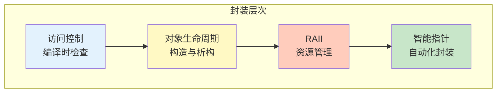
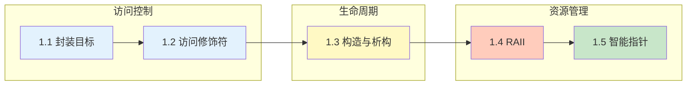

# 第1章 封装 —— 数据保护的边界

> [返回目录](../README.md)

## 本章概述

封装是面向对象编程的三大特性之一，它通过**隐藏内部实现细节**，只**暴露必要的接口**来实现数据保护和模块化设计。

在本章中，我们将深入探索封装在现代 C++ 中的实现原理：

- 从**编译时**的访问控制机制
- 到**运行时**的对象生命周期管理
- 再到**资源管理**的 RAII 惯用语
- 最后到**智能指针**的现代封装实践

## 本章小节

- [1.1 封装的目标：数据隐藏与接口暴露](./ch01-01-encapsulation-goal.md)
  - 问题描述：为什么需要封装
  - 核心原理：封装的设计原则
  - 代码示例：良好的封装 vs 糟糕的封装

- [1.2 访问修饰符的底层实现](./ch01-02-access-modifiers.md)
  - 编译时 vs 运行时
  - 访问检查的两个阶段
  - 访问控制的"漏洞"

- [1.3 构造函数与析构函数的调用时机](./ch01-03-ctor-dtor.md)
  - 各种存储持续期的对象
  - 成员对象与基类的构造顺序
  - 异常发生时的析构调用（栈展开）

- [1.4 RAII：资源管理即生命周期](./ch01-04-raii.md)
  - RAII 的核心思想
  - 异常安全保证级别
  - 自定义 RAII 包装器

- [1.5 智能指针的现代封装实践](./ch01-05-smart-ptr.md)
  - `std::unique_ptr`：独占所有权
  - `std::shared_ptr`：共享所有权与引用计数
  - `std::weak_ptr`：打破循环引用

## 学习目标

通过本章学习，你将能够：

| 目标 | 对应小节 |
|-----|---------|
| 理解封装的设计目标和价值 | 1.1 |
| 掌握访问修饰符的编译时检查机制 | 1.2 |
| 精确掌握对象生命周期的各个阶段 | 1.3 |
| 熟练运用 RAII 原则管理各类资源 | 1.4 |
| 正确选择和使用三种智能指针 | 1.5 |
| 编写异常安全、资源无泄漏的现代 C++ 代码 | 全章 |

## 章节关系图

## 核心要点速查

| 概念 | 关键要点 |
|-----|---------|
| **访问修饰符** | 只在编译时检查，运行时无区别 |
| **对象生命周期** | 构造顺序 = 声明顺序，析构顺序 = 构造逆序 |
| **RAII** | 资源获取即初始化，析构时自动释放 |
| **unique_ptr** | 独占所有权，零开销，禁止拷贝 |
| **shared_ptr** | 共享所有权，引用计数，有原子操作开销 |
| **weak_ptr** | 弱引用，不增加引用计数，打破循环引用 |

## 本章思考题

1. 为什么说"封装不是简单的私有化"？封装的真正价值是什么？
2. RAII 是如何利用 C++ 的析构机制来实现资源自动管理的？
3. `std::unique_ptr` 和 `std::shared_ptr` 在性能上有何差异？如何选择？
4. 为什么 `std::shared_ptr` 需要控制块？控制块中包含什么信息？
5. 如何设计一个 RAII 类来管理非内存资源（如文件句柄、互斥锁）？

---

*上一章：[目录](../README.md)*
*下一章：[第2章 继承 —— 代码复用与层次设计](../ch02/ch02-inheritance.md)*
