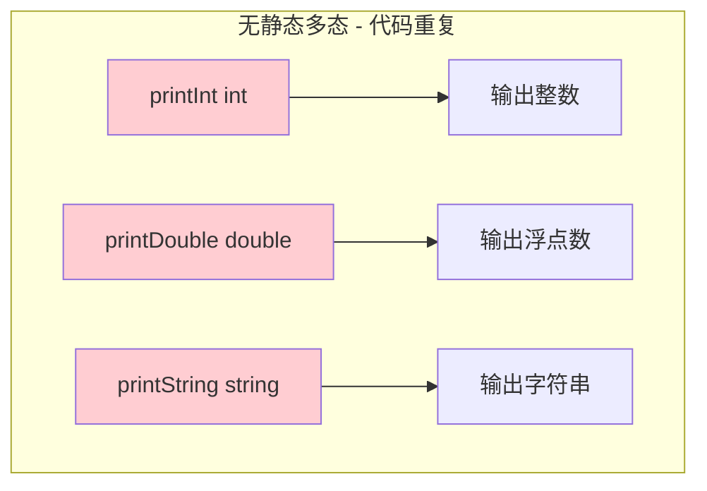
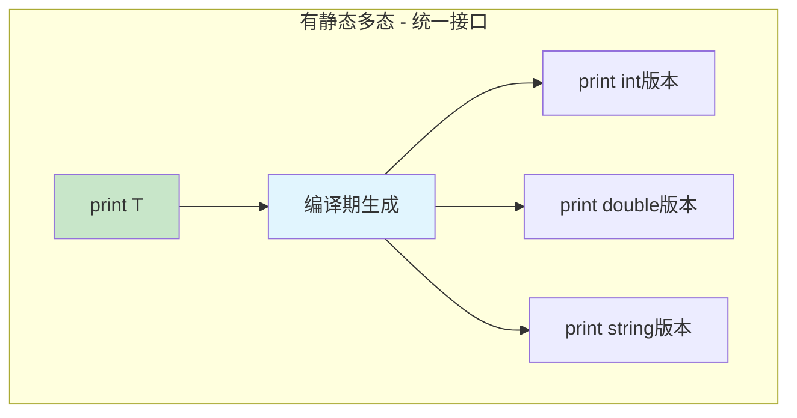
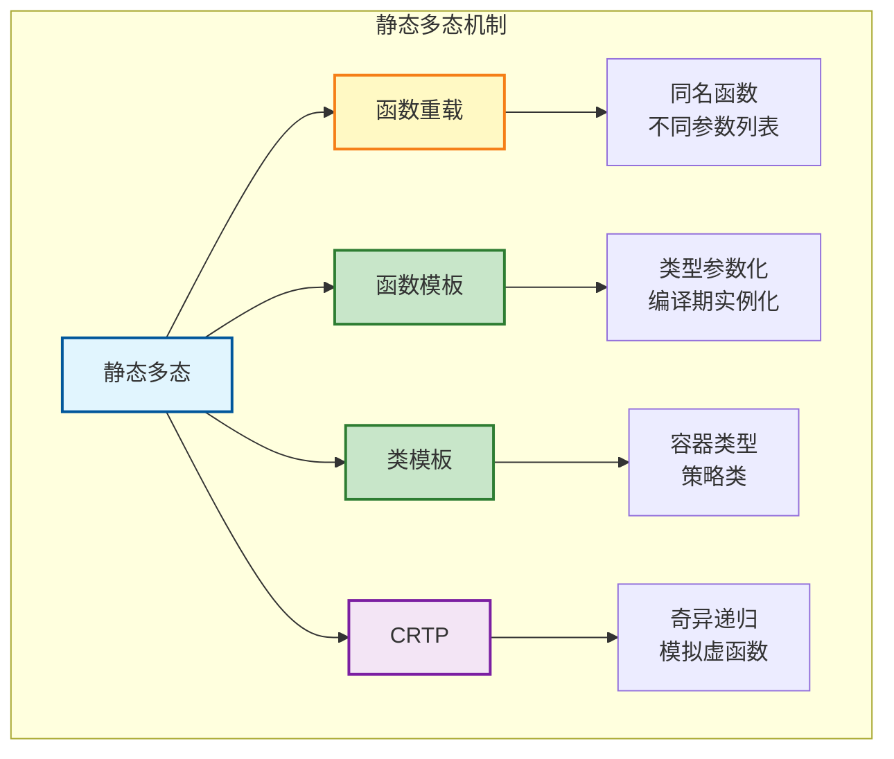
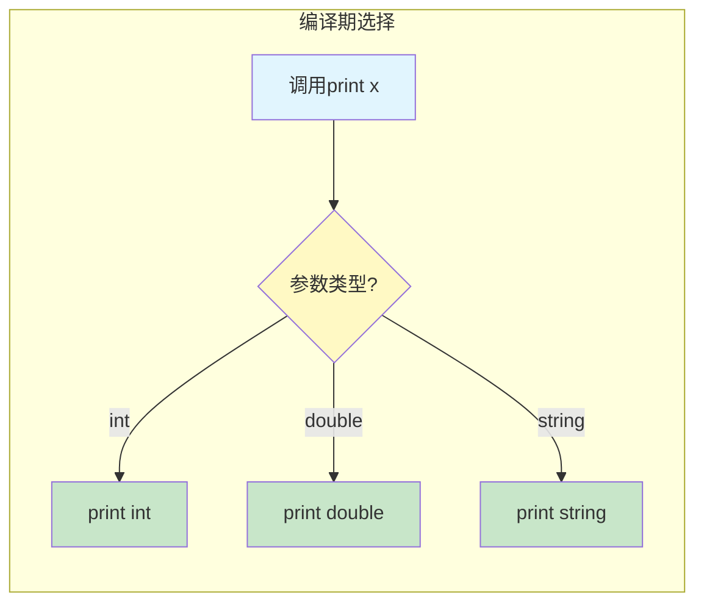
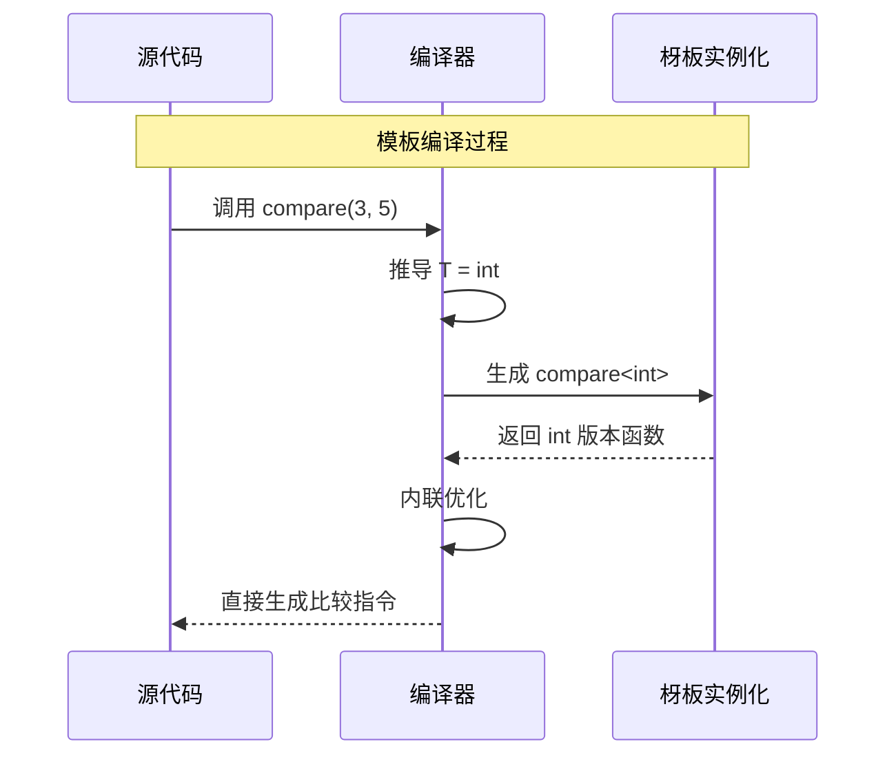
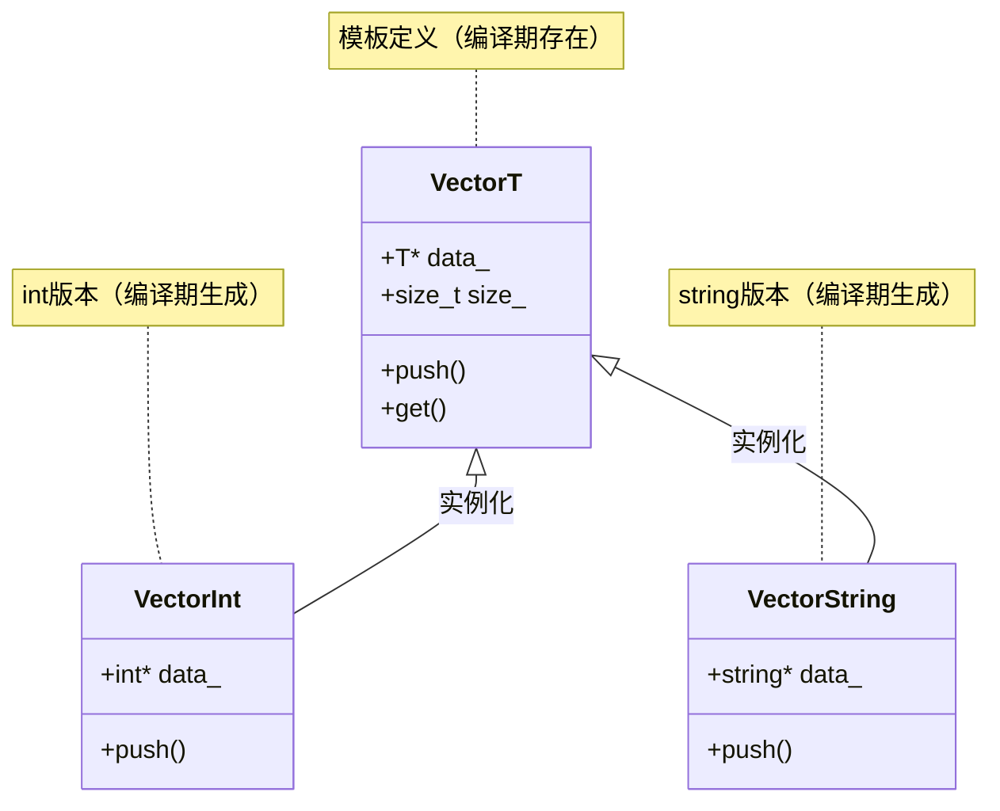
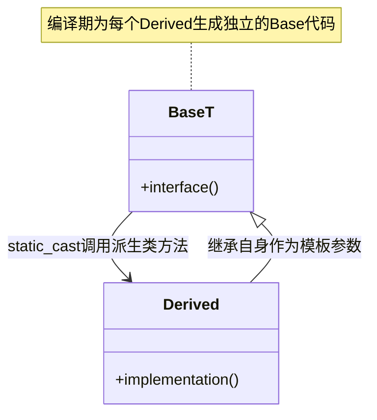
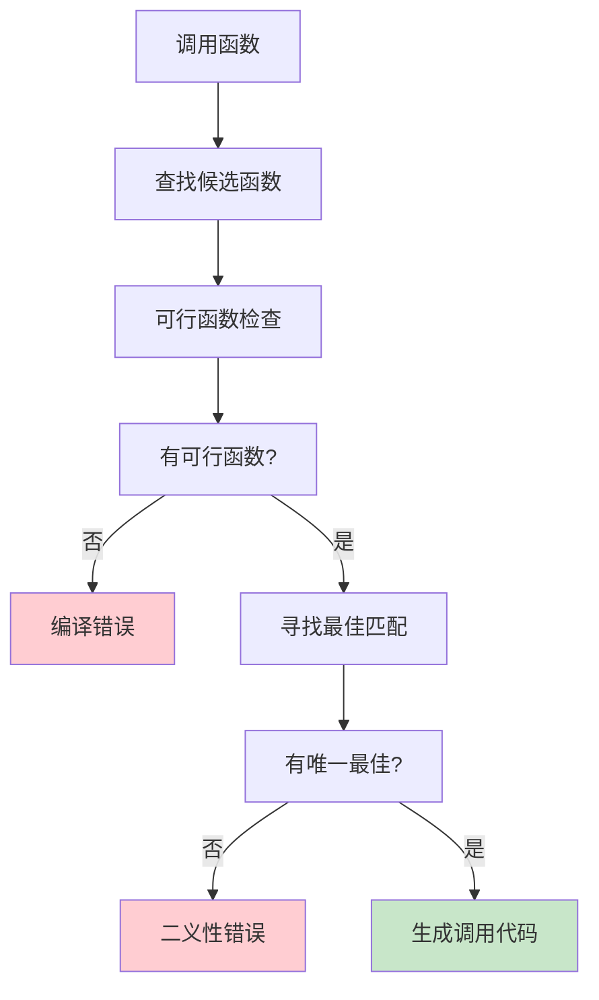
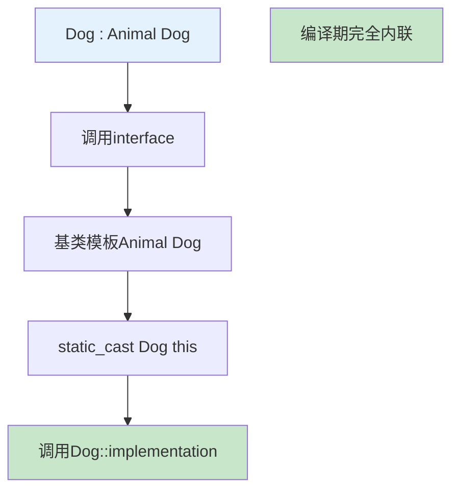

# 3.2 静态多态：函数重载与模板

> [返回第3章](./ch03-polymorphism.md) | [返回目录](../README.md)

在上一节中，我们学习了**动态多态**——通过虚函数在运行时确定要调用的函数。而本节要介绍的**静态多态**，则是在编译期就确定调用目标的多态形式。

如果说动态多态是"运行时做决定"，那么静态多态就是"编译时做决定"。由于所有决策都在编译期完成，静态多态可以实现零运行时开销，同时保持类型安全。

---

## 3.2.1 实现目标

### 问题描述

在开发中，我们经常需要对不同类型执行相似的操作。如果没有静态多态机制，会产生以下问题：

| 问题 | 描述 | 后果 |
|------|------|------|
| **函数命名冲突** | 为不同类型编写不同名称的函数 | 命名空间污染，代码冗长 |
| **代码重复** | 相同逻辑针对不同类型重复编写 | 维护成本高，容易出错 |
| **类型安全性差** | 使用void*或联合体处理不同类型 | 失去类型检查，运行时风险 |
| **性能开销** | 使用动态多态处理简单类型 | 虚函数调用开销 |

### 期望效果

通过静态多态实现以下目标：





1. **统一接口**：相同的函数名处理不同类型
2. **编译期绑定**：零运行时开销，支持内联优化
3. **类型安全**：编译期完全类型检查
4. **代码复用**：通过模板避免代码重复

---

## 3.2.2 核心原理

### 什么是静态多态

**静态多态（Static Polymorphism）**是指在编译期就确定具体函数调用形式的多态。C++主要通过**函数重载**和**模板**两种机制实现静态多态。



### 函数重载

**函数重载（Function Overloading）** 允许定义多个同名函数，只要它们的参数列表（类型、数量、顺序）不同即可。



### 函数模板

**函数模板（Function Template）** 是一种更强大的静态多态机制，它允许将类型作为参数，让编译器自动生成对应类型的函数版本。



### 类模板

**类模板（Class Template）** 允许将类本身的类型参数化，从而创建通用的容器、策略类或框架。类模板是静态多态的重要组成部分，它在编译期为每种类型生成独立的类。



**类模板的类型参数**：

```cpp
// 基本形式
template<typename T>
class Stack {
    std::vector<T> data_;
public:
    void push(const T& value) { data_.push_back(value); }
    T pop() {
        T value = data_.back();
        data_.pop_back();
        return value;
    }
};

// 多个类型参数
template<typename Key, typename Value, typename Comparator = std::less<Key>>
class TreeMap {
    // Comparator 用于静态多态的策略选择
};

// 非类型模板参数
template<typename T, size_t N>
class FixedArray {
    T data_[N];  // 编译期确定大小
public:
    constexpr size_t size() const { return N; }
    T& operator[](size_t index) { return data_[index]; }
};

// 使用
FixedArray<int, 10> arr;  // 编译期生成固定大小的数组类
```

**模板特例化与偏特化**：

```cpp
// 通用模板
template<typename T>
class TypeInfo {
public:
    static const char* name() { return "unknown"; }
};

// 针对int的完全特例化
template<>
class TypeInfo<int> {
public:
    static const char* name() { return "int"; }
};

// 针对指针类型的偏特化
template<typename T>
class TypeInfo<T*> {
public:
    static const char* name() { return "pointer"; }
};

// 使用
std::cout << TypeInfo<double>::name();   // "unknown"
std::cout << TypeInfo<int>::name();      // "int"
std::cout << TypeInfo<char*>::name();    // "pointer"
```

### CRTP：奇异递归模板模式

**CRTP（Curiously Recurring Template Pattern）** 是一种结合模板和继承的高级静态多态技术。它在2.5节中有详细讲解，此处仅作简要回顾。



**CRTP 基本形式**：

```cpp
template<typename Derived>
class Animal {
public:
    void speak() {
        // 编译期转换为派生类指针并调用
        static_cast<Derived*>(this)->speakImpl();
    }
};

class Dog : public Animal<Dog> {
public:
    void speakImpl() { std::cout << "Woof!\n"; }
};

class Cat : public Animal<Cat> {
public:
    void speakImpl() { std::cout << "Meow!\n"; }
};

// 编译期确定调用，无虚函数开销
Dog dog; dog.speak();   // 输出: Woof!
Cat cat; cat.speak();   // 输出: Meow!
```

**CRTP 的优势与局限**：

| 优势 | 局限 |
|------|------|
| 零运行时开销，可内联 | 代码膨胀（每个派生类生成一份基类代码） |
| 编译期类型检查 | 无法实现多态容器（如 `std::vector<Base<>>`） |
| 无虚表指针内存开销 | 头文件依赖（实现必须可见） |

> **深入学习**：关于 CRTP 的详细原理、应用模式和最佳实践，请回顾 **[2.5 CRTP：奇异递归模板模式](../ch02/ch02-05-crtp.md)**。

---

## 3.2.3 代码示例

### 示例1：未使用静态多态（代码重复）

```cpp
#include <iostream>
#include <string>

// ❌ 代码重复：为每种类型编写单独的函数
void printInt(int value) {
    std::cout << "Integer: " << value << "\n";
}

void printDouble(double value) {
    std::cout << "Double: " << value << "\n";
}

void printString(const std::string& value) {
    std::cout << "String: " << value << "\n";
}

// ❌ 代码重复：比较函数
int maxInt(int a, int b) {
    return (a > b) ? a : b;
}

double maxDouble(double a, double b) {
    return (a > b) ? a : b;
}

int main() {
    printInt(42);
    printDouble(3.14);
    printString("Hello");

    std::cout << "Max int: " << maxInt(10, 20) << "\n";
    std::cout << "Max double: " << maxDouble(1.5, 2.5) << "\n";

    return 0;
}
```

**问题分析**：
1. 相同逻辑重复多次
2. 添加新类型需要编写新函数
3. 函数命名冲突（printInt, printDouble...）
4. 维护困难，修改需要同步多处

### 示例2：使用函数重载

```cpp
#include <iostream>
#include <string>

// ✅ 函数重载：统一接口名
void print(int value) {
    std::cout << "Integer: " << value << "\n";
}

void print(double value) {
    std::cout << "Double: " << value << "\n";
}

void print(const std::string& value) {
    std::cout << "String: " << value << "\n";
}

// 参数数量不同的重载
void log(const std::string& msg) {
    std::cout << "[LOG] " << msg << "\n";
}

void log(const std::string& level, const std::string& msg) {
    std::cout << "[" << level << "] " << msg << "\n";
}

void log(const std::string& level, const std::string& msg, int code) {
    std::cout << "[" << level << "] " << msg << " (code: " << code << ")\n";
}

int main() {
    // 编译器根据参数类型选择正确的函数
    print(42);           // 调用 print(int)
    print(3.14);         // 调用 print(double)
    print("Hello");      // 调用 print(const char*),可能隐式转换

    print(std::string("World"));  // 调用 print(const std::string&)

    // 不同参数数量的重载
    log("Info");
    log("Warning", "Low memory");
    log("Error", "File not found", 404);

    return 0;
}
```

### 示例3：使用函数模板

```cpp
#include <iostream>
#include <string>
#include <vector>

// ✅ 函数模板：类型参数化
template<typename T>
void print(const T& value) {
    std::cout << "Value: " << value << "\n";
}

// 模板实现比较函数
template<typename T>
T maximum(const T& a, const T& b) {
    return (a > b) ? a : b;
}

// 多个类型参数的模板
template<typename T, typename U>
auto add(const T& a, const U& b) -> decltype(a + b) {
    return a + b;
}

// 非类型模板参数
template<int N>
void repeat(const std::string& msg) {
    for (int i = 0; i < N; ++i) {
        std::cout << msg << "\n";
    }
}

int main() {
    // 编译器自动推导类型并生成对应函数
    print(42);           // 实例化 print<int>
    print(3.14);         // 实例化 print<double>
    print(std::string("Hello"));  // 实例化 print<std::string>

    std::cout << "Max int: " << maximum(10, 20) << "\n";
    std::cout << "Max double: " << maximum(1.5, 2.5) << "\n";

    // 不同类型的加法
    std::cout << "Add: " << add(100, 1.5) << "\n";  // int + double
    std::cout << "Add: " << add(2.5f, 3) << "\n";   // float + int

    // 非类型模板参数
    repeat<3>("Hello!");  // 编译期确定循环次数

    return 0;
}
```

### 示例4：类模板与静态多态

```cpp
#include <iostream>
#include <vector>
#include <cassert>

// ✅ 类模板：通用容器
template<typename T>
class Stack {
private:
    std::vector<T> data_;

public:
    void push(const T& value) {
        data_.push_back(value);
    }

    T pop() {
        assert(!data_.empty());
        T value = data_.back();
        data_.pop_back();
        return value;
    }

    const T& top() const {
        assert(!data_.empty());
        return data_.back();
    }

    bool empty() const {
        return data_.empty();
    }

    size_t size() const {
        return data_.size();
    }
};

// 策略模式的静态多态实现
template<typename Strategy>
class Context {
private:
    Strategy strategy_;

public:
    void execute() {
        strategy_.execute();
    }
};

class ConcreteStrategyA {
public:
    void execute() {
        std::cout << "Executing Strategy A\n";
    }
};

class ConcreteStrategyB {
public:
    void execute() {
        std::cout << "Executing Strategy B\n";
    }
};

int main() {
    // 类模板实例化
    Stack<int> intStack;
    intStack.push(10);
    intStack.push(20);
    std::cout << "Top: " << intStack.top() << "\n";
    intStack.pop();
    std::cout << "Size: " << intStack.size() << "\n";

    Stack<std::string> stringStack;
    stringStack.push("Hello");
    stringStack.push("World");

    // 静态多态的策略模式
    Context<ConcreteStrategyA> contextA;
    contextA.execute();  // 输出: Executing Strategy A

    Context<ConcreteStrategyB> contextB;
    contextB.execute();  // 输出: Executing Strategy B

    return 0;
}
```

### 示例5：编译期类型选择（std::enable_if）

```cpp
#include <iostream>
#include <type_traits>
#include <string>

// SFINAE：Substitution Failure Is Not An Error
template<typename T>
typename std::enable_if<std::is_integral<T>::value>::type
process(T value) {
    std::cout << "Processing integer: " << value << "\n";
}

template<typename T>
typename std::enable_if<std::is_floating_point<T>::value>::type
process(T value) {
    std::cout << "Processing floating point: " << value << "\n";
}

// C++17 更简洁的写法
template<typename T>
std::enable_if_t<std::is_same_v<T, std::string>>
process(const T& value) {
    std::cout << "Processing string: " << value << "\n";
}

int main() {
    process(42);        // 调用整数版本
    process(3.14);      // 调用浮点版本
    process(std::string("Hello"));  // 调用字符串版本

    return 0;
}
```

---

## 3.2.4 深入讲解

### 函数重载的解析过程

编译器按照以下步骤选择最佳匹配函数：



**重载匹配规则**（按优先级排序）：
1. **精确匹配**：类型完全相同
2. **提升转换**：char → int, float → double
3. **标准转换**：int → double, double → int
4. **用户定义转换**：构造函数、转换运算符

```cpp
void func(int x)       { std::cout << "int\n"; }
void func(double x)    { std::cout << "double\n"; }
void func(long double x) { std::cout << "long double\n"; }

int main() {
    func(42);          // int: 精确匹配
    func(3.14f);       // double: float提升到double优先于long double
    func(3.14);        // double: 精确匹配
    func('a');         // int: char提升到int

    // func(42, 3.14);   // 错误：没有匹配的函数
}
```

### 模板的实例化机制

```cpp
template<typename T>
T square(T x) {
    return x * x;
}

// 使用时
int result = square(5);    // T推导为int
double d = square(3.14);   // T推导为double
```

**编译器实际生成的代码**（概念上）：

```cpp
// 编译器自动生成
int square(int x) {
    return x * x;
}

double square(double x) {
    return x * x;
}
```

### 模板的编译期计算

```cpp
// 编译期阶乘计算
template<int N>
struct Factorial {
    static constexpr int value = N * Factorial<N - 1>::value;
};

// 模板特例化作为递归终止
template<>
struct Factorial<0> {
    static constexpr int value = 1;
};

int main() {
    // 编译期计算，无需运行时开销
    constexpr int result = Factorial<5>::value;  // = 120
    return result;
}
```

### CRTP：奇异递归模板模式（回顾）

CRTP（Curiously Recurring Template Pattern）是一种用静态多态模拟动态多态的高级技术。**[2.5节](../ch02/ch02-05-crtp.md)** 已有详细讲解，此处仅概述其核心思想：



**核心形式**：

```cpp
template<typename Derived>
class Animal {
public:
    void speak() {
        static_cast<Derived*>(this)->speakImpl();  // 编译期绑定
    }
};

class Dog : public Animal<Dog> {
public:
    void speakImpl() { /* ... */ }  // 零开销调用
};
```

**CRTP 的典型应用**：
- **静态多态**：替代虚函数，消除运行时开销
- **单例模式**：每个派生类独立的单例基类
- **对象计数**：每个派生类独立的计数器
- **方法链**：返回派生类类型的引用

> **深入学习**：关于 CRTP 的完整原理、性能对比和设计模式应用，请回顾 **[2.5 CRTP：奇异递归模板模式](../ch02/ch02-05-crtp.md)**。

### 静态多态的优势与局限

#### 优势
1. **零开销**：无虚函数表查找开销，可内联
2. **类型安全**：编译期完全检查
3. **性能优化**：编译器可充分优化

#### 局限
1. **代码膨胀**：每个类型实例化一份代码
2. **编译时间长**：模板实例化增加编译负担
3. **错误信息复杂**：模板错误信息难以理解
4. **需要类型可见**：编译期需知道所有类型

---

## 3.2.5 常见陷阱与最佳实践

### 常见陷阱

#### 陷阱1：函数重载的二义性

```cpp
#include <iostream>

void func(double x) {
    std::cout << "double\n";
}

void func(long x) {
    std::cout << "long\n";
}

int main() {
    // func(10);  // 错误！二义性：int可以转换为double或long

    // 解决方案1：显式转换
    func(static_cast<double>(10));   // double
    func(static_cast<long>(10));     // long

    // 解决方案2：使用后缀
    func(10.0);   // double
    func(10L);    // long

    return 0;
}
```

#### 陷阱2：模板类型推导失败

```cpp
template<typename T>
void func(T value) {
    // ...
}

int main() {
    int x = 10;
    // func(x, 20);  // 错误：没有匹配的函数模板

    // 解决方案：提供接受多个参数的版本
    return 0;
}
```

#### 陷阱3：模板中的名字查找问题

```cpp
template<typename T>
void func(T t) {
    // foo(t);  // 错误：foo不是在此处声明的
}

class MyClass {
public:
    void foo(int x) { /* ... */ }
};

// 解决方案：使用 using 声明或限定名
```

#### 陷阱4：虚函数模板（不允许）

```cpp
class Base {
public:
    // template<typename T>
    // virtual void func(T x) { }  // 错误！虚函数不能是模板

    // 原因：虚函数表在编译期固定大小
    //        无法为每种类型生成虚表项
};
```

### 最佳实践

#### 1. 优先使用模板而非宏

```cpp
// ❌ 不推荐：宏
#define MAX(a, b) ((a) > (b) ? (a) : (b))
int x = MAX(++i, j);  // i可能被递增两次！

// ✅ 推荐：模板
template<typename T>
T maximum(const T& a, const T& b) {
    return (a > b) ? a : b;
}
```

#### 2. 使用 constexpr 进行编译期计算

```cpp
// C++11/14
constexpr int factorial(int n) {
    return (n <= 1) ? 1 : n * factorial(n - 1);
}

constexpr int result = factorial(5);  // 编译期计算
```

#### 3. 模板参数使用 const T& 传递

```cpp
// ✅ 高效：避免复制
template<typename T>
void print(const T& value) {
    std::cout << value << "\n";
}

// 对于小类型和基本类型，可以使用值传递
template<typename T>
void smallCopy(T value) {  // T是int等小类型时更高效
    // ...
}
```

#### 4. 使用概念约束模板（C++20）

```cpp
#include <concepts>

// C++20 概念
template<std::integral T>
T add(T a, T b) {
    return a + b;
}

// 或者
template<typename T>
requires std::integral<T>
T add(T a, T b) {
    return a + b;
}

int main() {
    add(10, 20);        // OK
    // add(1.5, 2.5);   // 编译错误：double不是整数类型
}
```

#### 5. 避免模板元编程过度使用

```cpp
// ❌ 过于复杂的模板元编程
template<typename T, typename U>
struct Meta {
    using type = typename std::conditional<
        std::is_same_v<T, int>,
        typename std::add_const<U>::type,
        typename std::add_reference<T>::type
    >::type;
};

// ✅ 更清晰的替代方案
using MetaType = std::conditional_t<
    std::is_same_v<T, int>,
    std::add_const_t<U>,
    std::add_lvalue_reference_t<T>
>;
```

---

## 3.2.6 思考题

1. 静态多态和动态多态的本质区别是什么？
   > 提示：从绑定时机、性能、灵活性三个角度分析

2. 以下代码的输出是什么？为什么？
   ```cpp
   template<typename T>
   void func(T x) { std::cout << 1; }

   template<>
   void func<int>(int x) { std::cout << 2; }

   void func(int x) { std::cout << 3; }

   int main() {
       func(42);
       func(42.0);
       func('a');
   }
   ```

3. 为什么虚函数不能是模板函数？

4. CRTP是如何实现静态多态的？它与传统的虚函数多态相比有什么优缺点？

5. 什么时候应该使用静态多态，什么时候应该使用动态多态？

---
**上一节：[3.1 函数重载与模板](./ch03-01-polymorphism-goal.md)*
*下一节：[3.3 动态多态：虚函数与虚表](./ch03-03-dynamic-polymorphism.md)*
