# 3.3 动态多态：虚函数与虚表

> [返回第3章](./ch03-polymorphism.md) | [返回目录](../README.md)

在3.1节中，我们了解了多态的目标——统一接口，不同实现。在3.2节中，我们学习了静态多态——编译期确定的函数调用。而本节要介绍的**动态多态**，则是在运行期通过虚函数表（vtable）机制来确定调用的多态形式。

动态多态是C++面向对象编程的核心机制，它使得基类指针或引用能够在运行时正确地调用派生类的实现。

---

## 3.3.1 实现目标

### 问题描述

在没有动态多态机制的情况下，处理不同派生类对象时会产生以下问题：

| 问题 | 描述 | 后果 |
|------|------|------|
| **类型分支泛滥** | 使用大量if-else/switch判断具体类型 | 代码臃肿，难以维护 |
| **扩展困难** | 添加新类型需要修改现有代码 | 违反开闭原则(OCP) |
| **无法统一存储** | 不同类型的派生类对象无法用同一容器存储 | 无法实现多态容器 |
| **切片问题** | 按值传递会导致对象切片 | 派生类部分丢失 |

### 期望效果

通过动态多态实现以下目标：

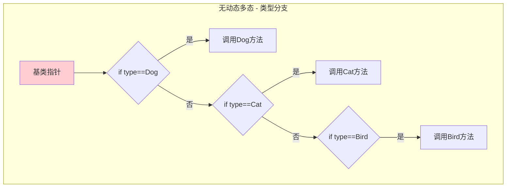

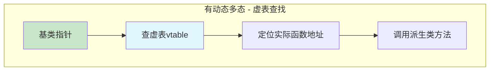

1. **统一接口**：通过基类指针/引用统一调用不同派生类方法
2. **运行时绑定**：根据实际对象类型动态调用正确函数
3. **多态容器**：可用容器存储不同派生类对象的指针
4. **易于扩展**：添加新类型无需修改现有调用代码

---

## 3.3.2 核心原理

### 什么是动态多态

**动态多态（Dynamic Polymorphism）**是指在程序运行期间，根据对象的实际类型来确定调用哪个函数的机制。C++通过**虚函数（Virtual Function）**和**虚函数表（Virtual Table，简称vtable）**实现动态多态。

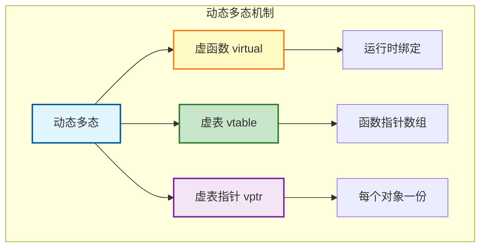

### 虚函数

**虚函数**是在基类中用`virtual`关键字声明的成员函数。虚函数的特点：
- 派生类可以重写（override）虚函数
- 通过基类指针/引用调用时，会调用派生类版本
- 析构函数通常声明为虚函数

### 虚函数表（vtable）

**虚函数表**是编译器为每个包含虚函数的类生成的静态数组，存储着该类虚函数的地址：

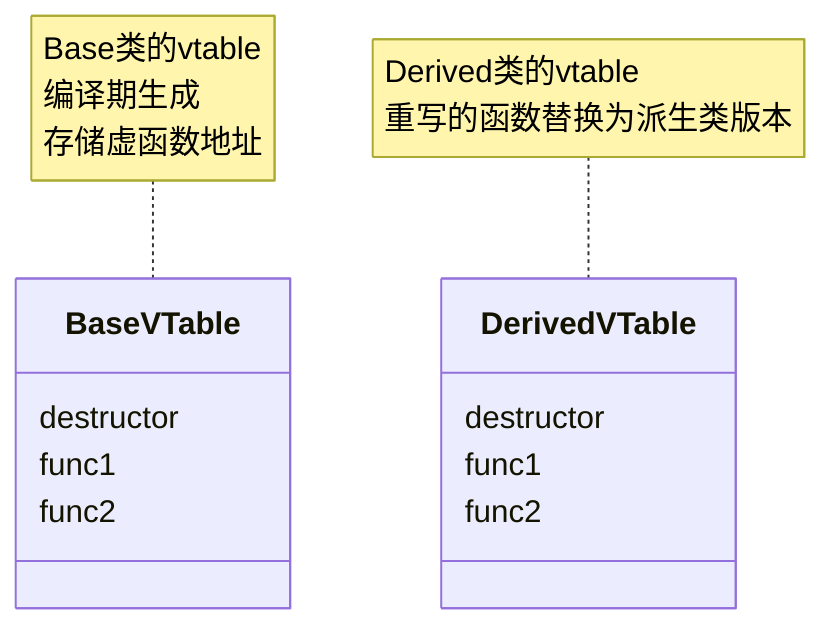

### 虚表指针（vptr）

**虚表指针（vptr）** 是每个包含虚函数的对象内部隐藏的指针，指向该对象对应类的虚函数表：

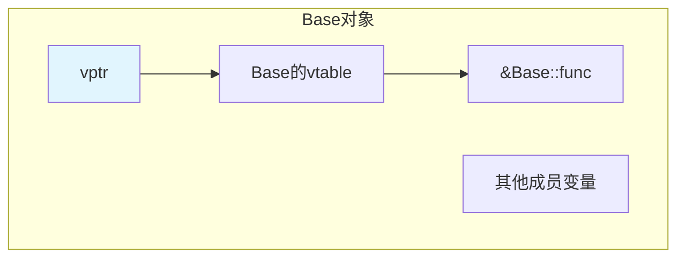
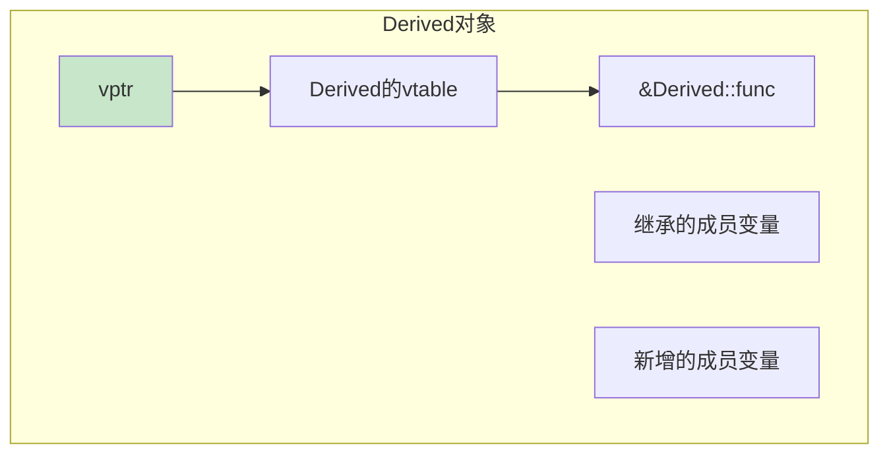

### 动态多态的调用过程

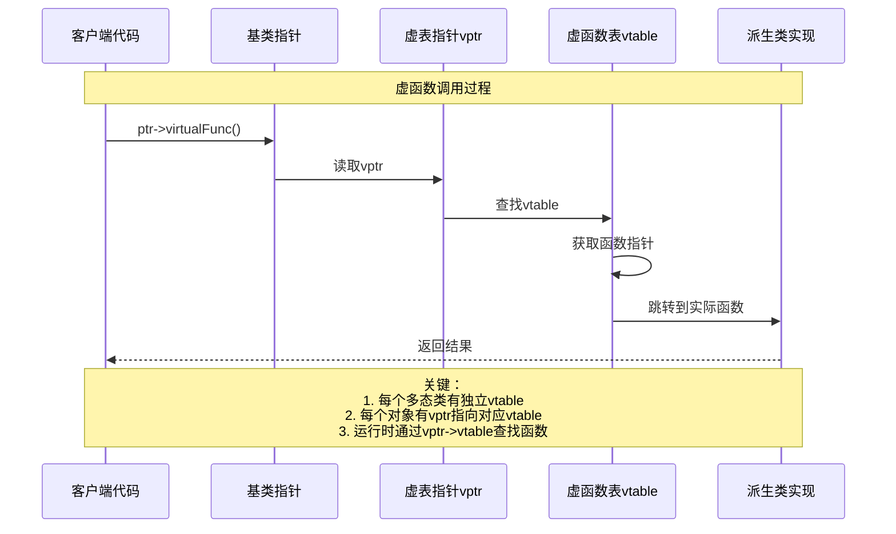

### 静态多态 vs 动态多态对比

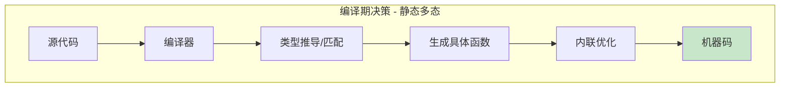
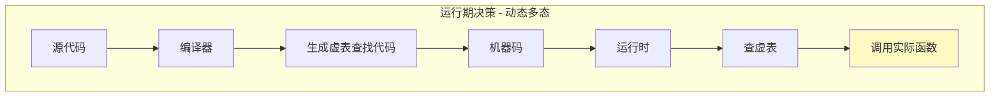

| 特性 | 静态多态 | 动态多态 |
|------|---------|---------|
| **绑定时机** | 编译期 | 运行期 |
| **实现方式** | 模板、重载、CRTP | 虚函数、虚表 |
| **性能** | 零开销，可内联 | 虚函数表查找开销 |
| **多态容器** | 不支持 | 支持（`vector<Base*>`） |
| **类型可见性** | 编译期需知所有类型 | 运行期确定类型 |
| **二进制兼容** | 每次编译重新生成 | 接口稳定 |
| **典型应用** | 算法库、高性能场景 | 插件系统、框架设计 |

---

## 3.3.3 代码示例

### 示例1：未使用虚函数（无多态）

```cpp
#include <iostream>
#include <string>
#include <vector>

// ❌ 没有使用虚函数
class Animal {
public:
    std::string name_;

    Animal(const std::string& name) : name_(name) {}

    void speak() {
        std::cout << name_ << " makes a sound.\n";
    }
};

class Dog : public Animal {
public:
    Dog(const std::string& name) : Animal(name) {}

    void speak() {
        std::cout << name_ << " says: Woof!\n";
    }
};

class Cat : public Animal {
public:
    Cat(const std::string& name) : Animal(name) {}

    void speak() {
        std::cout << name_ << " says: Meow!\n";
    }
};

// 问题：无法实现多态
void makeAnimalSpeak(Animal& animal) {
    animal.speak();  // 总是调用 Animal::speak()
}

int main() {
    Dog dog("Buddy");
    Cat cat("Whiskers");

    dog.speak();   // 输出: Buddy says: Woof!
    cat.speak();   // 输出: Whiskers says: Meow!

    // 通过基类引用调用，多态失效
    Animal& animalRef1 = dog;
    Animal& animalRef2 = cat;
    animalRef1.speak();  // 输出: Buddy makes a sound. (不是Woof!)
    animalRef2.speak();  // 输出: Whiskers makes a sound. (不是Meow!)

    return 0;
}
```

**问题分析**：
1. 通过基类引用调用时，总是调用基类版本
2. 无法用统一容器存储并调用不同派生类对象
3. 添加新动物类型需要修改客户端代码

### 示例2：使用虚函数（实现多态）

```cpp
#include <iostream>
#include <string>
#include <vector>
#include <memory>

// ✅ 使用虚函数实现多态
class Animal {
public:
    std::string name_;

    Animal(const std::string& name) : name_(name) {}

    // 虚函数：允许派生类重写
    virtual void speak() {
        std::cout << name_ << " makes a sound.\n";
    }

    // 虚析构函数：确保正确析构派生类
    virtual ~Animal() = default;
};

class Dog : public Animal {
public:
    Dog(const std::string& name) : Animal(name) {}

    // override关键字：明确表示重写基类虚函数
    void speak() override {
        std::cout << name_ << " says: Woof!\n";
    }
};

class Cat : public Animal {
public:
    Cat(const std::string& name) : Animal(name) {}

    void speak() override {
        std::cout << name_ << " says: Meow!\n";
    }
};

// 统一处理函数：多态调用
void makeAnimalSpeak(Animal& animal) {
    animal.speak();  // 根据实际对象类型调用对应函数
}

int main() {
    Dog dog("Buddy");
    Cat cat("Whiskers");

    dog.speak();   // 输出: Buddy says: Woof!
    cat.speak();   // 输出: Whiskers says: Meow!

    // 通过基类引用调用，多态正常工作
    Animal& animalRef1 = dog;
    Animal& animalRef2 = cat;
    animalRef1.speak();  // 输出: Buddy says: Woof!
    animalRef2.speak();  // 输出: Whiskers says: Meow!

    makeAnimalSpeak(dog);  // 输出: Buddy says: Woof!
    makeAnimalSpeak(cat);  // 输出: Whiskers says: Meow!

    // 多态容器
    std::vector<std::unique_ptr<Animal>> zoo;
    zoo.push_back(std::make_unique<Dog>("Max"));
    zoo.push_back(std::make_unique<Cat>("Mittens"));
    zoo.push_back(std::make_unique<Dog>("Rocky"));

    std::cout << "\n=== Zoo Tour ===\n";
    for (const auto& animal : zoo) {
        animal->speak();  // 多态调用
    }
    // 输出：
    // === Zoo Tour ===
    // Max says: Woof!
    // Mittens says: Meow!
    // Rocky says: Woof!

    return 0;
}
```

### 示例3：纯虚函数与抽象类

```cpp
#include <iostream>
#include <string>
#include <vector>
#include <memory>
#include <cmath>

const double PI = 3.14159265358979323846;

// ✅ 抽象基类：包含纯虚函数
class Shape {
protected:
    double x_, y_;  // 位置

public:
    Shape(double x, double y) : x_(x), y_(y) {}
    virtual ~Shape() = default;  // 虚析构函数

    // 纯虚函数：没有实现，要求派生类必须实现
    virtual double area() const = 0;
    virtual double perimeter() const = 0;
    virtual void draw() const = 0;

    // 普通虚函数：提供默认实现，派生类可选择重写
    virtual void move(double dx, double dy) {
        x_ += dx;
        y_ += dy;
    }

    void getPosition() const {
        std::cout << "Position: (" << x_ << ", " << y_ << ")\n";
    }
};

class Rectangle : public Shape {
    double width_, height_;

public:
    Rectangle(double x, double y, double w, double h)
        : Shape(x, y), width_(w), height_(h) {}

    double area() const override {
        return width_ * height_;
    }

    double perimeter() const override {
        return 2 * (width_ + height_);
    }

    void draw() const override {
        std::cout << "Drawing Rectangle at (" << x_ << ", " << y_
                  << ") size: " << width_ << "x" << height_ << "\n";
    }
};

class Circle : public Shape {
    double radius_;

public:
    Circle(double x, double y, double r)
        : Shape(x, y), radius_(r) {}

    double area() const override {
        return PI * radius_ * radius_;
    }

    double perimeter() const override {
        return 2 * PI * radius_;
    }

    void draw() const override {
        std::cout << "Drawing Circle at (" << x_ << ", " << y_
                  << ") radius: " << radius_ << "\n";
    }
};

// 计算总面积：多态实现
double totalArea(const std::vector<std::unique_ptr<Shape>>& shapes) {
    double sum = 0;
    for (const auto& shape : shapes) {
        sum += shape->area();  // 多态调用
    }
    return sum;
}

int main() {
    std::vector<std::unique_ptr<Shape>> shapes;

    shapes.push_back(std::make_unique<Rectangle>(0, 0, 5, 3));
    shapes.push_back(std::make_unique<Circle>(10, 10, 2));
    shapes.push_back(std::make_unique<Rectangle>(5, 5, 4, 4));

    std::cout << "Drawing all shapes:\n";
    for (const auto& shape : shapes) {
        shape->draw();  // 多态调用
    }

    std::cout << "\nTotal area: " << totalArea(shapes) << "\n";

    // Shape shape;  // 编译错误！不能实例化抽象类

    return 0;
}
```

### 示例4：虚析构函数的重要性

```cpp
#include <iostream>
#include <memory>

class Base {
public:
    // ❌ 危险：没有虚析构函数
    // virtual ~Base() { std::cout << "Base destructor\n"; }
    ~Base() { std::cout << "Base destructor\n"; }

    virtual void func() { std::cout << "Base::func\n"; }
};

class Derived : public Base {
    int* data_;

public:
    Derived() : data_(new int(42)) {
        std::cout << "Derived constructor, data=" << *data_ << "\n";
    }

    ~Derived() {
        std::cout << "Derived destructor, deleting data\n";
        delete data_;
    }

    void func() override {
        std::cout << "Derived::func, data=" << *data_ << "\n";
    }
};

int main() {
    std::cout << "=== Case 1: 直接删除派生类指针 ===\n";
    {
        Derived* d = new Derived();
        delete d;  // 正确：调用Derived和Base析构函数
    }

    std::cout << "\n=== Case 2: 删除基类指针（危险！） ===\n";
    {
        Base* b = new Derived();
        delete b;  // 危险！只调用Base析构函数，内存泄漏！
        // 输出只显示 "Base destructor"，没有 "Derived destructor"
    }

    std::cout << "\n=== Case 3: 使用智能指针（仍需虚析构函数） ===\n";
    {
        std::unique_ptr<Base> b = std::make_unique<Derived>();
        // 仍然有问题！unique_ptr<Base>删除时仍只调用Base析构函数
    }

    return 0;
}

/*
输出：
=== Case 1: 直接删除派生类指针 ===
Derived constructor, data=42
Derived destructor, deleting data
Base destructor

=== Case 2: 删除基类指针（危险！） ===
Derived constructor, data=42
Base destructor    ← 没有调用Derived析构函数！内存泄漏！

=== Case 3: 使用智能指针（仍需虚析构函数） ===
Derived constructor, data=42
Base destructor    ← 同样有问题
*/
```

**正确做法**：将基类析构函数声明为虚函数

```cpp
class Base {
public:
    virtual ~Base() { std::cout << "Base destructor\n"; }  // ✅ 虚析构函数
    // ...
};
```

---

## 3.3.4 深入讲解

### 虚函数表的内存布局

每个包含虚函数的类都有一个对应的虚函数表，虚函数表是类级别的（所有对象共享），在编译期生成：

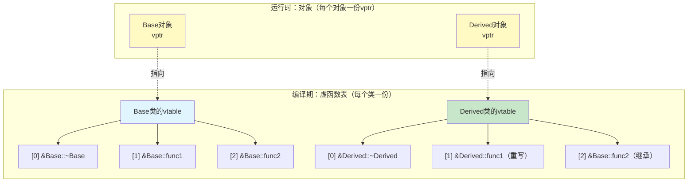

### 多继承下的虚函数表

```cpp
class Base1 {
public:
    virtual void func1() {}
    virtual void func2() {}
};

class Base2 {
public:
    virtual void func3() {}
    virtual void func4() {}
};

class Derived : public Base1, public Base2 {
public:
    void func1() override {}
    void func3() override {}
    virtual void func5() {}  // 新增虚函数
};
```

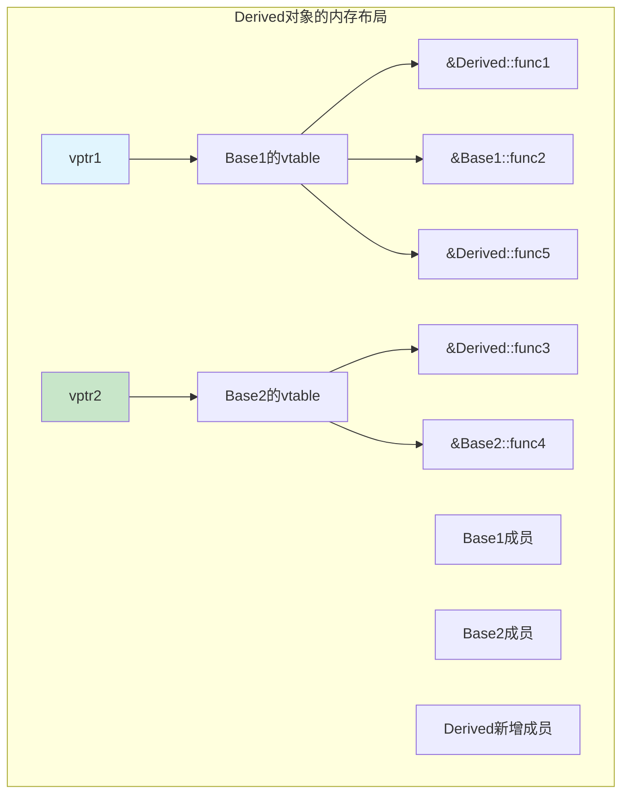

### 虚函数调用的汇编层面

```cpp
Base* ptr = new Derived();
ptr->virtualFunc();  // 虚函数调用
```

**概念上的汇编代码**：

```asm
; 1. 获取对象的vptr
mov   rax, [ptr]          ; rax = ptr->vptr

; 2. 查找vtable中的函数指针
mov   rax, [rax + offset] ; rax = vptr[virtualFunc的偏移量]

; 3. 调用函数
call  rax                 ; 调用实际函数
```

### 动态多态的性能分析

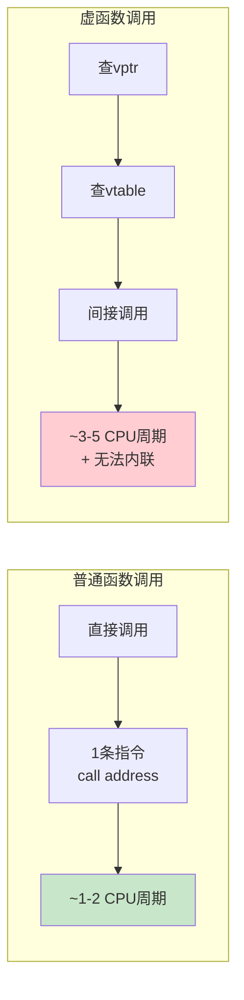

| 性能指标 | 普通函数调用 | 虚函数调用 | 静态多态（模板） |
|---------|------------|-----------|----------------|
| **指令数** | 1-2条 | 3-5条 | 1-2条（可内联） |
| **CPU周期** | ~1-2 | ~3-5 | ~0（完全内联） |
| **内联优化** | 可能 | 不可 | 可以 |
| **分支预测** | 容易 | 困难 | 容易 |

### 何时使用动态多态

| 适用场景 | 使用动态多态 | 使用静态多态 |
|---------|------------|------------|
| **类型在编译期未知** | ✅ 如插件系统 | ❌ |
| **需要多态容器** | ✅ `vector<Base*>` | ❌ |
| **运行时类型确定** | ✅ 如工厂模式 | ❌ |
| **性能关键路径** | ❌ | ✅ 模板+CRTP |
| **接口稳定性** | ✅ 二进制兼容 | ❌ 每次编译 |
| **代码大小** | ✅ 较小 | ❌ 代码膨胀 |

---

## 3.3.5 常见陷阱与最佳实践

### 常见陷阱

#### 陷阱1：忘记将析构函数声明为虚函数

```cpp
// ❌ 危险：基类析构函数不是虚函数
class Base {
public:
    ~Base() { /* ... */ }  // 不是虚函数！
    virtual void func() = 0;
};

Base* ptr = new Derived();
delete ptr;  // 未定义行为！Derived析构函数不会被调用

// ✅ 正确：声明虚析构函数
class Base {
public:
    virtual ~Base() { /* ... */ }  // 虚析构函数
    virtual void func() = 0;
};
```

#### 陷阱2：对象切片

```cpp
#include <iostream>

class Base {
public:
    virtual void func() { std::cout << "Base\n"; }
};

class Derived : public Base {
public:
    void func() override { std::cout << "Derived\n"; }
    void extra() { std::cout << "Extra\n"; }
};

// ❌ 按值传递导致对象切片
void processByValue(Base obj) {
    obj.func();  // 输出: Base（派生类部分被切掉）
}

// ✅ 按引用传递
void processByRef(Base& obj) {
    obj.func();  // 输出: Derived
}

int main() {
    Derived d;
    processByValue(d);   // 输出: Base
    processByRef(d);     // 输出: Derived
    return 0;
}
```

#### 陷阱3：在构造/析构函数中调用虚函数

```cpp
class Base {
public:
    Base() {
        init();  // 调用虚函数
    }
    virtual void init() { std::cout << "Base::init\n"; }
    virtual ~Base() { cleanup(); }
    virtual void cleanup() { std::cout << "Base::cleanup\n"; }
};

class Derived : public Base {
    std::string data_;
public:
    Derived() : data_("important") {}
    void init() override {
        std::cout << "Derived::init, data=" << data_ << "\n";
    }
    void cleanup() override {
        std::cout << "Derived::cleanup\n";
    }
};

int main() {
    Derived d;
    // 输出:
    // Base::init        (不是 Derived::init!)
    // Base::cleanup     (不是 Derived::cleanup!)
}
```

**原因**：构造派生类时，基类先构造，此时派生类部分未初始化。

#### 陷阱4：隐藏基类函数而非重写

```cpp
class Base {
public:
    virtual void func(int x) { std::cout << "Base::func int\n"; }
};

class Derived : public Base {
public:
    // ❌ 隐藏了基类的func(int)，而非重写
    void func(double x) { std::cout << "Derived::func double\n"; }
};

int main() {
    Derived d;
    d.func(1.0);    // 输出: Derived::func double
    // d.func(1);    // 编译错误！func(int)被隐藏
    return 0;
}

// ✅ 使用using引入基类函数
class Derived : public Base {
public:
    using Base::func;  // 引入基类的所有func重载
    void func(double x) { std::cout << "Derived::func double\n"; }
};
```

### 最佳实践

#### 1. 多态基类必须声明虚析构函数

```cpp
class Base {
public:
    virtual ~Base() = default;  // 虚析构函数
    // ...
};
```

#### 2. 始终使用`override`关键字（C++11及以上）

```cpp
class Base {
public:
    virtual void func() {}
    virtual void process(int x) {}
};

class Derived : public Base {
public:
    void func() override {}  // ✅ 明确表示重写
    // void fumc() override {}  // 编译错误：拼写错误
    // void process(double x) override {}  // 编译错误：签名不匹配
};
```

#### 3. 优先使用引用而非指针传递多态对象

```cpp
// ✅ 更好：使用引用
void process(const Animal& animal) {
    animal.speak();
}

// ⚠️ 可用但不推荐：使用原始指针
void process(const Animal* animal) {
    animal->speak();
}

// ✅ 最佳：使用智能指针
void process(const std::unique_ptr<Animal>& animal) {
    animal->speak();
}
```

#### 4. 纯虚函数 vs 普通虚函数的选择

```cpp
class Animal {
public:
    // 纯虚函数：强制派生类实现
    virtual void makeSound() const = 0;

    // 普通虚函数：提供默认实现，派生类可选择重写
    virtual void eat() const {
        std::cout << "Animal is eating.\n";
    }

    // 非虚函数：不期望派生类改变的行为
    std::string getName() const { return name_; }

protected:
    std::string name_;
};
```

#### 5. 接口类的设计模式

```cpp
// ✅ 接口类：只有纯虚函数和虚析构函数
class IShape {
public:
    virtual ~IShape() = default;
    virtual double area() const = 0;
    virtual double perimeter() const = 0;
    virtual void draw() const = 0;
};

// 实现类：继承接口并实现所有纯虚函数
class Rectangle : public IShape {
    double width_, height_;
public:
    Rectangle(double w, double h) : width_(w), height_(h) {}
    double area() const override { return width_ * height_; }
    double perimeter() const override { return 2 * (width_ + height_); }
    void draw() const override { /* ... */ }
};
```

---

## 3.3.6 思考题

1. 为什么多态基类的析构函数必须是虚函数？
   > 提示：考虑通过基类指针删除派生类对象时会发生什么

2. 以下代码的输出是什么？为什么？
   ```cpp
   class Base {
   public:
       virtual void func() { std::cout << "Base"; }
       Base() { func(); }
   };
   class Derived : public Base {
   public:
       void func() override { std::cout << "Derived"; }
   };
   int main() {
       Derived d;
   }
   ```

3. 虚函数表是在编译期生成还是运行期生成？每个类有几份虚函数表？每个对象有几个虚表指针？

4. 对象切片是如何发生的？如何避免？

5. 动态多态和静态多态各有什么优缺点？如何选择？

---

*上一节：[3.2 静态多态：函数重载与模板](./ch03-02-static-polymorphism.md)*
*下一节：[3.4 虚函数表的内存布局与调用过程](./ch03-04-vtable-layout.md)*
