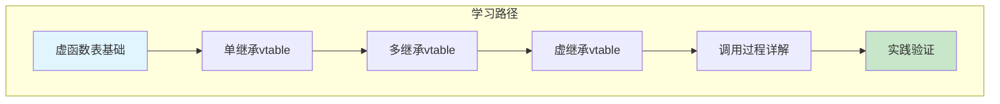
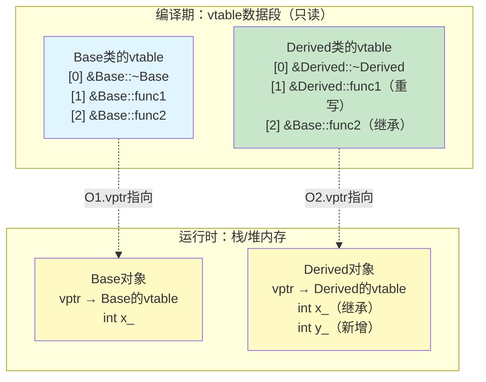
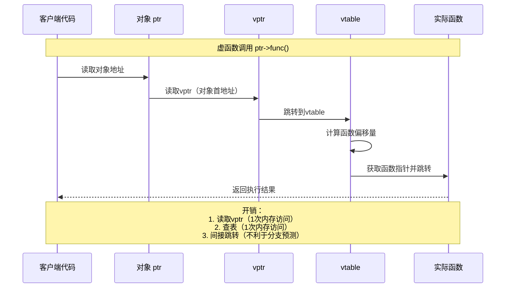
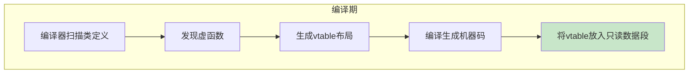
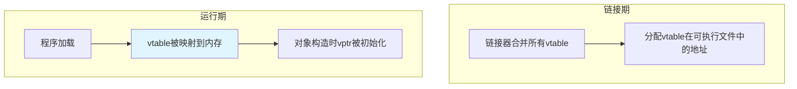
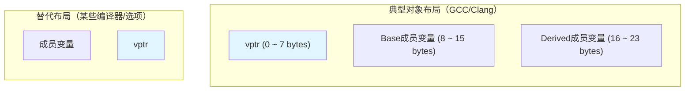

# 3.4 虚函数表的内存布局与调用过程

> [返回第3章](./ch03-polymorphism.md) | [返回目录](../README.md)

在3.3节中，我们学习了动态多态的基本概念——虚函数通过虚函数表（vtable）实现运行时绑定。本节将深入探讨虚函数表的内存布局、不同继承场景下的vtable结构，以及虚函数调用的完整过程。

理解vtable的底层实现机制，有助于我们更好地理解C++对象模型，调试多态相关问题，并优化性能关键代码。

---

## 3.4.1 实现目标

### 问题描述

在日常开发中，开发者往往对虚函数表有以下困惑：

| 问题 | 描述 | 后果 |
|------|------|------|
| **内存布局模糊** | 不清楚vtable在内存中的具体位置和结构 | 难以理解多态开销 |
| **继承场景复杂** | 单继承、多继承、虚继承的vtable布局不同 | 难以预测对象大小 |
| **调用过程不清** | 不知道虚函数调用具体经历了哪些步骤 | 无法定位性能问题 |
| **无法验证** | 缺乏验证vtable存在的方法 | 理解停留在概念层面 |

### 期望效果

通过本节学习，你将能够：

1. **理解内存布局**：清晰掌握vtable在内存中的位置和结构
2. **区分继承场景**：了解不同继承方式下vtable的差异
3. **掌握调用流程**：追踪虚函数调用的完整执行路径
4. **学会验证方法**：能够通过代码验证vtable的存在



---

## 3.4.2 核心原理

### vtable的基本概念

**虚函数表（vtable）** 是编译器为每个包含虚函数的类生成的静态数组，包含该类所有虚函数的函数指针。

**关键特性**：
- vtable是**类级别**的，所有该类的对象共享同一个vtable
- vtable在**编译期**生成，存储在程序的只读数据段
- 每个包含虚函数的对象内部有一个**虚表指针（vptr）**，指向对应类的vtable

### 单继承下的内存布局



### vtable的典型结构

| 偏移量 | 内容 | 说明 |
|--------|------|------|
| 0 | typeinfo指针（RTTI） | 用于`dynamic_cast`和`typeid` |
| 1 | 虚析构函数 | 如果存在虚析构函数 |
| 2~n | 其他虚函数 | 按声明顺序排列 |

### 虚函数调用的完整过程



---

## 3.4.3 代码示例

### 示例1：验证vtable的存在

```cpp
#include <iostream>
#include <memory>

// 简单的多态类
class Base {
public:
    virtual void func1() { std::cout << "Base::func1\n"; }
    virtual void func2() { std::cout << "Base::func2\n"; }
    virtual ~Base() = default;
};

class Derived : public Base {
public:
    void func1() override { std::cout << "Derived::func1\n"; }
    virtual void func3() { std::cout << "Derived::func3\n"; }  // 新增虚函数
};

// 虚函数表指针类型：函数指针数组
using VTable = const void*[];

// 打印对象内存内容和vtable
void inspectObject(Base* obj) {
    std::cout << "=== Object Inspection ===\n";
    std::cout << "Object address: " << obj << "\n";

    // 读取vptr（对象的前8/4字节）
    const void** vptr_ptr = reinterpret_cast<const void**>(obj);
    const void* vptr = *vptr_ptr;
    std::cout << "vptr points to: " << vptr << "\n";

    // 访问vtable
    const VTable* vtable = reinterpret_cast<const VTable*>(vptr);

    // 打印vtable中的函数指针
    std::cout << "\nvtable contents:\n";
    for (int i = 0; i < 4; ++i) {
        std::cout << "  [" << i << "] " << (*vtable)[i] << "\n";
    }

    // 尝试调用vtable中的函数
    std::cout << "\nCalling through vtable:\n";
    using FuncType = void(*)(Base*);
    FuncType func = reinterpret_cast<FuncType>((*vtable)[1]);  // func1通常在偏移1
    func(obj);  // 通过vtable直接调用
}

int main() {
    Base b;
    Derived d;

    std::cout << "Base object:\n";
    std::cout << "sizeof(Base) = " << sizeof(Base) << "\n";
    inspectObject(&b);

    std::cout << "\n\nDerived object:\n";
    std::cout << "sizeof(Derived) = " << sizeof(Derived) << "\n";
    inspectObject(&d);

    return 0;
}

/*
典型输出（64位系统）：
sizeof(Base) = 8  (只有一个vptr)
sizeof(Derived) = 8  (只有一个vptr)

Base object:
vtable contents:
  [0] 0x...  (typeinfo或析构函数)
  [1] 0x...  (Base::func1)
  [2] 0x...  (Base::func2)

Derived object:
vtable contents:
  [0] 0x...
  [1] 0x...  (Derived::func1)
  [2] 0x...  (Base::func2，继承)
  [3] 0x...  (Derived::func3，新增)
*/
```

### 示例2：单继承的内存布局详解

```cpp
#include <iostream>
#include <cstddef>

// 带有成员变量的基类
class Base {
public:
    int baseData_;
    virtual void func1() { std::cout << "Base::func1, baseData=" << baseData_ << "\n"; }
    virtual void func2() { std::cout << "Base::func2\n"; }
    virtual ~Base() { std::cout << "Base::~Base\n"; }

    Base(int data) : baseData_(data) {}
};

class Derived : public Base {
public:
    int derivedData_;

    Derived(int baseData, int derivedData)
        : Base(baseData), derivedData_(derivedData) {}

    void func1() override {
        std::cout << "Derived::func1, baseData=" << baseData_
                  << ", derivedData=" << derivedData_ << "\n";
    }

    virtual void func3() {  // 新增虚函数
        std::cout << "Derived::func3\n";
    }
};

void printMemoryLayout(const char* name, const void* obj, size_t size) {
    const unsigned char* bytes = static_cast<const unsigned char*>(obj);
    std::cout << name << " memory layout (" << size << " bytes):\n";

    for (size_t i = 0; i < size; ++i) {
        if (i % 8 == 0) std::cout << "  ";
        std::cout << std::hex << std::setw(2) << std::setfill('0') << (int)bytes[i] << " ";
        if ((i + 1) % 8 == 0) std::cout << "\n";
    }
    std::cout << "\n";

    // 解释内存布局
    std::cout << "Layout explanation:\n";
    std::cout << "  Bytes 0-7:  vptr (pointer to vtable)\n";
    if (size >= 16) {
        std::cout << "  Bytes 8-15: Base class members (baseData_)\n";
    }
    if (size >= 24) {
        std::cout << "  Bytes 16-23: Derived class members (derivedData_)\n";
    }
    std::cout << "\n";
}

int main() {
    std::cout << "Size information:\n";
    std::cout << "  sizeof(Base) = " << sizeof(Base) << " bytes\n";
    std::cout << "  sizeof(Derived) = " << sizeof(Derived) << " bytes\n";
    std::cout << "  sizeof(void*) = " << sizeof(void*) << " bytes\n\n";

    Base b(42);
    Derived d(100, 200);

    printMemoryLayout("Base object", &b, sizeof(b));
    printMemoryLayout("Derived object", &d, sizeof(d));

    // 验证vptr的位置
    std::cout << "Verification:\n";
    const void** vptr_ptr = reinterpret_cast<const void**>(&d);
    std::cout << "  vptr is at the start of the object: " << *vptr_ptr << "\n";

    return 0;
}
```

### 示例3：多继承的内存布局

```cpp
#include <iostream>
#include <cstddef>

class Base1 {
public:
    int b1Data_;
    virtual void func1() { std::cout << "Base1::func1\n"; }
    virtual void funcB1() { std::cout << "Base1::funcB1\n"; }
    Base1(int data) : b1Data_(data) {}
};

class Base2 {
public:
    int b2Data_;
    virtual void func2() { std::cout << "Base2::func2\n"; }
    virtual void funcB2() { std::cout << "Base2::funcB2\n"; }
    Base2(int data) : b2Data_(data) {}
};

class Derived : public Base1, public Base2 {
public:
    int dData_;

    Derived(int b1, int b2, int d)
        : Base1(b1), Base2(b2), dData_(d) {}

    void func1() override { std::cout << "Derived::func1\n"; }
    void func2() override { std::cout << "Derived::func2\n"; }
    virtual void funcD() { std::cout << "Derived::funcD\n"; }
};

void inspectMultiInheritance() {
    Derived d(1, 2, 3);

    std::cout << "=== Multiple Inheritance Memory Layout ===\n";
    std::cout << "sizeof(Derived) = " << sizeof(Derived) << " bytes\n\n";

    // 作为Base1*访问
    Base1* b1 = &d;
    std::cout << "As Base1*:\n";
    std::cout << "  Address: " << b1 << "\n";
    std::cout << "  vptr content: " << *(const void**)b1 << "\n";
    b1->func1();  // Derived::func1

    // 作为Base2*访问（地址会调整！）
    Base2* b2 = &d;
    std::cout << "\nAs Base2*:\n";
    std::cout << "  Address: " << b2 << " (offset from Derived: "
              << (char*)b2 - (char*)&d << " bytes)\n";
    std::cout << "  vptr content: " << *(const void**)b2 << "\n";
    b2->func2();  // Derived::func2

    std::cout << "\nExplanation:\n";
    std::cout << "  - Derived has TWO vptrs (one for each base)\n";
    std::cout << "  - Converting to Base2* adjusts the pointer\n";
    std::cout << "  - Each base class has its own vtable\n";
}

int main() {
    inspectMultiInheritance();
    return 0;
}

/*
典型输出：
sizeof(Derived) = 32 bytes  (两个vptr + 三个int)

As Base1*:
  Address: 0x...
  vptr content: 0x... (指向Base1的vtable)

As Base2*:
  Address: 0x... (比Derived地址偏移16字节)
  vptr content: 0x... (指向Base2的vtable)

Explanation:
  - Derived对象布局:
    [vptr1][b1Data_][vptr2][b2Data_][dData_]
    0      8       16     24      32
*/
```

### 示例4：虚继承下的vtable

```cpp
#include <iostream>

class Base {
public:
    int data_;
    virtual void func() { std::cout << "Base::func, data=" << data_ << "\n"; }
    Base(int data) : data_(data) {}
};

class Derived1 : virtual public Base {
public:
    int d1Data_;
    Derived1(int base, int d1) : Base(base), d1Data_(d1) {}
    void func() override { std::cout << "Derived1::func\n"; }
};

class Derived2 : virtual public Base {
public:
    int d2Data_;
    Derived2(int base, int d2) : Base(base), d2Data_(d2) {}
    void func() override { std::cout << "Derived2::func\n"; }
};

class Diamond : public Derived1, public Derived2 {
public:
    Diamond(int base, int d1, int d2)
        : Base(base), Derived1(base, d1), Derived2(base, d2) {}
    void func() override { std::cout << "Diamond::func\n"; }
};

void inspectVirtualInheritance() {
    std::cout << "=== Virtual Inheritance Memory Layout ===\n\n";

    Base b(1);
    Derived1 d1(10, 11);
    Derived2 d2(20, 21);
    Diamond dm(100, 101, 102);

    std::cout << "sizeof(Base) = " << sizeof(Base) << "\n";
    std::cout << "sizeof(Derived1) = " << sizeof(Derived1) << "\n";
    std::cout << "sizeof(Derived2) = " << sizeof(Derived2) << "\n";
    std::cout << "sizeof(Diamond) = " << sizeof(Diamond) << "\n\n";

    std::cout << "Addresses:\n";
    std::cout << "  Base b:          " << &b << "\n";
    std::cout << "  Derived1 d1:     " << &d1 << "\n";
    std::cout << "  Derived2 d2:     " << &d2 << "\n";
    std::cout << "  Diamond dm:      " << &dm << "\n";

    // 虚继承下，Base子对象只有一个
    std::cout << "\nKey points:\n";
    std::cout << "  - Virtual inheritance adds a vptr to each class\n";
    std::cout << "  - Diamond contains only ONE Base subobject\n";
    std::cout << "  - Access to Base members goes through the vtable\n";
}

int main() {
    inspectVirtualInheritance();
    return 0;
}

/*
典型输出（64位）：
sizeof(Base) = 16      (vptr + int)
sizeof(Derived1) = 32  (vptr + int + vbptr + offset + Base子对象)
sizeof(Derived2) = 32
sizeof(Diamond) = 48   (Derived1部分 + Derived2部分 + 共享Base子对象)

虚继承增加了额外的指针开销：
- vptr: 指向该类的vtable
- vbptr: 指向虚基类表（virtual base table）
- 虚基类表：存储到虚基类的偏移量
*/
```

---

## 3.4.4 深入讲解

### vtable的生成时机和位置




| 阶段 | 动作 | vtable状态 |
|------|------|-----------|
| **编译期** | 编译器分析类，生成vtable结构 | 静态数据，写入.o文件 |
| **链接期** | 链接器合并vtable，分配地址 | 位于.rodata段 |
| **加载期** | 程序加载时vtable被映射到内存 | 只读内存页面 |
| **运行期** | 对象构造时初始化vptr | vptr指向对应vtable |

### 不同编译器的vtable实现差异

| 编译器 | vtable特点 | 备注 |
|--------|-----------|------|
| **GCC/Clang** | Itanium C++ ABI | Linux平台标准 |
| **MSVC** | 自己的ABI | Windows平台 |
| **类型信息** | vtable[0]通常指向typeinfo | 用于RTTI |

### 虚函数调用的汇编分析

```cpp
// 源代码
Base* ptr = new Derived();
ptr->func1();
```

**x86-64汇编（GCC -O2）**：

```asm
; new Derived()
mov     edi, 8                    ; sizeof(Derived)
call    operator new(unsigned long)
; ... 初始化对象，设置vptr ...

; ptr->func1()
mov     rax, [rdi]                ; rax = ptr->vptr
mov     rdx, [rax + 8]            ; rdx = vtable[1] (func1的偏移)
call    rdx                        ; 调用函数
```

**关键点**：
1. `mov rax, [rdi]`：读取vptr（一次内存访问）
2. `mov rdx, [rax + 8]`：查表（一次内存访问）
3. `call rdx`：间接跳转（不利于CPU分支预测）

### vptr在对象中的位置



大多数编译器将vptr放在对象开头，优点：
- 快速访问vtable
- 便于多继承时的指针调整

### 对象大小的影响因素

```cpp
class Empty { };                  // sizeof = 1
class EmptyVirtual {
    virtual void func() {}        // sizeof = 8 (64位，一个vptr)
};

class Single {
    int x_;                        // sizeof = 4
    virtual void func() {}        // sizeof = 16 (vptr + 对齐)
};

class Multiple {
    int x_;
    virtual void func1() {}
    virtual void func2() {}       // sizeof = 16 (vptr数量不随虚函数增加)
};
```

| 类 | vptr数量 | 成员大小 | 对齐 | 总大小 |
|---|---------|---------|------|--------|
| Empty | 0 | 0 | 1 | 1 |
| EmptyVirtual | 1 | 0 | 8 | 8 |
| Single | 1 | 4 | 8 | 16 |
| Multiple | 1 | 4 | 8 | 16 |

### 虚函数的开销量化分析

```cpp
#include <chrono>
#include <iostream>

class Base {
public:
    virtual int func(int x) { return x * 2; }
};

class Derived : public Base {
public:
    int func(int x) override { return x * 3; }
};

// 非虚函数版本
class BaseStatic {
public:
    int func(int x) { return x * 2; }
};

class DerivedStatic : public BaseStatic {
public:
    int func(int x) { return x * 3; }
};

constexpr size_t ITERATIONS = 100'000'000;

void benchmarkVirtual() {
    Derived d;
    Base* ptr = &d;
    int sum = 0;

    auto start = std::chrono::high_resolution_clock::now();
    for (size_t i = 0; i < ITERATIONS; ++i) {
        sum += ptr->func(i % 100);
    }
    auto end = std::chrono::high_resolution_clock::now();

    auto duration = std::chrono::duration_cast<std::chrono::milliseconds>(end - start);
    std::cout << "Virtual call: " << duration.count() << "ms, sum=" << sum << "\n";
}

void benchmarkStatic() {
    DerivedStatic d;
    DerivedStatic* ptr = &d;
    int sum = 0;

    auto start = std::chrono::high_resolution_clock::now();
    for (size_t i = 0; i < ITERATIONS; ++i) {
        sum += ptr->func(i % 100);
    }
    auto end = std::chrono::high_resolution_clock::now();

    auto duration = std::chrono::duration_cast<std::chrono::milliseconds>(end - start);
    std::cout << "Static call: " << duration.count() << "ms, sum=" << sum << "\n";
}

int main() {
    std::cout << "Performance comparison (" << ITERATIONS << " iterations):\n";
    benchmarkVirtual();
    benchmarkStatic();

    // 典型输出：
    // Virtual call: ~150ms
    // Static call: ~50ms (或更少，可能完全内联)
    return 0;
}
```

---

## 3.4.5 常见陷阱与最佳实践

### 常见陷阱

#### 陷阱1：假设vptr位置固定

```cpp
// ❌ 不安全：假设vptr总是在对象开头
void unsafeCast(Base* base) {
    // 直接假设前8字节是vptr
    void* vptr = *(void**)base;
    // 这在某些编译器/配置下可能失败
}

// ✅ 安全：让编译器处理多态
void safeUse(Base* base) {
    base->func();  // 编译器生成正确的代码
}
```

#### 陷阱2：多继承下指针转换的隐藏开销

```cpp
class Base1 { virtual void f1() {} };
class Base2 { virtual void f2() {} };
class Derived : public Base1, public Base2 {};

void process(Base2* b2) {
    b2->f2();  // 每次调用可能需要调整指针
}

// 如果这是性能关键路径，考虑重新设计
```

#### 陷阱3：虚继承的性能陷阱

```cpp
class Base { virtual void func() {} };
class D1 : virtual public Base {};
class D2 : virtual public Base {};
class Diamond : public D1, public D2 {};

void useDiamond() {
    Diamond d;
    Base* b = &d;  // 指针转换更复杂
    b->func();      // 访问成员需要通过vtable间接查找
}
```

### 最佳实践

#### 1. 理解并接受虚函数的开销

虚函数的开销是合理的代价，换来的是：
- 代码灵活性
- 运行时多态
- 易于扩展

只有在性能关键路径（如热点循环）中才考虑替代方案。

#### 2. 优先使用组合而非继承

```cpp
// ✅ 优先：组合 + 接口
class IRenderer {
public:
    virtual void render() = 0;
};

class Game {
    std::unique_ptr<IRenderer> renderer_;
public:
    void setRenderer(IRenderer* r) { renderer_.reset(r); }
    void render() { renderer_->render(); }
};
```

#### 3. 避免在构造函数中调用虚函数

```cpp
class Base {
public:
    Base() {
        // init();  // ❌ 此时派生类部分未初始化
    }
    virtual void init() {}
};

// ✅ 使用两阶段构造
class Base {
public:
    Base() {}  // 只做基本初始化
    void completeInit() {
        init();  // ✅ 在构造完成后调用
    }
    virtual void init() {}
};
```

#### 4. 使用`final`避免不必要的虚函数

```cpp
class Leaf final : public Base {
public:
    void func() override {
        // 编译器知道这是最终类，可以优化虚函数调用
    }
};
```

#### 5. 调试多态问题时的技巧

```cpp
// 使用typeid检查实际类型
#include <typeinfo>

void debugType(Base* base) {
    std::cout << "Actual type: " << typeid(*base).name() << "\n";
}

// 使用dynamic_cast安全转换
void safeCast(Base* base) {
    if (Derived* d = dynamic_cast<Derived*>(base)) {
        d->derivedSpecificMethod();
    }
}
```

---

## 3.4.6 思考题

1. 为什么vtable是类级别而不是对象级别的？
   > 提示：考虑所有对象的虚函数表内容是否相同

2. 多继承下，派生类对象有几个vptr？为什么？
   > 提示：考虑通过不同基类指针访问时的行为

3. 虚继承除了带来菱形继承问题的解决方案，还有什么代价？
   > 提示：考虑内存布局和访问开销

4. 以下代码的输出是什么？为什么？
   ```cpp
   class Base {
   public:
       int x_;
       virtual void func() {}
   };
   class Derived : public Base {
   public:
       int y_;
       void func() override {}
   };
   std::cout << sizeof(Base) << ", " << sizeof(Derived);
   ```

5. 如何通过代码验证一个对象是否有vptr？

---

*上一节：[3.3 动态多态：虚函数与虚表](./ch03-03-dynamic-polymorphism.md)*
*下一节：[3.5 虚析构函数的重要性](./ch03-05-virtual-dtor.md)*
