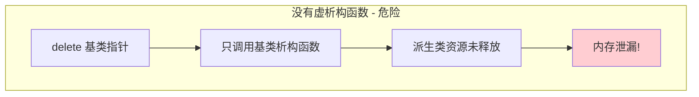
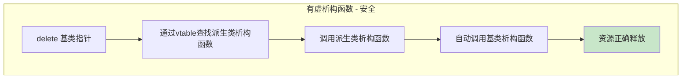
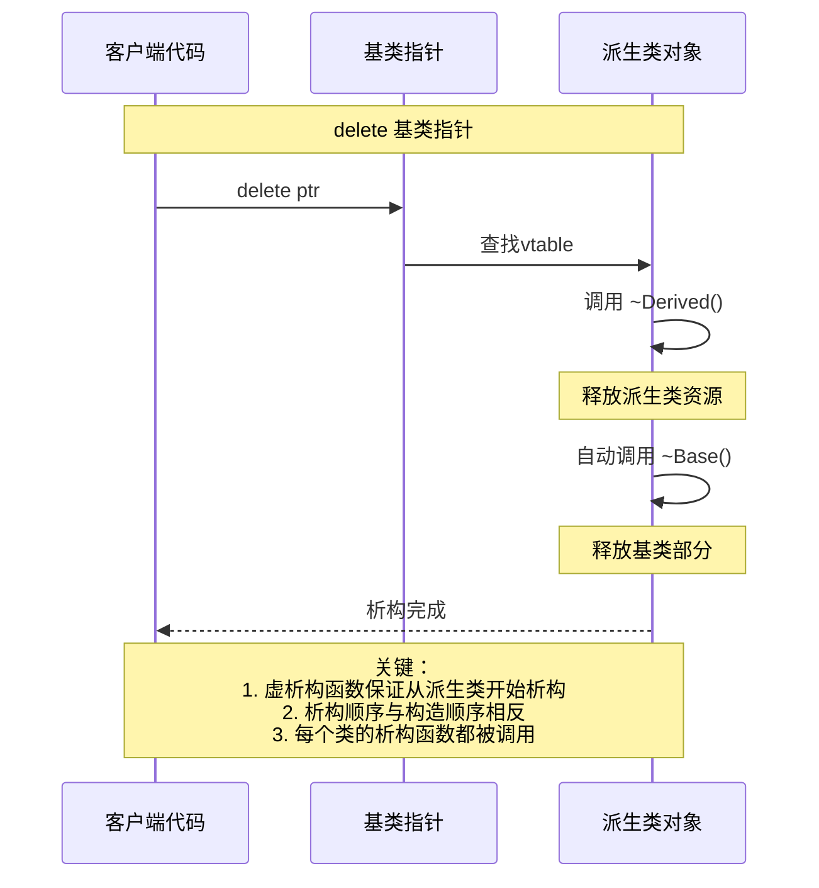
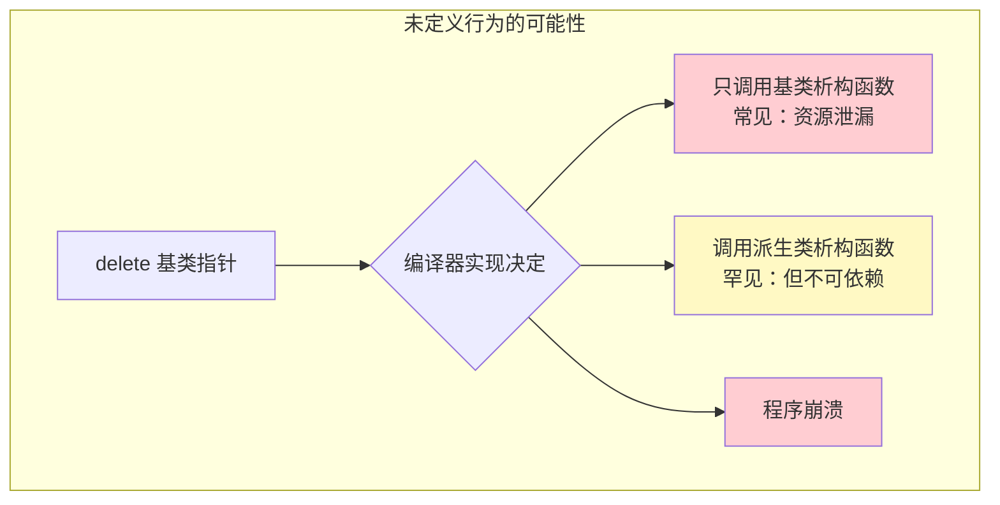
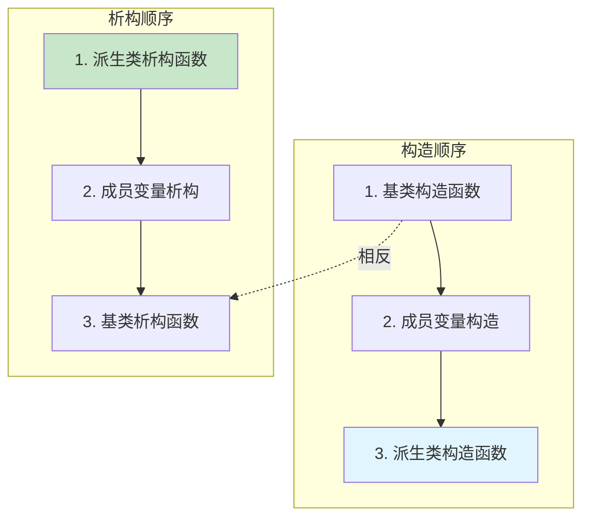

# 3.5 虚析构函数的重要性

> [返回第3章](./ch03-polymorphism.md) | [返回目录](../README.md)

在前面的章节中，我们学习了虚函数和虚函数表的工作原理。本节将聚焦于一个特殊但极其重要的虚函数——**虚析构函数**。

虚析构函数是多态基类设计中不可或缺的一环。忘记将基类析构函数声明为虚函数，是C++中最危险的错误之一，它会导致难以察觉的资源泄漏和未定义行为。

---

## 3.5.1 实现目标

### 问题描述

在涉及继承和多态的场景中，析构函数的设计存在以下问题：

| 问题 | 描述 | 后果 |
|------|------|------|
| **资源泄漏** | 通过基类指针删除派生类对象时，派生类析构函数未被调用 | 内存泄漏、文件句柄泄漏 |
| **未定义行为** | 删除不完整对象是C++标准规定的未定义行为 | 程序崩溃、数据损坏 |
| **难以调试** | 泄漏通常没有明显症状，长时间运行才暴露 | 问题难以定位和修复 |
| **智能指针失效** | 即使使用智能指针，仍需虚析构函数 | `unique_ptr<Base>`也无法正确清理 |

### 期望效果

正确使用虚析构函数可以实现：

1. **完整析构**：确保派生类和基类的析构函数都被正确调用
2. **资源安全**：避免内存泄漏和资源泄漏
3. **多态兼容**：支持通过基类指针/引用安全删除派生类对象
4. **RAII友好**：与现代C++的RAII和智能指针完美配合





---

## 3.5.2 核心原理

### 什么是虚析构函数

**虚析构函数**是用`virtual`关键字声明的析构函数。当基类析构函数是虚函数时，通过基类指针删除派生类对象时，会先调用派生类析构函数，再自动调用基类析构函数。

### 析构函数的调用顺序



### 虚析构函数在vtable中的位置

| vtable偏移 | 内容 | 说明 |
|-----------|------|------|
| 0 | typeinfo指针（RTTI） | 用于类型识别 |
| 1 | 虚析构函数指针 | 指向该类的析构函数 |
| 2~n | 其他虚函数 | 按声明顺序 |

### 纯虚析构函数

**纯虚析构函数**可以将基类变成抽象类，但仍需提供实现：

```cpp
class AbstractBase {
public:
    virtual ~AbstractBase() = 0;  // 纯虚析构函数
};

// 即使是纯虚函数，也必须提供实现！
AbstractBase::~AbstractBase() {
    // 清理基类资源
}
```

---

## 3.5.3 代码示例

### 示例1：忘记虚析构函数的后果

```cpp
#include <iostream>
#include <memory>
#include <cstring>

// ❌ 危险：基类析构函数不是虚函数
class Base {
public:
    int* baseData_;

    Base() : baseData_(new int(100)) {
        std::cout << "Base constructor, allocating baseData_\n";
    }

    ~Base() {  // 不是虚函数！
        std::cout << "Base destructor, freeing baseData_\n";
        delete baseData_;
    }

    virtual void func() {
        std::cout << "Base::func\n";
    }
};

class Derived : public Base {
public:
    char* derivedData_;

    Derived() : Base(), derivedData_(new char[1024]) {
        std::cout << "Derived constructor, allocating derivedData_\n";
        std::memcpy(derivedData_, "Hello, World!", 14);
    }

    ~Derived() {  // 不是虚函数，且不会被调用！
        std::cout << "Derived destructor, freeing derivedData_\n";
        delete[] derivedData_;
    }

    void func() override {
        std::cout << "Derived::func, derivedData=" << derivedData_ << "\n";
    }
};

void testCase1_DirectDelete() {
    std::cout << "=== Case 1: 直接删除派生类指针 ===\n";
    Derived* d = new Derived();
    delete d;  // 正确：调用 ~Derived() 和 ~Base()
    std::cout << "Case 1: 内存已正确释放\n\n";
}

void testCase2_DeleteThroughBasePointer() {
    std::cout << "=== Case 2: 通过基类指针删除（危险！） ===\n";
    Base* b = new Derived();
    delete b;  // 危险！只调用 ~Base()，~Derived() 不会被调用
    std::cout << "Case 2: Derived的内存泄漏了！\n\n";
}

void testCase3_SmartPointerStillNeedsVirtualDtor() {
    std::cout << "=== Case 3: 智能指针仍需虚析构函数 ===\n";
    std::unique_ptr<Base> ptr = std::make_unique<Derived>();
    // 当ptr销毁时，仍只调用 ~Base()！
    std::cout << "Case 3: 即使使用智能指针，Derived的内存仍然泄漏！\n\n";
}

int main() {
    testCase1_DirectDelete();
    testCase2_DeleteThroughBasePointer();
    testCase3_SmartPointerStillNeedsVirtualDtor();

    return 0;
}

/*
输出：
=== Case 1: 直接删除派生类指针 ===
Base constructor, allocating baseData_
Derived constructor, allocating derivedData_
Derived destructor, freeing derivedData_
Base destructor, freeing baseData_
Case 1: 内存已正确释放

=== Case 2: 通过基类指针删除（危险！） ===
Base constructor, allocating baseData_
Derived constructor, allocating derivedData_
Base destructor, freeing baseData_
Case 2: Derived的内存泄漏了！
（derivedData_ 的1024字节内存永远不会被释放）

=== Case 3: 智能指针仍需虚析构函数 ===
Base constructor, allocating baseData_
Derived constructor, allocating derivedData_
Base destructor, freeing baseData_
Case 3: 即使使用智能指针，Derived的内存仍然泄漏！
*/
```

### 示例2：正确的虚析构函数实现

```cpp
#include <iostream>
#include <memory>
#include <cstring>

// ✅ 正确：基类析构函数是虚函数
class Base {
public:
    int* baseData_;

    Base() : baseData_(new int(100)) {
        std::cout << "Base constructor, allocating baseData_\n";
    }

    virtual ~Base() {  // 虚析构函数
        std::cout << "Base destructor, freeing baseData_\n";
        delete baseData_;
    }

    virtual void func() {
        std::cout << "Base::func\n";
    }
};

class Derived : public Base {
public:
    char* derivedData_;

    Derived() : Base(), derivedData_(new char[1024]) {
        std::cout << "Derived constructor, allocating derivedData_\n";
        std::memcpy(derivedData_, "Hello, World!", 14);
    }

    ~Derived() override {  // override关键字（C++11）
        std::cout << "Derived destructor, freeing derivedData_\n";
        delete[] derivedData_;
    }

    void func() override {
        std::cout << "Derived::func, derivedData=" << derivedData_ << "\n";
    }
};

int main() {
    std::cout << "=== 正确使用虚析构函数 ===\n\n";

    std::cout << "场景1：通过基类指针删除\n";
    {
        Base* b = new Derived();
        delete b;  // 现在是安全的！
    }
    // 输出：
    // Base constructor, allocating baseData_
    // Derived constructor, allocating derivedData_
    // Derived destructor, freeing derivedData_
    // Base destructor, freeing baseData_
    // 所有资源都被正确释放

    std::cout << "\n场景2：使用智能指针\n";
    {
        std::unique_ptr<Base> ptr = std::make_unique<Derived>();
        // 智能指针现在也能正确工作
    }
    // 输出：与场景1相同

    std::cout << "\n场景3：多态容器\n";
    {
        std::vector<std::unique_ptr<Base>> objects;
        objects.push_back(std::make_unique<Derived>());
        objects.clear();  // 所有对象被正确析构
    }

    return 0;
}
```

### 示例3：纯虚析构函数

```cpp
#include <iostream>
#include <memory>

// ✅ 抽象基类使用纯虚析构函数
class Shape {
public:
    virtual double area() const = 0;
    virtual double perimeter() const = 0;
    virtual void draw() const = 0;

    // 纯虚析构函数
    virtual ~Shape() = 0;
};

// ⚠️ 即使是纯虚函数，也必须提供实现！
Shape::~Shape() {
    std::cout << "Shape destructor\n";
}

class Circle : public Shape {
    double radius_;

public:
    Circle(double r) : radius_(r) {
        std::cout << "Circle constructor\n";
    }

    ~Circle() override {
        std::cout << "Circle destructor\n";
    }

    double area() const override {
        return 3.14159 * radius_ * radius_;
    }

    double perimeter() const override {
        return 2 * 3.14159 * radius_;
    }

    void draw() const override {
        std::cout << "Drawing Circle, radius=" << radius_ << "\n";
    }
};

int main() {
    std::cout << "=== 纯虚析构函数示例 ===\n\n";

    // Shape shape;  // 编译错误！不能实例化抽象类

    std::unique_ptr<Shape> shape = std::make_unique<Circle>(5.0);
    std::cout << "Area: " << shape->area() << "\n";
    shape->draw();

    // 销毁时自动调用 ~Circle() 和 ~Shape()
    return 0;
}

/*
输出：
Circle constructor
Area: 78.5398
Drawing Circle, radius=5
Circle destructor
Shape destructor
*/
```

### 示例4：虚析构函数与析构顺序

```cpp
#include <iostream>
#include <memory>

class Base {
public:
    int baseResource_;

    Base() : baseResource_(0) {
        std::cout << "Base::Base() - 构造基类部分\n";
    }

    virtual ~Base() {
        std::cout << "Base::~Base() - 析构基类部分, 释放 baseResource_\n";
    }
};

class Middle : public Base {
public:
    int middleResource_;

    Middle() : middleResource_(0) {
        std::cout << "Middle::Middle() - 构造中间类部分\n";
    }

    virtual ~Middle() {
        std::cout << "Middle::~Middle() - 析构中间类部分, 释放 middleResource_\n";
    }
};

class Derived : public Middle {
public:
    int derivedResource_;

    Derived() : derivedResource_(0) {
        std::cout << "Derived::Derived() - 构造派生类部分\n";
    }

    ~Derived() override {
        std::cout << "Derived::~Derived() - 析构派生类部分, 释放 derivedResource_\n";
    }
};

void demonstrateOrder() {
    std::cout << "=== 构造顺序 ===\n";
    Derived* d = new Derived();

    std::cout << "\n=== 析构顺序 ===\n";
    delete d;  // 通过基类指针删除

    /*
    构造顺序：
    1. Base::Base() - 构造基类部分
    2. Middle::Middle() - 构造中间类部分
    3. Derived::Derived() - 构造派生类部分

    析构顺序（与构造相反）：
    3. Derived::~Derived() - 析构派生类部分
    2. Middle::~Middle() - 析构中间类部分
    1. Base::~Base() - 析构基类部分
    */
}

int main() {
    demonstrateOrder();
    return 0;
}
```

### 示例5：虚析构函数的性能开销

```cpp
#include <iostream>
#include <chrono>
#include <vector>

// 有虚析构函数的类
class VirtualDtor {
public:
    int data_;
    VirtualDtor(int d = 0) : data_(d) {}
    virtual ~VirtualDtor() {}
};

// 没有虚析构函数的类
class NonVirtualDtor {
public:
    int data_;
    NonVirtualDtor(int d = 0) : data_(d) {}
    ~NonVirtualDtor() {}
};

constexpr size_t N = 10'000'000;

void benchmarkWithVirtual() {
    auto start = std::chrono::high_resolution_clock::now();
    for (size_t i = 0; i < N; ++i) {
        VirtualDtor* obj = new VirtualDtor(i);
        delete obj;
    }
    auto end = std::chrono::high_resolution_clock::now();
    auto duration = std::chrono::duration_cast<std::chrono::milliseconds>(end - start);
    std::cout << "With virtual dtor: " << duration.count() << "ms\n";
}

void benchmarkWithoutVirtual() {
    auto start = std::chrono::high_resolution_clock::now();
    for (size_t i = 0; i < N; ++i) {
        NonVirtualDtor* obj = new NonVirtualDtor(i);
        delete obj;
    }
    auto end = std::chrono::high_resolution_clock::now();
    auto duration = std::chrono::duration_cast<std::chrono::milliseconds>(end - start);
    std::cout << "Without virtual dtor: " << duration.count() << "ms\n";
}

int main() {
    std::cout << "虚析构函数性能测试 (" << N << " 次分配/释放):\n\n";

    benchmarkWithVirtual();
    benchmarkWithoutVirtual();

    std::cout << "\n说明：虚析构函数的开销主要来自：\n";
    std::cout << "1. vptr存储的空间开销（每个对象+8字节）\n";
    std::cout << "2. 查表的时间开销（可通过内联优化部分抵消）\n";
    std::cout << "3. 对于大多数应用，这个开销是可以接受的\n";

    return 0;
}
```

---

## 3.5.4 深入讲解

### 为什么需要虚析构函数

C++标准规定：通过基类指针删除派生类对象，且基类析构函数不是虚函数时，行为是**未定义的**。

**未定义行为意味着**：
- 程序可能崩溃
- 程序可能运行错误
- 程序可能看似正常但实际有内存泄漏



### 虚析构函数的实现机制

当基类有虚析构函数时：

1. **vtable中包含析构函数指针**
2. **delete表达式执行流程**：
   ```cpp
   Base* ptr = new Derived();
   delete ptr;  // 展开为以下步骤：
   ```
   ```asm
   ; 1. 获取vptr
   mov rax, [ptr]

   ; 2. 查找析构函数指针
   mov rdx, [rax + vtable_offset]

   ; 3. 调用派生类析构函数
   call rdx  ; ~Derived()

   ; 4. ~Derived() 自动调用 ~Base()
   ```

### 析构顺序与RAII

析构顺序与构造顺序相反：



### 纯虚析构函数的特殊规则

```cpp
class AbstractBase {
public:
    virtual ~AbstractBase() = 0;  // 纯虚析构函数
};

// ⚠️ 必须提供函数体！
AbstractBase::~AbstractBase() {
    // 基类资源的清理
}
```

**为什么纯虚析构函数需要实现？**

- 析构派生类时，会自动调用基类析构函数
- 如果没有实现，链接器会报错
- 这与其他纯虚函数不同（它们可以没有实现）

### 虚析构函数与对象大小

```cpp
class NoVirtual {
    int data_;
};  // sizeof = 4

class WithVirtual {
    int data_;
    virtual ~WithVirtual() {}
};  // sizeof = 16 (64位：vptr + 对齐)
```

| 类 | vptr | 成员 | 对齐 | 总大小 |
|---|------|------|------|--------|
| NoVirtual | 0 | 4 | 4 | 4 |
| WithVirtual | 1 | 4 | 8 | 16 |

### default与deleted析构函数

```cpp
// C++11 之后的写法
class Base {
public:
    // 显式默认虚析构函数
    virtual ~Base() = default;

    // 禁用拷贝，但保留移动
    Base(const Base&) = delete;
    Base& operator=(const Base&) = delete;
    Base(Base&&) = default;
    Base& operator=(Base&&) = default;
};
```

---

## 3.5.5 常见陷阱与最佳实践

### 常见陷阱

#### 陷阱1：忘记声明虚析构函数

```cpp
// ❌ 常见错误
class Base {
public:
    virtual void func() {}
    ~Base() {}  // 忘记virtual！
};

// ✅ 正确做法
class Base {
public:
    virtual void func() {}
    virtual ~Base() {}  // 或 virtual ~Base() = default;
};
```

#### 陷阱2：纯虚析构函数忘记提供实现

```cpp
// ❌ 错误：纯虚析构函数没有实现
class Base {
public:
    virtual ~Base() = 0;
};

// 链接错误：undefined reference to `Base::~Base()`

// ✅ 正确：提供实现
class Base {
public:
    virtual ~Base() = 0;
};

Base::~Base() {
    // 清理基类资源
}
```

#### 陷阱3：删除数组时的额外问题

```cpp
// ❌ 危险：通过基类指针删除数组
Base* arr = new Derived[10];
delete arr;  // 未定义行为！只调用第一个元素的析构函数

// ✅ 正确做法1：使用智能指针和标准容器
std::vector<std::unique_ptr<Base>> arr;
arr.emplace_back(new Derived());
// ...

// ✅ 正确做法2：手动析构每个元素
Derived* dArr = new Derived[10];
for (int i = 0; i < 10; ++i) {
    dArr[i].~Derived();  // 显式调用析构函数
}
operator delete[](dArr);  // 释放内存
```

#### 陷阱4：析构函数中抛出异常

```cpp
// ❌ 危险：析构函数抛出异常
class Dangerous {
    ~Dangerous() {
        throw std::runtime_error("Error in destructor");  // 不要这样做！
    }
};

// ✅ 正确：析构函数捕获异常
class Safe {
    ~Safe() noexcept {
        try {
            // 清理操作
        } catch (...) {
            // 记录错误，但不抛出
        }
    }
};

// C++11之后，析构函数默认是noexcept(true)
class Safe {
public:
    ~Safe() noexcept = default;  // 明确指定
};
```

### 最佳实践

#### 1. 多态基类的铁律

```cpp
// ✅ 铁律：如果类有虚函数，析构函数也应该是虚函数
class PolymorphicBase {
public:
    virtual void interface() = 0;
    virtual ~PolymorphicBase() = default;  // 虚析构函数
};
```

#### 2. 使用`= default`简化代码

```cpp
// ✅ C++11：使用默认实现
class Base {
public:
    virtual ~Base() = default;  // 编译器生成最优代码
};
```

#### 3. 析构函数标记为`noexcept`

```cpp
// ✅ 明确表示析构函数不会抛出异常
class Base {
public:
    virtual ~Base() noexcept {
        // 清理操作，保证不抛出异常
    }
};
```

#### 4. 遵循"五法则"（Rule of Five）

```cpp
class ResourceManager {
    void* handle_;
public:
    ResourceManager(const char* name);
    ~ResourceManager();  // 释放资源

    // 禁用拷贝和移动（如果需要）
    ResourceManager(const ResourceManager&) = delete;
    ResourceManager& operator=(const ResourceManager&) = delete;
    ResourceManager(ResourceManager&&) = delete;
    ResourceManager& operator=(ResourceManager&&) = delete;
};
```

#### 5. 工厂模式的正确实现

```cpp
// ✅ 工厂返回基类指针，基类必须有虚析构函数
class IProduct {
public:
    virtual void use() = 0;
    virtual ~IProduct() = default;  // 虚析构函数
};

class ConcreteProduct : public IProduct {
public:
    void use() override { /* ... */ }
};

std::unique_ptr<IProduct> Factory::create(ProductType type) {
    switch (type) {
        case TypeA: return std::make_unique<ProductA>();
        case TypeB: return std::make_unique<ProductB>();
    }
}
```

---

## 3.5.6 思考题

1. 为什么通过基类指针删除派生类对象时，基类析构函数必须是虚函数？
   > 提示：考虑析构函数的调用过程

2. 纯虚析构函数为什么还需要提供函数体？这与普通纯虚函数有什么不同？
   > 提示：考虑析构派生类时的行为

3. 以下代码有什么问题？如何修复？
   ```cpp
   class Base {
   public:
       virtual void func() {}
       ~Base() { std::cout << "Base dtor\n"; }
   };

   Base* ptr = new Derived();
   delete ptr;
   ```

4. 使用智能指针（如`unique_ptr<Base>`）是否就不需要虚析构函数了？
   > 提示：考虑unique_ptr的析构行为

5. 析构顺序与构造顺序有什么关系？RAII是如何利用这一特性的？

---

*上一节：[3.4 虚函数表的内存布局与调用过程](./ch03-04-vtable-layout.md)*
*下一节：[3.6 final与override关键字](./ch03-06-final-override.md)*
