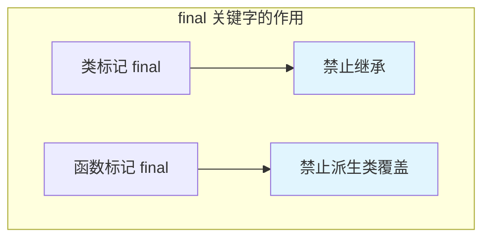
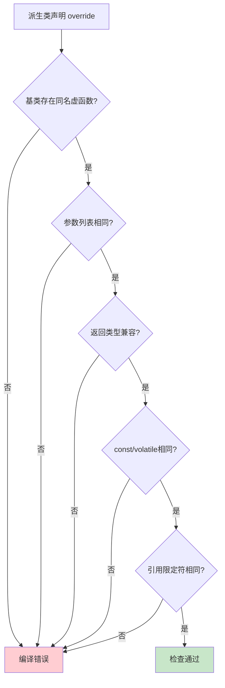
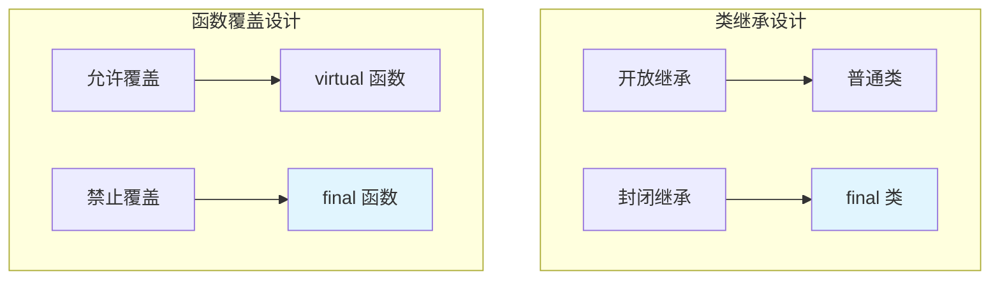

# 3.6 final与override关键字

> [返回第3章](./ch03-polymorphism.md) | [返回目录](../README.md)

在前面几节中，我们学习了虚函数、虚函数表和虚析构函数。本节将介绍C++11引入的两个重要关键字——`final`和`override`，它们专门用于增强虚函数和继承的安全性。

这两个关键字被称为"上下文关键字"（context-sensitive keywords），它们只在特定位置有特殊含义，不会破坏使用这些名称的现有代码。

---

## 3.6.1 实现目标

### 问题描述

在没有`final`和`override`关键字之前，C++的虚函数和继承存在以下问题：

| 问题 | 描述 | 后果 |
|------|------|------|
| **拼写错误** | 派生类虚函数名拼写错误 | 编译器认为是新函数，而不是覆盖 |
| **签名不匹配** | 参数类型或const属性不同 | 隐瞒了重载失败的事实 |
| **基类改动** | 基类修改虚函数签名 | 派生类函数不再覆盖，但编译器不报错 |
| **误继承** | 类被继承但设计上不该被继承 | 违背设计意图，产生难以维护的代码 |
| **误覆盖** | 函数被覆盖但设计上不该被覆盖 | 破坏类的封装性和不变量 |

### 期望效果

正确使用`final`和`override`可以实现：

1. **编译期检查**：让编译器在编译期发现覆盖错误
2. **明确意图**：代码更清晰地表达设计意图
3. **防止误用**：禁止不该发生的继承或覆盖
4. **更好的维护性**：基类修改时，派生类错误会被立即发现




---

## 3.6.2 核心原理

### override 关键字

`override`关键字明确指定一个虚函数意图覆盖基类的虚函数。它放在函数声明的末尾：

```cpp
class Base {
public:
    virtual void func(int x);
};

class Derived : public Base {
public:
    void func(int x) override;  // 明确表示覆盖Base::func
};
```

**`override`的检查规则**：
1. 基类必须有一个同名的虚函数
2. 参数列表必须完全相同
3. 返回类型必须相同或协变
4. 引用修饰符（`&`、`&&`）必须相同
5. const/volatile修饰符必须相同

### final 关键字

`final`关键字可以用于类或虚函数，表示"禁止继承"或"禁止覆盖"：

```cpp
// 用于类：禁止继承
class FinalClass final {  // 错误：不能继承FinalClass
};

// 用于虚函数：禁止覆盖
class Base {
public:
    virtual void func() final;  // 派生类不能覆盖func()
};
```

### 两者对比

| 特性 | override | final |
|------|----------|-------|
| **作用对象** | 虚函数 | 类或虚函数 |
| **目的** | 确保函数覆盖基类虚函数 | 禁止继承或覆盖 |
| **位置** | 函数声明末尾 | 类名后或函数声明末尾 |
| **C++版本** | C++11 | C++11 |
| **主要好处** | 编译期检查覆盖错误 | 封装设计意图 |

### 语法位置

```cpp
class MyClass final : public Base {  // final 在类名后
public:
    virtual void func() override final;  // override 和 final 可以同时使用
    //           ^^^^^^^^ 检查是否覆盖
    //                          ^^^^^ 禁止进一步覆盖
};
```

---

## 3.6.3 代码示例

### 示例1：override 防止拼写错误

```cpp
#include <iostream>

class Base {
public:
    virtual void process() {
        std::cout << "Base::process\n";
    }

    virtual ~Base() = default;
};

// ❌ 错误演示：没有 override，拼写错误不会被发现
class DerivedWrong : public Base {
public:
    void proccess() {  // 拼写错误！process -> proccess
        std::cout << "DerivedWrong::proccess\n";
    }
};

// ✅ 正确做法：使用 override
class DerivedRight : public Base {
public:
    void proccess() override {  // 编译错误！没有 Base::proccess
        std::cout << "DerivedRight::proccess\n";
    }
};

// 编译错误信息：
// error: 'void DerivedRight::proccess()' marked 'override', but does not override
// note:  no function named 'proccess' in 'DerivedRight'

int main() {
    Base* b1 = new DerivedWrong();
    b1->process();  // 输出: Base::process （而不是期望的派生类版本）

    // 使用 override 后，DerivedRight 根本无法编译通过
    // Base* b2 = new DerivedRight();

    return 0;
}
```

### 示例2：override 检查签名匹配

```cpp
#include <iostream>

class Base {
public:
    virtual void process(int x, int y) {
        std::cout << "Base::process(" << x << ", " << y << ")\n";
    }

    virtual void getData() const {
        std::cout << "Base::getData const\n";
    }

    virtual void processRef() & {
        std::cout << "Base::processRef &\n";
    }

    virtual ~Base() = default;
};

// ❌ 错误1：参数类型不同
class Derived1 : public Base {
public:
    void process(int x, double y) override {  // 错误！int vs double
        std::cout << "Derived1::process\n";
    }
};

// ❌ 错误2：缺少 const
class Derived2 : public Base {
public:
    void getData() override {  // 错误！缺少 const
        std::cout << "Derived2::getData\n";
    }
};

// ❌ 错误3：引用限定符不同
class Derived3 : public Base {
public:
    void processRef() && override {  // 错误！& vs &&
        std::cout << "Derived3::processRef\n";
    }
};

// ✅ 正确：签名完全匹配
class DerivedCorrect : public Base {
public:
    void process(int x, int y) override {
        std::cout << "DerivedCorrect::process(" << x << ", " << y << ")\n";
    }

    void getData() const override {
        std::cout << "DerivedCorrect::getData const\n";
    }

    void processRef() & override {
        std::cout << "DerivedCorrect::processRef &\n";
    }
};

int main() {
    DerivedCorrect d;
    d.process(1, 2);     // DerivedCorrect::process(1, 2)
    d.getData();         // DerivedCorrect::getData const
    d.processRef();      // DerivedCorrect::processRef &

    return 0;
}
```

### 示例3：final 禁止继承

```cpp
#include <iostream>

// ✅ 正确：标记类为 final
class Utility final {
public:
    static void helper() {
        std::cout << "Utility::helper\n";
    }
};

// ❌ 错误：无法继承 final 类
// class ExtendedUtility : public Utility {  // 编译错误
// public:
//     void extraMethod();
// };

// 编译错误信息：
// error: cannot derive from 'final' base 'Utility' in derived type 'ExtendedUtility'

// 正确使用：通过组合而非继承
class ExtendedUtility {
    Utility util_;  // 组合
public:
    void helper() {
        util_.helper();  // 委托
    }

    void extraMethod() {
        std::cout << "Extra functionality\n";
    }
};

int main() {
    Utility::helper();  // 直接使用

    ExtendedUtility ext;
    ext.helper();       // 通过组合使用
    ext.extraMethod();

    return 0;
}
```

### 示例4：final 禁止覆盖虚函数

```cpp
#include <iostream>

class Base {
public:
    virtual void criticalFunction() {
        std::cout << "Base::criticalFunction - 核心逻辑\n";
    }

    virtual void flexibleFunction() {
        std::cout << "Base::flexibleFunction - 可覆盖\n";
    }

    virtual ~Base() = default;
};

class Middle : public Base {
public:
    void criticalFunction() override {  // 覆盖基类
        std::cout << "Middle::criticalFunction\n";
        // 一些额外操作
    }

    // ✅ 标记为 final：派生类不能进一步覆盖
    void flexibleFunction() override final {
        std::cout << "Middle::flexibleFunction - 不允许再覆盖\n";
    }
};

class Derived : public Middle {
public:
    // ❌ 错误：不能覆盖 final 函数
    // void flexibleFunction() override {
    //     std::cout << "Derived::flexibleFunction\n";
    // }

    // 编译错误信息：
    // error: virtual function 'virtual void Derived::flexibleFunction()'
    // error: overriding final function 'virtual void Middle::flexibleFunction()'

    // ✅ 可以覆盖非 final 函数
    void criticalFunction() override {
        std::cout << "Derived::criticalFunction\n";
        Middle::criticalFunction();  // 调用中间层版本
    }
};

int main() {
    Derived d;
    d.criticalFunction();
    d.flexibleFunction();  // 调用 Middle::flexibleFunction

    return 0;
}
```

### 示例5：override 和 final 同时使用

```cpp
#include <iostream>
#include <memory>

class Interface {
public:
    virtual void execute() = 0;
    virtual void configure() = 0;
    virtual ~Interface() = default;
};

class Implementation : public Interface {
public:
    void execute() override final {
        std::cout << "Implementation::execute - 最终实现\n";
    }

    void configure() override {
        std::cout << "Implementation::configure\n";
    }
};

class OptimizedImplementation : public Implementation {
public:
    // ❌ 错误：不能覆盖 final 函数
    // void execute() override {
    //     std::cout << "Optimized version\n";
    // }

    // ✅ 可以覆盖非 final 函数
    void configure() override {
        std::cout << "OptimizedImplementation::configure\n";
        Implementation::configure();
    }
};

// 完全禁止继承的类
class FinalImplementation final : public Interface {
public:
    void execute() override {
        std::cout << "FinalImplementation::execute\n";
    }

    void configure() override {
        std::cout << "FinalImplementation::configure\n";
    }
};

// ❌ 错误：不能继承 final 类
// class ExtendedFinal : public FinalImplementation { };

int main() {
    std::unique_ptr<Interface> impl = std::make_unique<OptimizedImplementation>();
    impl->execute();    // Implementation::execute
    impl->configure();  // OptimizedImplementation::configure

    std::unique_ptr<Interface> finalImpl = std::make_unique<FinalImplementation>();
    finalImpl->execute();

    return 0;
}
```

### 示例6：协变返回类型与 override

```cpp
#include <iostream>
#include <memory>

class Base {
public:
    virtual Base* clone() {
        std::cout << "Base::clone\n";
        return new Base(*this);
    }

    virtual ~Base() = default;
};

class Derived : public Base {
public:
    // ✅ 协变返回类型：允许返回 Derived* 覆盖 Base*
    Derived* clone() override {
        std::cout << "Derived::clone\n";
        return new Derived(*this);
    }
};

// 更实用的例子
class Animal {
public:
    virtual Animal* create() {
        std::cout << "Creating generic animal\n";
        return new Animal();
    }

    virtual ~Animal() = default;
};

class Dog : public Animal {
public:
    // 协变返回：返回更具体的类型
    Dog* create() override {
        std::cout << "Creating dog\n";
        return new Dog();
    }

    void bark() {
        std::cout << "Woof!\n";
    }
};

int main() {
    Dog d;
    Animal* a = &d;

    Animal* clonedAnimal = a->create();  // 返回 Animal*
    Dog* specificDog = dynamic_cast<Dog*>(clonedAnimal);
    if (specificDog) {
        specificDog->bark();
    }

    // 使用 Dog 指针时，可以直接得到 Dog*
    Dog dog;
    Dog* clonedDog = dog.create();  // 返回 Dog*，不需要转换
    clonedDog->bark();

    return 0;
}
```

---

## 3.6.4 深入讲解

### override 的编译期检查机制

`override`关键字让编译器执行严格的覆盖检查：



### final 的设计哲学

`final`关键字体现了"按意图编程"的理念：



### 虚函数表与 final/override

```cpp
class Base {
public:
    virtual void func1();
    virtual void func2() final;
    virtual void func3();
};

class Derived : public Base {
public:
    void func1() override;  // 正常覆盖
    // void func2() override;  // 错误：func2 是 final
    void func3() override;  // 正常覆盖
};
```

**vtable 布局**（final 不影响 vtable 结构）：

| Base vtable | Derived vtable |
|-------------|----------------|
| typeinfo | typeinfo |
| &Base::func1 | &Derived::func1 |
| &Base::func2 | &Base::func2（继承） |
| &Base::func3 | &Derived::func3 |

### final 与内联优化

标记为`final`的函数可能获得更好的优化机会：

```cpp
class Base {
public:
    virtual void process() { /* ... */ }
};

class Derived : public Base {
public:
    void process() override final { /* ... */ }
};

// 由于知道 process 是 final，编译器可以：
// 1. 消除虚函数调用开销（在某些情况下）
// 2. 更激进地进行内联优化
void useDerived(Derived* d) {
    d->process();  // 可能被内联，因为编译器知道没有进一步覆盖
}
```

### override 与析构函数

```cpp
class Base {
public:
    virtual ~Base() { /* ... */ }
};

class Derived : public Base {
public:
    ~Derived() override { /* ... */ }  // 明确表示覆盖
};

// 或者使用 default
class Derived2 : public Base {
public:
    ~Derived2() override = default;  // 明确表示使用默认实现
};
```

### 模板类中的 override

```cpp
template<typename T>
class Base {
public:
    virtual void process(T value) {
        std::cout << "Base::process: " << value << "\n";
    }

    virtual ~Base() = default;
};

template<typename T>
class Derived : public Base<T> {
public:
    void process(T value) override {
        std::cout << "Derived::process: " << value << "\n";
    }
};

int main() {
    Derived<int> d;
    d.process(42);  // Derived::process: 42

    return 0;
}
```

---

## 3.6.5 常见陷阱与最佳实践

### 常见陷阱

#### 陷阱1：忘记使用 override

```cpp
// ❌ 常见错误：不使用 override
class Derived : public Base {
public:
    void func(int x);  // 想覆盖但拼写错了，编译器不会发现
};

// ✅ 正确：始终使用 override
class Derived : public Base {
public:
    void func(int x) override;  // 拼写错误会立即被发现
};
```

#### 陷阱2：错误地认为 override 代替 virtual

```cpp
// ❌ 错误理解：override 不代替 virtual
class Base {
public:
    void func() override;  // 错误！Base 不是派生类
};

// ✅ 正确：基类使用 virtual，派生类使用 override
class Base {
public:
    virtual void func();
};

class Derived : public Base {
public:
    void func() override;
};
```

#### 陷阱3：final 类中的虚函数

```cpp
// ❌ 不必要的虚函数：final 类中不需要虚函数（除非用于多态容器）
class FinalClass final {
public:
    virtual void func();  // 没有意义，类不能被继承
};

// ✅ 如果不需要多态，去掉 virtual
class FinalClass final {
public:
    void func();  // 普通成员函数
};

// ✅ 如果需要放入基类指针容器
class FinalClass final : public Base {
public:
    void func() override;  // 覆盖基类虚函数
};
```

#### 陷阱4：override 和 ref-qualifier 混淆

```cpp
class Base {
public:
    virtual void func() &;   // 左值版本
    virtual void func() &&;  // 右值版本
};

class Derived : public Base {
public:
    void func() & override;   // 覆盖左值版本
    void func() && override;  // 覆盖右值版本
};

// ❌ 错误：混淆引用限定符
class DerivedWrong : public Base {
public:
    void func() override;  // 错误！没有指定引用限定符
};
```

### 最佳实践

#### 1. 始终在派生类虚函数中使用 override

```cpp
// ✅ 规则：只要意图覆盖，就写 override
class Derived : public Base {
public:
    void func() override;
    void another() override;
    ~Derived() override;
};
```

#### 2. 在设计上不允许覆盖时使用 final

```cpp
// ✅ 场景1：保护核心逻辑不被修改
class SecureBase {
public:
    virtual void customizable() { /* 可覆盖 */ }
    virtual void critical() final { /* 不可覆盖 */ }
};

// ✅ 场景2：工具类禁止继承
class MathUtils final {
public:
    static int add(int a, int b) { return a + b; }
};
```

#### 3. 在析构函数中使用 override

```cpp
// ✅ 明确表示析构函数覆盖基类
class Derived : public Base {
public:
    ~Derived() override = default;
    // 或
    ~Derived() override { /* 清理 */ }
};
```

#### 4. 组合使用 override 和 final

```cpp
// ✅ 确保覆盖基类，同时禁止进一步覆盖
class Middle : public Base {
public:
    void func() override final;
};
```

#### 5. 使用 override 发现基类接口变化

```cpp
// 基类被修改
class Base {
public:
    // virtual void process(int x);  // 旧版本
    virtual void process(int x, int y = 0);  // 新版本：增加参数
};

// 派生类会立即报错
class Derived : public Base {
public:
    // void process(int x) override;  // 编译错误！签名不匹配
    void process(int x, int y) override;  // 必须更新
};
```

---

## 3.6.6 思考题

1. `override`关键字是否代替了`virtual`关键字？两者有什么区别？
   > 提示：考虑在基类和派生类中的使用

2. 为什么`final`类中仍然可以有虚函数？这在什么场景下有用？
   > 提示：考虑多态容器和统一接口

3. 以下代码有什么问题？
   ```cpp
   class Base {
   public:
       virtual void func(int x);
   };

   class Derived : public Base {
   public:
       void func(double x) override;
   };
   ```

4. `override`和`final`可以同时使用吗？这种组合有什么意义？
   > 提示：考虑继承链中间的类

5. 协变返回类型与`override`有什么关系？
   > 提示：考虑返回类型的变化规则

---

*上一节：[3.5 虚析构函数的重要性](./ch03-05-virtual-dtor.md)*