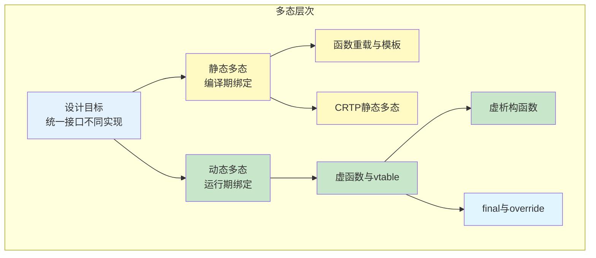
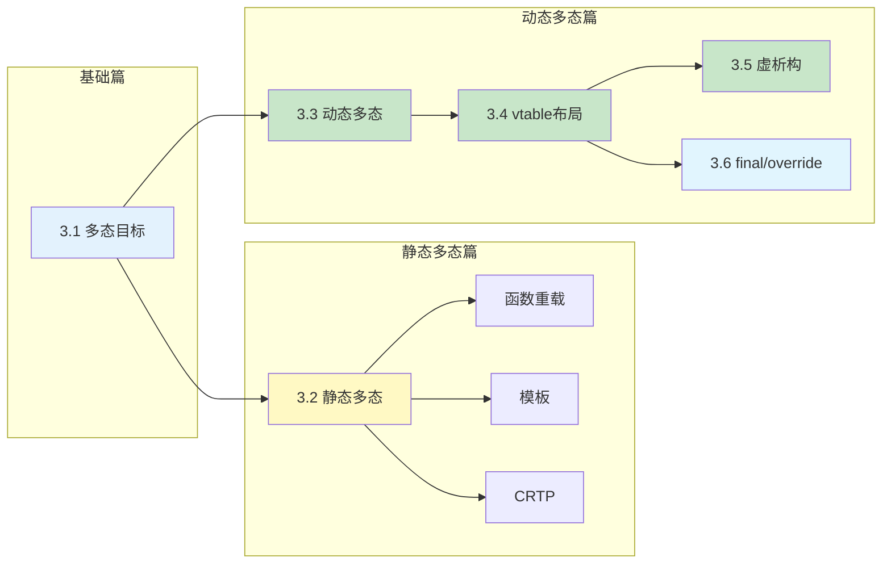
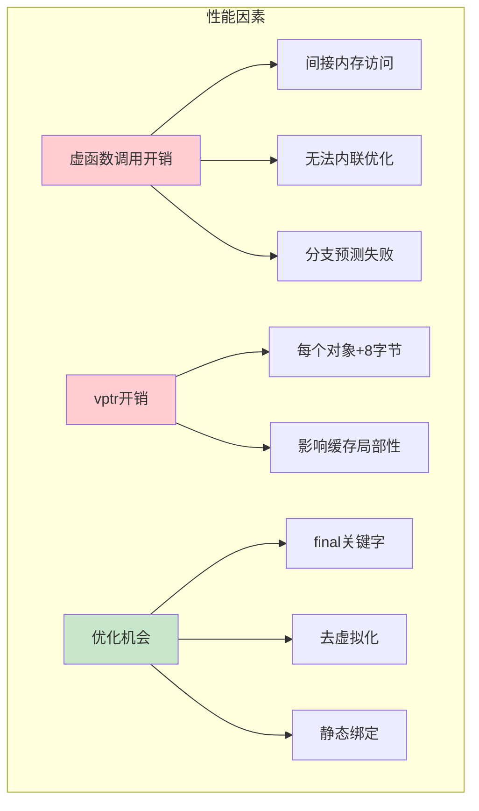

# 第3章 多态 —— 接口抽象与行为扩展

> [返回目录](../README.md)

## 本章概述

多态是面向对象编程的三大特性之一，也是最具魔力的特性。它允许**统一的接口调用**产生**不同的行为**，让继承层次真正"活"起来。

如果说封装隐藏了实现细节，继承建立了类型层次那么多态就是让这些类型能够**各司其职**的机制——通过统一的接口操作不同的对象，实现代码的灵活性和可扩展性。

C++支持两种多态：**静态多态**（编译期确定）和**动态多态**（运行期确定）。本章将深入探索这两种多态机制的实现原理、应用场景和性能特点。

在本章中，我们将深入探索多态在现代C++中的实现原理：

- 从**设计目标**出发：理解多态要解决什么问题
- 到**静态多态**：函数重载、模板、CRTP的编译期多态
- 再到**动态多态**：虚函数和虚函数表的运行期多态
- 然后是**内存布局**：揭示虚函数表的底层实现
- 接着是**虚析构函数**：多态场景下的资源管理
- 最后是**安全增强**：final与override关键字的应用

## 本章小节

- [3.1 多态的目标：统一接口，不同实现](./ch03-01-polymorphism-goal.md)
  - 问题描述：类型分支泛滥、扩展困难
  - 核心原理：静态多态vs动态多态、多态的运作机制
  - 代码示例：未使用多态vs使用多态、图形绘制系统
  - 常见陷阱：对象切片、构造/析构中调用虚函数

- [3.2 静态多态：函数重载与模板](./ch03-02-static-polymorphism.md)
  - 函数重载的解析规则
  - 函数模板与类模板
  - CRTP（奇异递归模板模式）
  - 静态多态的性能优势

- [3.3 动态多态：虚函数与虚表](./ch03-03-dynamic-polymorphism.md)
  - 虚函数的声明与使用
  - 虚函数表（vtable）和虚表指针（vptr）
  - 纯虚函数与抽象类
  - 动态多态的性能分析

- [3.4 虚函数表的内存布局与调用过程](./ch03-04-vtable-layout.md)
  - 单继承的vtable布局
  - 多继承的vtable布局
  - 虚继承的vtable布局
  - 汇编层面的虚函数调用

- [3.5 虚析构函数的重要性](./ch03-05-virtual-dtor.md)
  - 忘记虚析构函数的后果
  - 虚析构函数的实现机制
  - 析构顺序与RAII
  - 纯虚析构函数的特殊规则

- [3.6 final与override关键字](./ch03-06-final-override.md)
  - override关键字的编译期检查
  - final关键字防止继承和覆盖
  - 协变返回类型与override
  - 最佳实践与常见陷阱

## 学习目标

通过本章学习，你将能够：

| 目标 | 对应小节 |
|-----|---------|
| 理解多态的设计目标和价值 | 3.1 |
| 掌握静态多态的实现机制和应用场景 | 3.2 |
| 深入理解虚函数和虚函数表的工作原理 | 3.3, 3.4 |
| 理解虚析构函数的必要性 | 3.5 |
| 熟练使用final和override关键字 | 3.6 |
| 在静态多态和动态多态之间做出正确选择 | 3.2, 3.3 |
| 编写类型安全、高性能的多态代码 | 全章 |

## 章节关系图

## 核心要点速查

| 概念 | 关键要点 |
|-----|---------|
| **多态** | 统一接口产生不同行为，是OOP的核心特性 |
| **静态多态** | 编译期确定调用目标，零开销，包括重载、模板、CRTP |
| **动态多态** | 运行期确定调用目标，通过虚函数表实现 |
| **虚函数表(vtable)** | 每个多态类一个，存储虚函数地址，编译期生成 |
| **虚表指针(vptr)** | 每个对象一个，指向该类的vtable |
| **对象切片** | 按值传递派生类对象时，派生类部分被切掉 |
| **虚析构函数** | 多态基类必须声明虚析构函数，否则资源泄漏 |
| **override** | 确保函数覆盖基类虚函数，编译期检查 |
| **final** | 禁止类被继承或函数被覆盖 |

## 静态多态 vs 动态多态

| 特性 | 静态多态 | 动态多态 |
|------|---------|---------|
| **绑定时机** | 编译期 | 运行期 |
| **实现方式** | 函数重载、模板、CRTP | 虚函数、虚函数表 |
| **性能开销** | 零开销（可内联） | 虚函数调用开销 |
| **类型安全** | 完全编译期检查 | 运行期类型检查 |
| **代码膨胀** | 模板实例化导致较大 | 较小 |
| **灵活性** | 需要知道所有类型 | 可添加新类型 |
| **典型应用** | STL算法、高性能计算 | 插件系统、框架设计 |

## 多态的性能考量

## 多态与设计模式

多态是许多设计模式的基础：

| 设计模式 | 多态的作用 | 典型场景 |
|---------|-----------|---------|
| **策略模式** | 不同策略实现同一接口 | 排序算法、压缩算法 |
| **工厂模式** | 根据类型创建不同产品 | 对象创建解耦 |
| **观察者模式** | 不同观察者响应同一事件 | 事件驱动系统 |
| **模板方法** | 基类定义骨架，派生类实现步骤 | 算法框架 |
| **命令模式** | 不同命令封装为对象 | 撤销/重做 |
| **访问者模式** | 对不同类型执行不同操作 | 编译器、解释器 |

## 本章思考题

1. 静态多态和动态多态分别在什么场景下使用？如何权衡性能与灵活性？
2. 虚函数调用比普通函数调用慢多少？为什么？有哪些优化机会？
3. 为什么多态基类的析构函数必须是虚函数？不声明会有什么后果？
4. 对象切片是如何发生的？在多态场景下如何避免？
5. override关键字如何帮助我们写出更安全的代码？final关键字有什么设计意义？
6. CRTP实现的静态多态与虚函数实现的动态多态有什么本质区别？
7. 在什么情况下应该选择组合而非继承来实现多态行为？

---

*上一章：[第2章 继承 —— 代码复用与层次设计](../ch02/ch02-inheritance.md)*
*下一章：[第4章 线程基础与原子操作](ch04/ch04-thread-atomic.md)*