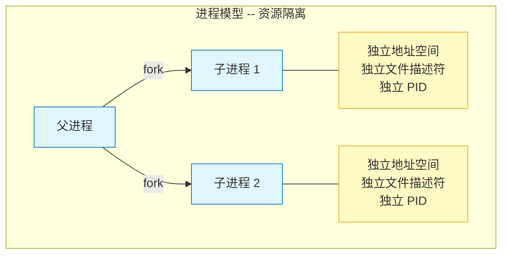
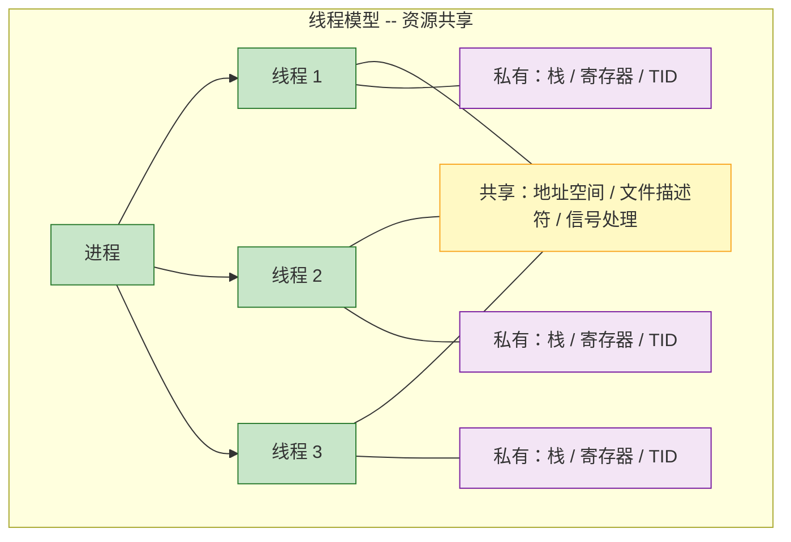
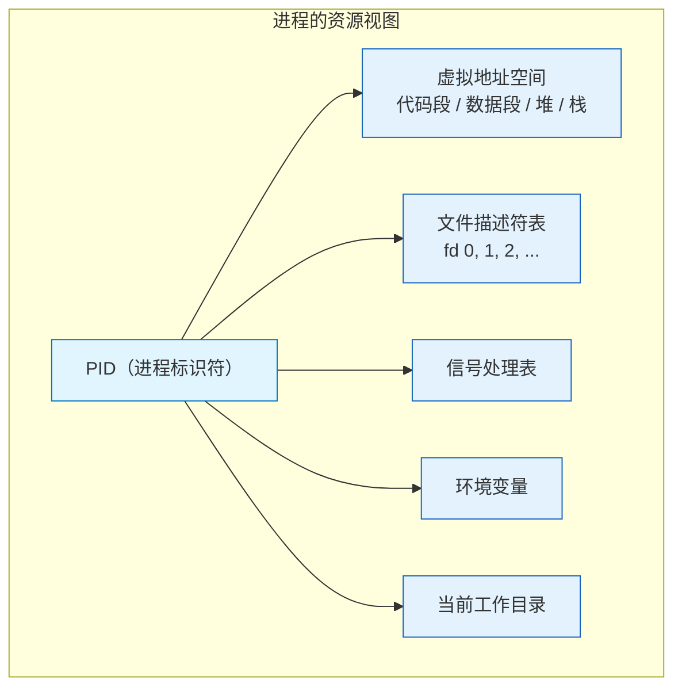
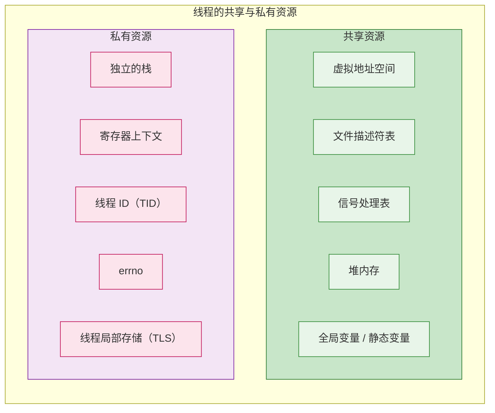
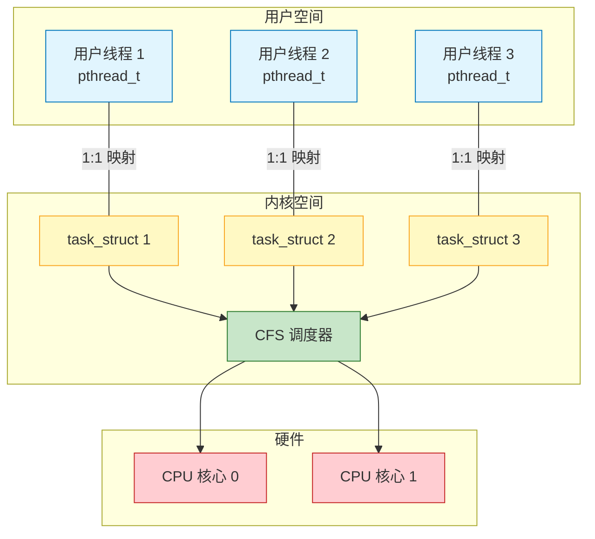
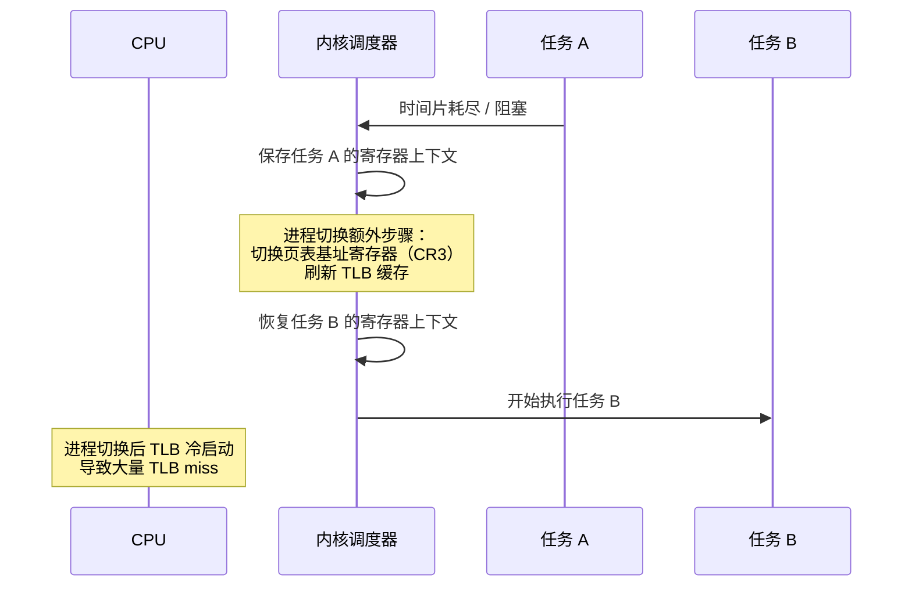
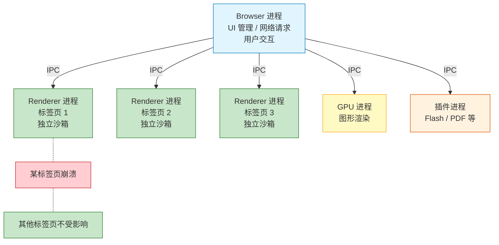

# 4.1 进程 vs 线程：资源与调度的差异

> [返回第4章](./ch04-thread-atomic.md) | [返回目录](../README.md)

在前三章中，我们围绕封装、继承和多态，深入探讨了 C++ 面向对象编程的核心机制。从本章开始，我们进入系统编程的另一个关键领域——**并发编程**。并发编程的基础是理解操作系统提供的两种执行抽象：**进程（Process）**和**线程（Thread）**。

进程和线程是操作系统中最基本的调度与资源管理单元。理解二者的区别与联系，不仅是编写正确并发程序的前提，更是理解后续章节中互斥锁、原子操作、无锁数据结构等高级主题的基石。本节将通过代码实验和内核原理分析，揭示进程与线程在资源隔离、创建开销、上下文切换等方面的本质差异。

---

## 4.1.1 实现目标

### 问题描述

在实际开发中，我们经常面临"选择进程还是线程"的设计决策：

| 场景 | 需求 | 挑战 |
|------|------|------|
| **Web 服务器** | 同时处理数千个客户端连接 | 需要高并发、低开销，但要保证请求之间互不干扰 |
| **视频播放器** | 同时进行解码、渲染、音频播放 | 多个任务需要共享同一份视频数据，但各自独立执行 |
| **数据处理** | 将大规模计算任务拆分到多个 CPU 核心 | 子任务需要高效通信和数据共享，避免序列化瓶颈 |
| **GUI 应用** | UI 渲染和后台任务互不阻塞 | 后台任务崩溃不应导致整个应用退出 |

### 期望效果

进程模型和线程模型在资源组织方式上有本质区别：





通过本节学习，我们将达成以下目标：

1. **理解进程的资源隔离机制**：掌握 `fork()` 创建子进程后，父子进程各自拥有独立的地址空间副本（Copy-on-Write）
2. **理解线程的资源共享模型**：掌握同一进程内的线程共享地址空间、文件描述符等资源，同时各自拥有独立的栈和寄存器
3. **量化创建与切换开销**：通过基准测试对比进程与线程的创建开销差异
4. **建立选型直觉**：根据故障隔离、通信效率、可扩展性等维度，在实际项目中做出合理选择

---

## 4.1.2 核心原理

### 进程：资源分配的基本单位

**进程（Process）** 是操作系统进行资源分配和保护的基本单位。每个进程拥有独立的地址空间、文件描述符表、信号处理表等系统资源。



在 Linux 内核中，每个进程由一个 `task_struct` 结构体描述。这个结构体是内核调度的核心数据结构，包含了进程的所有信息：PID、状态、调度优先级、内存映射（`mm_struct`）、文件系统信息（`fs_struct`）、打开文件表（`files_struct`）等。当调用 `fork()` 创建子进程时，内核会为子进程分配一个新的 `task_struct`，并复制（或通过 Copy-on-Write 延迟复制）父进程的地址空间。

### 线程：调度执行的基本单位

**线程（Thread）** 是操作系统进行 CPU 调度的基本单位。同一进程内的多个线程共享该进程的地址空间和大部分系统资源，但每个线程拥有自己独立的执行上下文。



### Linux 的 clone() 系统调用

在 Linux 中，进程和线程的创建底层都依赖 `clone()` 系统调用。`clone()` 通过一组标志位来精确控制父子任务之间共享哪些资源：

| 标志位 | 含义 | 设置时效果 |
|--------|------|-----------|
| `CLONE_VM` | 共享虚拟内存 | 父子共享同一地址空间（线程行为） |
| `CLONE_FS` | 共享文件系统信息 | 共享根目录、当前工作目录、umask |
| `CLONE_FILES` | 共享文件描述符表 | 共享打开的文件描述符 |
| `CLONE_SIGHAND` | 共享信号处理表 | 共享信号处理函数的注册 |
| `CLONE_THREAD` | 同一线程组 | 共享 PID，使用 TID 区分，属于同一进程 |

- **fork()** 的底层实现：调用 `clone()` 时不设置上述共享标志，因此子进程获得独立的地址空间、文件描述符表等所有资源的副本。
- **pthread_create()** 的底层实现：调用 `clone()` 时设置 `CLONE_VM | CLONE_FS | CLONE_FILES | CLONE_SIGHAND | CLONE_THREAD` 等标志，使新线程与调用者共享几乎所有资源。

### 进程 vs 线程：全面对比

| 维度 | 进程 | 线程 |
|------|------|------|
| **资源分配** | 独立的地址空间、文件描述符表等 | 共享进程的地址空间和大部分资源 |
| **创建开销** | 较高（需复制页表等内核数据结构） | 较低（仅需分配栈和少量元数据） |
| **切换开销** | 较高（需切换地址空间、刷新 TLB） | 较低（同进程内切换无需刷新 TLB） |
| **通信方式** | 需要 IPC（管道、共享内存、socket 等） | 直接读写共享变量（需同步保护） |
| **故障隔离** | 强隔离，子进程崩溃不影响父进程 | 弱隔离，一个线程崩溃整个进程终止 |
| **数据安全** | 天然隔离，无需额外同步 | 共享数据需要互斥锁或原子操作保护 |
| **可扩展性** | 可利用多机分布式部署 | 受限于单机（同一进程地址空间内） |
| **适用场景** | 需要强隔离的服务（如浏览器多标签页） | 需要高效数据共享的计算密集型任务 |

---

## 4.1.3 代码示例

### 示例 1：fork() 创建子进程 -- 地址空间隔离

```cpp
// code/ch04/04_01a_fork_demo.cpp
// 04_01a_fork_demo.cpp — fork() 创建子进程，演示 Copy-on-Write 地址空间隔离
#include <iostream>
#include <unistd.h>
#include <sys/wait.h>

int globalVar = 100;

int main() {
    int localVar = 200;

    std::cout << "=== 进程创建与资源隔离 ===" << std::endl;
    std::cout << "父进程 PID: " << getpid() << std::endl;
    std::cout << std::endl;

    pid_t pid = fork();

    if (pid < 0) {
        std::cerr << "fork() 失败" << std::endl;
        return 1;
    }

    if (pid == 0) {
        // 子进程
        globalVar = 999;
        localVar = 888;
        std::cout << "[子进程] PID: " << getpid()
                  << ", 父进程PID: " << getppid() << std::endl;
        std::cout << "[子进程] globalVar = " << globalVar
                  << " (地址: 0x" << std::hex
                  << reinterpret_cast<uintptr_t>(&globalVar) << ")" << std::endl;
        std::cout << "[子进程] localVar = " << std::dec << localVar
                  << " (地址: 0x" << std::hex
                  << reinterpret_cast<uintptr_t>(&localVar) << ")" << std::endl;
        _exit(0);
    }

    // 父进程
    int status;
    waitpid(pid, &status, 0);

    std::cout << std::endl;
    std::cout << "[父进程] 子进程退出后：" << std::endl;
    std::cout << "[父进程] globalVar = " << globalVar
              << " (地址: 0x" << std::hex
              << reinterpret_cast<uintptr_t>(&globalVar) << ")" << std::endl;
    std::cout << "[父进程] localVar = " << std::dec << localVar
              << " (地址: 0x" << std::hex
              << reinterpret_cast<uintptr_t>(&localVar) << ")" << std::endl;
    std::cout << "[父进程] 变量未被子进程修改 ── 地址空间隔离！" << std::endl;

    return 0;
}
```

> 📁 完整代码：[code/ch04/04_01a_fork_demo.cpp](../code/ch04/04_01a_fork_demo.cpp)

**关键观察：**

- `fork()` 之后，父子进程拥有**相同的虚拟地址**，但映射到**不同的物理页面**（Copy-on-Write）。因此子进程打印的变量地址与父进程相同，但修改操作互不影响。
- 子进程将 `globalVar` 修改为 999、`localVar` 修改为 888，但父进程中这两个变量仍然是 100 和 200——这就是地址空间隔离的直观体现。
- 子进程使用 `_exit(0)` 而非 `exit(0)` 退出，这是因为 `exit()` 会执行 `atexit` 注册的清理函数和冲刷 `stdio` 缓冲区，在多进程场景下可能导致重复输出。

### 示例 2：std::thread 共享全局变量

```cpp
// code/ch04/04_01b_thread_share.cpp
// 04_01b_thread_share.cpp — std::thread 共享全局变量演示
#include <iostream>
#include <thread>

int sharedVar = 100;

void threadFunc(int id) {
    std::cout << "[线程 " << id << "] sharedVar 地址: 0x"
              << std::hex << reinterpret_cast<uintptr_t>(&sharedVar)
              << std::dec << std::endl;
    sharedVar += id * 10;
    std::cout << "[线程 " << id << "] sharedVar += " << id * 10
              << " → " << sharedVar << std::endl;
}

int main() {
    std::cout << "=== 线程共享地址空间 ===" << std::endl;
    std::cout << "主线程 sharedVar = " << sharedVar << std::endl;

    std::thread t1(threadFunc, 1);
    std::thread t2(threadFunc, 2);

    t1.join();
    t2.join();

    std::cout << "主线程 sharedVar = " << sharedVar << std::endl;

    return 0;
}
// 注意：本示例存在数据竞争（data race）。两个线程同时读写 sharedVar
// 而没有任何同步机制（如 mutex 或 atomic），在实际生产代码中这是未定义行为。
```

> 📁 完整代码：[code/ch04/04_01b_thread_share.cpp](../code/ch04/04_01b_thread_share.cpp)

**关键观察：**

- 所有线程打印的 `sharedVar` 地址**完全相同**，证明它们确实共享同一个地址空间。
- 两个线程对 `sharedVar` 的修改都会反映到主线程中——最终值可能是 130（如果串行执行 `+10` 再 `+20`），但由于没有同步机制，实际结果是不确定的。
- 这个示例故意展示了**数据竞争（data race）**。在后续章节中，我们将学习如何使用 `std::mutex`（第5章）和 `std::atomic`（4.4 节）来解决这个问题。
- 与 `fork()` 的隔离形成鲜明对比：线程模型中，共享数据带来了便利，但也带来了同步的责任。

### 示例 3：进程 vs 线程创建开销对比

```cpp
// code/ch04/04_01c_overhead_compare.cpp
// 04_01c_overhead_compare.cpp — 进程 vs 线程创建开销对比
#include <iostream>
#include <vector>
#include <thread>
#include <chrono>
#include <unistd.h>
#include <sys/wait.h>

int main() {
    const int COUNT = 1000;

    std::cout << "=== 进程 vs 线程 创建开销对比 ===" << std::endl;
    std::cout << "创建数量: " << COUNT << std::endl;

    // 线程基准测试
    {
        auto start = std::chrono::high_resolution_clock::now();

        std::vector<std::thread> threads;
        threads.reserve(COUNT);
        for (int i = 0; i < COUNT; ++i) {
            threads.emplace_back([]() {});
        }
        for (auto& t : threads) {
            t.join();
        }

        auto end = std::chrono::high_resolution_clock::now();
        auto ms = std::chrono::duration_cast<std::chrono::milliseconds>(end - start).count();
        std::cout << "线程创建+回收: " << ms << " ms" << std::endl;
    }

    // 进程基准测试
    {
        auto start = std::chrono::high_resolution_clock::now();

        for (int i = 0; i < COUNT; ++i) {
            pid_t pid = fork();
            if (pid < 0) {
                std::cerr << "fork() 失败" << std::endl;
                return 1;
            }
            if (pid == 0) {
                _exit(0);
            }
            waitpid(pid, nullptr, 0);
        }

        auto end = std::chrono::high_resolution_clock::now();
        auto ms = std::chrono::duration_cast<std::chrono::milliseconds>(end - start).count();
        std::cout << "进程创建+回收: " << ms << " ms" << std::endl;
    }

    return 0;
}
```

> 📁 完整代码：[code/ch04/04_01c_overhead_compare.cpp](../code/ch04/04_01c_overhead_compare.cpp)

**关键观察：**

- 在典型的 Linux 系统上，创建 1000 个线程的耗时通常在 **20-50 ms** 左右，而创建 1000 个进程的耗时通常在 **200-500 ms** 以上，线程创建开销大约是进程的 **1/5 到 1/10**。
- 线程创建开销低的原因：线程只需要分配一个新的栈空间和内核中的 `task_struct`，不需要复制页表和其他内核数据结构。
- 进程创建虽然使用了 Copy-on-Write 优化（不会立即复制物理页面），但仍需复制页表项、`vm_area_struct` 链表等内核元数据，开销显著高于线程。
- 注意：进程测试采用串行的 fork-wait 模式，线程测试采用批量创建后批量 join 的模式，这是因为进程模型天然适合独立运行，而线程通常需要协调。

---

## 4.1.4 深入讲解

### Linux 1:1 线程模型

Linux 采用 **1:1 线程模型**，即每个用户态线程（POSIX 线程）对应一个内核态的 `task_struct`。这意味着线程的调度完全由内核完成，能够充分利用多核 CPU。



Linux 的 `NPTL`（Native POSIX Threads Library）实现了这种 1:1 模型。与早期的 M:N 线程模型或用户态线程库（如 GNU Pth）相比，1:1 模型的优势在于：内核感知每个线程的存在，可以对其独立调度，不会因为一个线程执行阻塞系统调用而影响同进程的其他线程。

### 进程地址空间布局

每个进程拥有独立的虚拟地址空间，其典型布局如下（以 64 位 Linux 为例）：


### 多线程栈分布

在多线程程序中，主线程使用进程的默认栈，而每个新建线程由 `pthread_create` 通过 `mmap` 在内存映射区分配一个独立的栈（默认大小通常为 8 MB）。各线程的栈之间没有保护页（或只有一个 guard page），栈溢出可能导致难以调试的内存破坏。


### 上下文切换开销分析

上下文切换（Context Switch）是操作系统将 CPU 从一个任务切换到另一个任务的过程。进程切换和线程切换的开销有显著差异：



| 切换类型 | 操作内容 | 典型耗时 |
|---------|----------|---------|
| **线程切换（同进程内）** | 保存/恢复寄存器上下文、切换栈指针 | 约 1-5 us |
| **进程切换** | 保存/恢复寄存器 + 切换页表（CR3）+ TLB 刷新 | 约 5-30 us |
| **进程切换后续影响** | TLB 冷启动导致的 cache miss 惩罚 | 数十到数百 us |

同进程内的线程切换不需要切换页表（因为它们共享同一地址空间），也不会导致 TLB 缓存失效，因此开销显著低于进程切换。这是线程在高频切换场景下的重要优势。

### Chrome 浏览器的多进程架构

Chrome 浏览器是进程隔离的经典应用案例。它选择多进程而非多线程架构，核心原因是**安全性**和**稳定性**。



Chrome 采用多进程架构的设计考量：

- **安全隔离**：每个 Renderer 进程运行在独立的沙箱中，即使执行了恶意 JavaScript 代码，也无法访问其他标签页或系统资源。
- **稳定性**：一个标签页的渲染器崩溃（如遇到非法内存访问）不会导致整个浏览器退出，只会显示该标签页的"页面无响应"提示。
- **资源管理**：操作系统可以独立回收已关闭标签页的进程资源，避免内存泄漏在长期运行中累积。
- **代价**：多进程架构的内存占用显著高于多线程方案（每个进程都有独立的 V8 引擎实例、DOM 树等），这就是 Chrome "吃内存"的根本原因。

---

## 4.1.5 常见误区

| 误区 | 真相 |
|------|------|
| "线程总是比进程快" | 线程的创建和切换开销更低，但在计算本身耗时远大于创建/切换开销时，差异可以忽略。此外，多线程共享数据需要同步机制（锁、原子操作），同步的开销可能抵消甚至超过线程模型省下的创建/切换时间。选型应基于隔离需求和通信模式，而非单纯追求"更快"。 |
| "fork() 很慢因为要复制整个地址空间" | 现代 Linux 的 `fork()` 使用 **Copy-on-Write（COW）**机制：调用 `fork()` 时只复制页表等内核元数据，物理页面仍然与父进程共享，标记为只读。只有当父进程或子进程实际写入某一页时，内核才会分配新的物理页并复制内容。因此 `fork()` 本身的开销主要来自复制页表和 `vm_area_struct` 链表，而不是复制实际数据。 |
| "线程共享所有资源" | 线程共享地址空间、文件描述符表、信号处理表等，但每个线程拥有**独立的栈**、**寄存器上下文**、**线程 ID（TID）**、**errno**以及**线程局部存储（TLS，通过 `thread_local` 关键字声明）**。这些私有资源保证了每个线程的执行上下文互不干扰。 |
| "多线程程序一定比单线程快" | 多线程能否带来性能提升取决于任务是否可以有效并行化。对于 I/O 密集型任务，多线程可以在等待 I/O 时让其他线程利用 CPU。但对于串行依赖强的计算任务，或者临界区过大导致线程大部分时间在等待锁的场景，多线程不仅无法加速，反而会因为线程创建、同步、缓存一致性协议（cache coherence）等额外开销而变慢。著名的 **Amdahl 定律**指出：程序的加速比受限于其中不可并行化部分的比例。 |

---

## 4.1.6 思考题

1. 在 `fork()` 之后、`exec()` 之前，子进程与父进程共享相同的虚拟地址（Copy-on-Write）。如果子进程立即调用 `exec()` 加载新程序，COW 机制带来了什么优势？如果子进程不调用 `exec()`，而是进行大量内存写入操作，COW 的表现如何？

2. 假设你需要设计一个高性能的日志系统，该系统需要将日志写入磁盘文件。你会选择独立进程还是专用线程来处理日志写入？请从性能、可靠性、实现复杂度三个角度分析你的选择。

3. Linux 内核对进程和线程使用统一的 `task_struct` 结构体来描述。从内核的角度来看，进程和线程的区别本质上只是"共享资源的程度"不同。请思考：这种统一设计带来了哪些好处？是否存在弊端？

4. 在示例 2（`04_01b_thread_share.cpp`）中，两个线程同时对 `sharedVar` 执行"读取-修改-写回"操作，存在数据竞争。请分析：在不使用互斥锁的前提下，`sharedVar` 的最终值有哪些可能？如果将 `sharedVar` 声明为 `std::atomic<int>`，结果会如何变化？

---

> 下一节：[4.2 线程的创建与生命周期](./ch04-02-thread-lifecycle.md)
