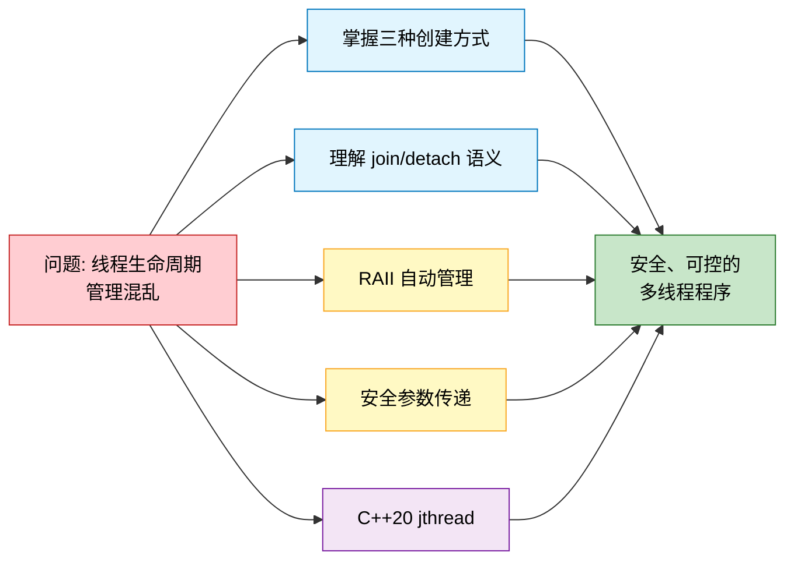
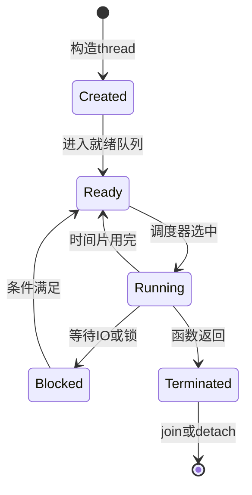
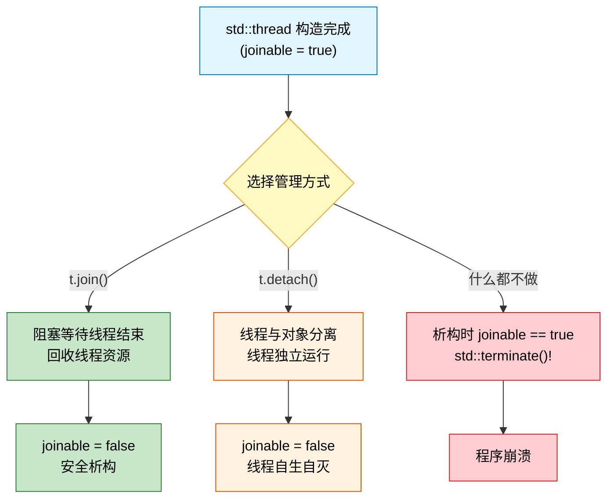
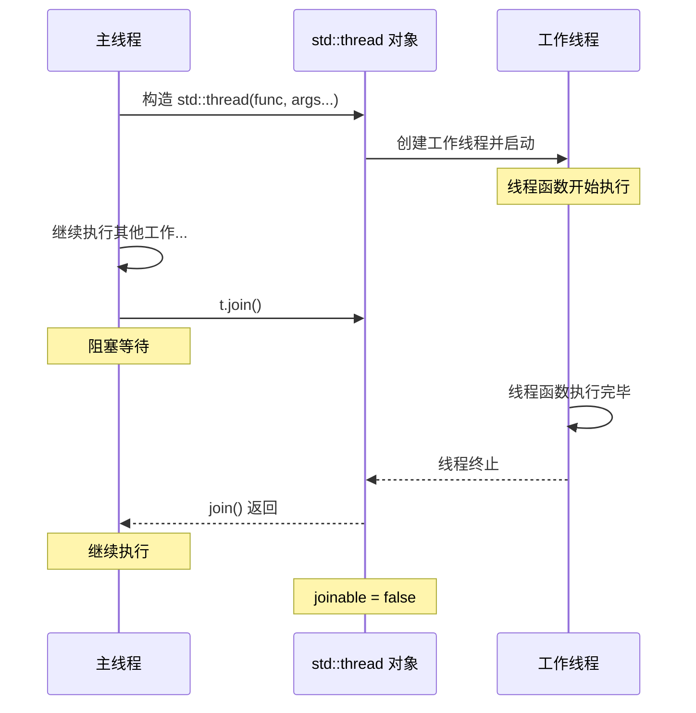
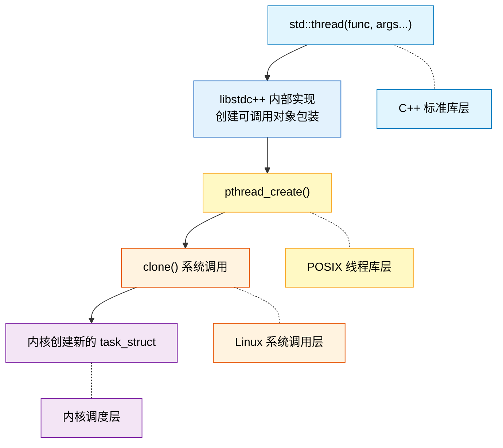

# 4.2 线程的创建与生命周期

> [返回第4章](./ch04-thread-atomic.md) | [返回目录](../README.md)

在上一节中，我们了解了进程与线程在资源模型和调度层面的差异。我们知道线程共享进程的地址空间，拥有更轻量的创建和切换开销。然而，"轻量"并不意味着"简单"——线程的创建、运行、同步与销毁构成一个完整的生命周期，任何一个环节处理不当都可能导致资源泄漏、未定义行为甚至程序崩溃。

本节将系统讲解 `std::thread` 的创建方式、joinable 与 detached 两种语义、RAII 守护模式、参数传递机制，以及 C++20 引入的 `std::jthread`。同时，我们会深入到 `std::thread` 底层的系统调用链（`pthread_create` -> `clone`），帮助你建立从标准库到内核的完整认知。

---

## 4.2.1 实现目标

### 问题描述

多线程编程中，线程生命周期管理不当是最常见的错误来源之一：

| 问题 | 描述 | 后果 |
|------|------|------|
| 悬挂线程 | `std::thread` 对象析构时仍处于 joinable 状态 | 调用 `std::terminate()`，程序异常终止 |
| 资源泄漏 | `detach()` 后线程访问已销毁的栈变量 | 未定义行为（UB），可能导致段错误或数据损坏 |
| 异常安全 | 异常发生时跳过了 `join()` 调用 | 同悬挂线程，触发 `std::terminate()` |
| 参数传递 | 误用引用传递、隐式类型转换时机不对 | 数据竞争或悬空引用 |
| 线程失控 | 缺乏协作式取消机制，无法优雅停止线程 | 线程无法响应停止请求，只能强制终止 |

### 期望效果

通过本节学习，你将掌握线程生命周期的完整管理方案：



具体目标：

1. **三种创建方式**：普通函数、Lambda、成员函数
2. **joinable vs detached**：理解两种语义的适用场景和风险
3. **RAII 守护**：用 `ThreadGuard` 类保证异常安全
4. **安全参数传递**：值传递、`std::ref` 引用传递、`std::move` 移动语义
5. **C++20 jthread**：自动 join + 协作式取消

---

## 4.2.2 核心原理

### 线程状态机

一个线程从创建到终止，经历以下状态转换：



关键要点：
- **Created -> Ready** 是自动发生的，`std::thread` 构造函数返回时线程已经可以被调度执行
- **Terminated** 不等于"资源已回收"——必须通过 `join()` 或 `detach()` 来处理线程的最终状态
- **Blocked** 状态是线程自愿放弃 CPU 的结果（I/O 等待、锁等待、主动休眠等）

### joinable vs detached：两条路径

`std::thread` 对象创建后处于 **joinable** 状态，必须在析构前选择以下两条路径之一：



| 特性 | `join()` | `detach()` |
|------|----------|------------|
| 阻塞调用者 | 是，直到线程结束 | 否 |
| 资源回收 | 由调用者负责 | 由系统自动回收 |
| 线程结果 | 可通过共享变量获取 | 无法直接获取 |
| 安全性 | 高——生命周期明确 | 低——需要额外保证数据生命周期 |
| 适用场景 | 绝大多数情况 | "发射后不管"的后台任务 |

### 线程生命周期时序

下面的时序图展示了 `join()` 模式下主线程与工作线程的交互：



---

## 4.2.3 代码示例

### 示例 1：三种创建方式

> 源文件：[`code/ch04/04_02a_basic_thread.cpp`](../code/ch04/04_02a_basic_thread.cpp)

```cpp
// 04_02a_basic_thread.cpp — 线程创建的三种方式
// 编译: g++ -std=c++17 -Wall -Wextra -g -pthread -o 04_02a_basic_thread 04_02a_basic_thread.cpp

#include <iostream>
#include <thread>
#include <string>

// 方式1: 普通函数
void hello(int id) {
    std::cout << "[线程] hello from thread " << id << std::endl;
}

// 方式3: 成员函数
class Worker {
public:
    std::string name;
    explicit Worker(const std::string& n) : name(n) {}
    void run() {
        std::cout << "[线程] Worker::run, name = " << name << std::endl;
    }
};

int main() {
    std::cout << "=== 基本线程创建 ===" << std::endl;

    // 方式1: 普通函数
    std::cout << "--- 方式1: 普通函数 ---" << std::endl;
    std::thread t1(hello, 1);
    t1.join();

    // 方式2: Lambda
    std::cout << "--- 方式2: Lambda ---" << std::endl;
    int x = 42;
    std::thread t2([x]() {
        std::cout << "[线程] lambda: x = " << x << std::endl;
    });
    t2.join();

    // 方式3: 成员函数
    std::cout << "--- 方式3: 成员函数 ---" << std::endl;
    Worker w("worker1");
    std::thread t3(&Worker::run, &w);
    t3.join();

    std::cout << "=== 完成 ===" << std::endl;
    return 0;
}
```

> 📁 完整代码：[code/ch04/04_02a_basic_thread.cpp](../code/ch04/04_02a_basic_thread.cpp)

**关键观察**：

1. **普通函数**：`std::thread t1(hello, 1)` —— 第一个参数是函数指针，后续参数会被转发给该函数
2. **Lambda**：Lambda 是最灵活的方式，可以通过捕获列表控制变量的传递方式（值捕获 `[x]` vs 引用捕获 `[&x]`）
3. **成员函数**：`std::thread t3(&Worker::run, &w)` —— 第二个参数是对象指针，作为成员函数的隐式 `this`
4. 每个线程创建后**必须**调用 `join()` 或 `detach()`，这里统一使用 `join()` 确保安全

---

### 示例 2：detach 的风险

> 源文件：[`code/ch04/04_02b_detach_risk.cpp`](../code/ch04/04_02b_detach_risk.cpp)

> **WARNING**: 这段代码包含未定义行为（UB），仅作为教学示例。不要在实际项目中使用这种模式。可用 `g++ -fsanitize=address` 编译来观察实际错误。

```cpp
// 04_02b_detach_risk.cpp — detach 导致的未定义行为示例
// 编译: g++ -std=c++17 -Wall -Wextra -g -pthread -o 04_02b_detach_risk 04_02b_detach_risk.cpp
// ⚠️ 仅编译，不要运行！

// ⚠️ WARNING: 这段代码包含未定义行为（UB）！
// 仅作为教学示例，不要在实际项目中这样写。
// 可用 g++ -fsanitize=address 编译来观察实际错误。
// 正确做法：使用 shared_ptr 或确保线程在数据销毁前完成。

#include <iostream>
#include <thread>
#include <vector>
#include <chrono>
#include <numeric>

void dangerousDetach() {
    std::vector<int> data = {1, 2, 3, 4, 5};

    std::thread t([&data]() {
        // 线程休眠 100ms，此时 dangerousDetach() 可能已经返回
        std::this_thread::sleep_for(std::chrono::milliseconds(100));

        // ⚠️ UB: data 已被销毁，访问悬空引用！
        int sum = std::accumulate(data.begin(), data.end(), 0);
        std::cout << "[线程] sum = " << sum << std::endl;
    });

    // detach 后函数返回，data 被销毁
    t.detach();
    std::cout << "[主线程] dangerousDetach 返回，data 即将销毁" << std::endl;
}

int main() {
    std::cout << "=== detach 风险示例 ===" << std::endl;

    dangerousDetach();

    // 等待足够长时间让分离的线程尝试访问已销毁的数据
    std::this_thread::sleep_for(std::chrono::milliseconds(200));

    std::cout << "=== 完成 ===" << std::endl;
    return 0;
}
```

> 📁 完整代码：[code/ch04/04_02b_detach_risk.cpp](../code/ch04/04_02b_detach_risk.cpp)

**关键观察**：

1. `dangerousDetach()` 中的 `data` 是局部变量，函数返回后即被销毁
2. Lambda 通过 `[&data]` 捕获了 `data` 的引用，但 `detach()` 后函数立即返回
3. 线程在 100ms 后试图访问已销毁的 `data`，这是典型的**悬空引用**（dangling reference）
4. 正确做法：使用值捕获（拷贝数据）、`std::shared_ptr` 共享所有权，或改用 `join()` 确保线程在数据销毁前完成

---

### 示例 3：RAII ThreadGuard

> 源文件：[`code/ch04/04_02c_thread_guard.cpp`](../code/ch04/04_02c_thread_guard.cpp)

```cpp
// 04_02c_thread_guard.cpp — RAII 线程守护类
// 编译: g++ -std=c++17 -Wall -Wextra -g -pthread -o 04_02c_thread_guard 04_02c_thread_guard.cpp

#include <iostream>
#include <thread>
#include <stdexcept>

class ThreadGuard {
    std::thread& t_;
public:
    explicit ThreadGuard(std::thread& t) : t_(t) {}

    ~ThreadGuard() {
        if (t_.joinable()) {
            std::cout << "[ThreadGuard] 析构函数中自动 join 线程" << std::endl;
            t_.join();
        }
    }

    // 禁止拷贝
    ThreadGuard(const ThreadGuard&) = delete;
    ThreadGuard& operator=(const ThreadGuard&) = delete;
};

void demo_normal_path() {
    std::cout << "--- 场景1: 正常路径 ---" << std::endl;

    std::thread t([]() {
        std::cout << "[线程] 正常路径中的工作线程" << std::endl;
    });

    ThreadGuard guard(t);
    std::cout << "[主线程] 函数即将返回，ThreadGuard 将自动 join" << std::endl;
    // guard 析构时自动 join
}

void demo_exception_path() {
    std::cout << "--- 场景2: 异常路径 ---" << std::endl;

    std::thread t([]() {
        std::cout << "[线程] 异常路径中的工作线程" << std::endl;
    });

    ThreadGuard guard(t);

    try {
        std::cout << "[主线程] 模拟抛出异常..." << std::endl;
        throw std::runtime_error("模拟异常");
    } catch (const std::exception& e) {
        std::cout << "[主线程] 捕获异常: " << e.what() << std::endl;
    }
    // guard 析构时自动 join，即使发生了异常
}

int main() {
    std::cout << "=== ThreadGuard RAII 示例 ===" << std::endl;

    demo_normal_path();
    std::cout << std::endl;
    demo_exception_path();

    std::cout << "=== 完成 ===" << std::endl;
    return 0;
}
```

> 📁 完整代码：[code/ch04/04_02c_thread_guard.cpp](../code/ch04/04_02c_thread_guard.cpp)

**关键观察**：

1. `ThreadGuard` 持有 `std::thread` 的引用，在析构函数中检查 `joinable()` 并自动 `join()`
2. 无论函数正常返回还是异常退出，C++ 保证局部对象的析构函数被调用——这就是 RAII 的威力
3. 禁止拷贝（`= delete`）是必要的，因为同一个线程不能被 `join()` 两次
4. 这个模式本质上就是 C++20 `std::jthread` 的核心思想——把"析构时自动 join"内置到标准库中

---

### 示例 4：参数传递的三种方式

> 源文件：[`code/ch04/04_02d_pass_args.cpp`](../code/ch04/04_02d_pass_args.cpp)

```cpp
// 04_02d_pass_args.cpp — 线程参数传递的三种方式
// 编译: g++ -std=c++17 -Wall -Wextra -g -pthread -o 04_02d_pass_args 04_02d_pass_args.cpp

#include <iostream>
#include <thread>
#include <memory>
#include <string>
#include <functional>

int main() {
    std::cout << "=== 线程参数传递 ===" << std::endl;

    // --- 值传递 ---
    std::cout << "--- 值传递 ---" << std::endl;
    {
        int val = 42;
        std::thread t([](int v) {
            v = 100;
            std::cout << "[线程] 收到值: 42, 修改为: " << v << std::endl;
        }, val);
        t.join();
        std::cout << "[主线程] 原始值未变: " << val << std::endl;
    }

    // --- 引用传递 ---
    std::cout << "--- 引用传递 ---" << std::endl;
    {
        int val = 42;
        std::thread t([](int& v) {
            v = 100;
            std::cout << "[线程] 收到引用, 修改为: " << v << std::endl;
        }, std::ref(val));
        t.join();
        std::cout << "[主线程] 值已被修改: " << val << std::endl;
    }

    // --- 移动语义 ---
    std::cout << "--- 移动语义 ---" << std::endl;
    {
        auto ptr = std::make_unique<std::string>("hello");
        std::thread t([](std::unique_ptr<std::string> p) {
            std::cout << "[线程] 收到 unique_ptr, 值: " << *p << std::endl;
        }, std::move(ptr));
        t.join();
        std::cout << "[主线程] unique_ptr 已转移 (nullptr)" << std::endl;
    }

    std::cout << "=== 完成 ===" << std::endl;
    return 0;
}
```

> 📁 完整代码：[code/ch04/04_02d_pass_args.cpp](../code/ch04/04_02d_pass_args.cpp)

**关键观察**：

1. **值传递**：`std::thread` 构造函数默认**拷贝**所有参数。线程内修改不影响原始变量，这是最安全的方式
2. **引用传递**：必须使用 `std::ref()` 包装，否则 `std::thread` 会拷贝参数而非传递引用。使用 `join()` 模式时引用传递是安全的
3. **移动语义**：对于不可拷贝的类型（如 `std::unique_ptr`），必须使用 `std::move()` 转移所有权。转移后原指针变为 `nullptr`
4. 一个常见的陷阱：如果参数是 `const char*`，传入 `std::thread` 后可能在新线程中才转换为 `std::string`，此时原字符串可能已被销毁

---

### 示例 5：C++20 jthread 与 stop_token

> 源文件：[`code/ch04/04_02e_jthread.cpp`](../code/ch04/04_02e_jthread.cpp)

```cpp
// 04_02e_jthread.cpp — C++20 std::jthread 与 stop_token
// 编译 C++20: g++ -std=c++20 -Wall -Wextra -g -pthread -o 04_02e_jthread 04_02e_jthread.cpp
// 编译 C++17: g++ -std=c++17 -Wall -Wextra -g -pthread -o 04_02e_jthread 04_02e_jthread.cpp

#include <iostream>
#include <thread>
#include <chrono>

#if __cplusplus >= 202002L && __has_include(<stop_token>)
#include <stop_token>

void worker(std::stop_token stoken) {
    int count = 0;
    while (!stoken.stop_requested()) {
        std::cout << "[jthread] 工作中... count = " << ++count << std::endl;
        std::this_thread::sleep_for(std::chrono::milliseconds(50));
    }
    std::cout << "[jthread] 收到停止请求，退出" << std::endl;
}

int main() {
    std::cout << "=== std::jthread 示例 (C++20) ===" << std::endl;

    {
        std::jthread jt(worker);
        std::this_thread::sleep_for(std::chrono::milliseconds(180));
        std::cout << "[主线程] 请求停止..." << std::endl;
        jt.request_stop();
        // jthread 析构时自动 join
    }

    std::cout << "=== 完成 ===" << std::endl;
    return 0;
}

#else

int main() {
    std::cout << "std::jthread 需要 C++20 支持，当前编译器不支持" << std::endl;
    return 0;
}

#endif
```

> 📁 完整代码：[code/ch04/04_02e_jthread.cpp](../code/ch04/04_02e_jthread.cpp)

**关键观察**：

1. `std::jthread` 在析构时**自动调用 `join()`**，无需手动管理——彻底消除了"忘记 join"的问题
2. `std::stop_token` 提供了**协作式取消**机制：主线程调用 `request_stop()`，工作线程通过 `stop_requested()` 轮询检查
3. `stop_token` 作为线程函数的**第一个参数**自动传入，无需手动创建
4. 代码中使用了编译期条件检查 `__cplusplus >= 202002L`，确保在不支持 C++20 的编译器上也能编译通过
5. `std::jthread` 本质上就是"内置 `ThreadGuard` 的 `std::thread`"加上取消机制

---

## 4.2.4 深入讲解

### std::thread 到内核的调用链

当你写下 `std::thread t(func)` 时，从标准库到内核实际经历了以下调用链：



各层的职责：

1. **std::thread 构造函数**：将可调用对象和参数打包成一个内部的调用包装，然后调用 `pthread_create()`
2. **pthread_create()**：POSIX 线程创建函数，负责设置线程属性（栈大小、调度策略等），最终调用 `clone()`
3. **clone() 系统调用**：Linux 特有的系统调用，通过 flags 参数精确控制父子任务之间共享哪些资源
4. **内核 task_struct**：内核为新线程创建一个 `task_struct`，这是 Linux 内核中进程/线程的统一抽象

### clone() 的 CLONE_* 标志

`clone()` 系统调用的强大之处在于通过标志位精确控制资源共享：

```c
// pthread_create() 内部调用 clone() 时使用的典型 flags
clone(fn, stack,
      CLONE_VM        // 共享虚拟内存空间
    | CLONE_FS        // 共享文件系统信息（cwd, umask）
    | CLONE_FILES     // 共享文件描述符表
    | CLONE_SIGHAND   // 共享信号处理函数
    | CLONE_THREAD    // 同一线程组（相同 TGID）
    | CLONE_SYSVSEM   // 共享 System V 信号量
    | CLONE_SETTLS    // 设置线程本地存储（TLS）
    | CLONE_PARENT_SETTID   // 设置父线程中的 TID
    | CLONE_CHILD_CLEARTID, // 子线程退出时清除 TID
      ...);
```

| 标志 | 含义 | 线程 vs 进程 |
|------|------|-------------|
| `CLONE_VM` | 共享虚拟内存地址空间 | 线程: 设置; 进程(fork): 不设置 |
| `CLONE_FS` | 共享文件系统信息 | 线程: 设置; 进程: 不设置 |
| `CLONE_FILES` | 共享文件描述符表 | 线程: 设置; 进程: 不设置 |
| `CLONE_SIGHAND` | 共享信号处理方式 | 线程: 设置; 进程: 不设置 |
| `CLONE_THREAD` | 归入同一线程组 | 线程: 设置; 进程: 不设置 |
| `CLONE_SETTLS` | 设置线程本地存储 | 线程: 设置; 进程: 不设置 |

这也印证了上一节的结论：**线程就是共享了几乎所有资源的"轻量级进程"**，内核对二者使用相同的 `task_struct` 来管理。

### 线程栈大小配置

每个线程都有独立的栈空间。默认栈大小因系统而异，通常为 8 MB：

```bash
# 查看系统默认栈大小
$ ulimit -s
8192    # 单位: KB，即 8 MB
```

| 配置方式 | 作用范围 | 方法 |
|----------|----------|------|
| `ulimit -s <size>` | 当前 shell 及子进程 | `ulimit -s 16384`（设为 16 MB） |
| `pthread_attr_setstacksize()` | 单个线程 | 见下方代码 |
| 链接器选项 | 主线程 | `-Wl,-z,stacksize=...` |

```cpp
// 设置单个线程的栈大小
pthread_attr_t attr;
pthread_attr_init(&attr);
pthread_attr_setstacksize(&attr, 2 * 1024 * 1024);  // 2 MB

pthread_t tid;
pthread_create(&tid, &attr, thread_func, nullptr);
pthread_attr_destroy(&attr);
```

注意事项：
- 栈大小过小会导致栈溢出（stack overflow），表现为段错误
- 栈大小过大则浪费虚拟地址空间，在大量线程场景下（如 10000 个线程 x 8 MB = 80 GB 虚拟地址空间）会成为瓶颈
- `std::thread` 目前没有标准接口设置栈大小，如需自定义必须使用 `pthread_attr_t`

### 线程 vs 协程：简要对比

C++20 引入了协程（coroutine），它与线程有本质区别：

| 特性 | 线程 (std::thread) | 协程 (C++20 coroutine) |
|------|---------------------|----------------------|
| 调度方式 | 内核抢占式调度 | 用户态协作式调度 |
| 栈空间 | 独立栈（默认 8 MB） | 无栈或极小栈帧 |
| 创建开销 | 较大（内核调用 clone） | 极小（用户态分配） |
| 切换开销 | 较大（上下文切换） | 极小（仅保存/恢复寄存器） |
| 并行能力 | 真正并行（多核） | 单线程内并发（非并行） |
| 同步机制 | mutex / atomic / condition_variable | co_await / co_yield |
| 适用场景 | CPU 密集计算、真并行 | I/O 密集、高并发连接 |

简而言之：**线程解决的是"并行"问题（多核利用），协程解决的是"并发"问题（高效等待）**。两者可以组合使用——在多个线程上分别运行协程调度器，同时获得并行和并发的优势。

---

## 4.2.5 常见陷阱

### 陷阱 1：忘记 join/detach 导致 std::terminate

`std::thread` 析构时如果仍处于 joinable 状态，程序将调用 `std::terminate()` 立即终止。

❌ **错误写法**：

```cpp
void bad_example() {
    std::thread t([]() {
        std::cout << "工作中..." << std::endl;
    });
    // 函数返回，t 析构时 joinable == true
    // => std::terminate()!
}
```

✅ **正确写法**：

```cpp
void good_example() {
    std::thread t([]() {
        std::cout << "工作中..." << std::endl;
    });

    // 方法1: join 等待
    t.join();

    // 或方法2: 使用 RAII 守护
    // ThreadGuard guard(t);

    // 或方法3: 使用 C++20 jthread
    // std::jthread jt([]() { ... });  // 自动 join
}
```

> 设计原因：C++ 标准委员会选择在析构时调用 `std::terminate()` 而非默认 `join()` 或 `detach()`，是因为默认 `join()` 可能导致难以调试的死锁，而默认 `detach()` 可能导致难以调试的悬空引用。**显式选择、失败时大声报错**是 C++ 的设计哲学。

---

### 陷阱 2：向 detach 的线程传递局部变量引用

detach 后线程独立运行，如果引用了调用者栈上的变量，函数返回后引用即悬空。

❌ **错误写法**：

```cpp
void bad_detach() {
    int local_data = 42;

    std::thread t([&local_data]() {
        // 线程可能在 bad_detach() 返回后才执行到这里
        std::this_thread::sleep_for(std::chrono::milliseconds(100));
        std::cout << local_data << std::endl;  // UB: 悬空引用！
    });

    t.detach();
    // 函数返回，local_data 销毁，但线程仍在运行
}
```

✅ **正确写法**：

```cpp
void good_detach() {
    int local_data = 42;

    // 方案1: 值捕获（拷贝数据到线程）
    std::thread t([local_data]() {
        std::this_thread::sleep_for(std::chrono::milliseconds(100));
        std::cout << local_data << std::endl;  // 安全：使用的是拷贝
    });
    t.detach();

    // 方案2: 使用 shared_ptr 延长生命周期
    // auto data = std::make_shared<int>(42);
    // std::thread t2([data]() {
    //     std::cout << *data << std::endl;  // 安全：shared_ptr 引用计数 > 0
    // });
    // t2.detach();
}
```

> 经验法则：**如果你需要 `detach()`，那么线程函数使用的所有数据都必须通过值捕获或共享指针传入，绝不能依赖外部栈变量的引用。**

---

### 陷阱 3：线程函数中的异常传播

线程函数中未捕获的异常会导致 `std::terminate()`——异常**不会**传播到创建该线程的父线程。

❌ **错误写法**：

```cpp
void bad_exception() {
    std::thread t([]() {
        throw std::runtime_error("线程中的异常");
        // 未捕获的异常 => std::terminate()!
    });
    t.join();
    // 即使这里有 try-catch，也捕获不到线程中的异常
}
```

✅ **正确写法**：

```cpp
void good_exception() {
    std::exception_ptr eptr = nullptr;

    std::thread t([&eptr]() {
        try {
            throw std::runtime_error("线程中的异常");
        } catch (...) {
            // 捕获异常并存储，稍后在主线程中重新抛出
            eptr = std::current_exception();
        }
    });
    t.join();

    // 在主线程中检查并重新抛出异常
    if (eptr) {
        std::rethrow_exception(eptr);
    }
}
```

> 更好的做法是使用 `std::async` / `std::future`，它们内置了跨线程异常传播机制——异常会被自动捕获并在调用 `future::get()` 时重新抛出。我们将在下一节讨论这个话题。

---

## 4.2.6 思考题

1. **joinable 析构语义**：为什么 C++ 标准选择在 `std::thread` 析构时（joinable 状态下）调用 `std::terminate()`，而不是默认 `join()` 或默认 `detach()`？各自有什么潜在的风险？

2. **ThreadGuard 的改进**：示例 3 中的 `ThreadGuard` 持有的是 `std::thread&`（引用）。如果改为持有 `std::thread`（值，通过移动语义转入），有什么好处和局限？与 `std::jthread` 的实现方式有何异同？

3. **参数传递的隐式转换陷阱**：考虑以下代码，分析可能存在的问题：
   ```cpp
   void process(const std::string& s) { /* ... */ }

   void create_thread() {
       const char* data = "hello";
       std::thread t(process, data);
       t.detach();
   }
   ```
   提示：`const char*` 到 `std::string` 的隐式转换发生在什么时候？

4. **jthread 与 stop_token 的进阶使用**：`std::stop_token` 除了轮询 `stop_requested()` 之外，还可以注册 `std::stop_callback`。请查阅文档，思考 `stop_callback` 在什么场景下比轮询更合适？

5. **线程数量与栈大小的权衡**：如果你需要在一个进程中创建 10000 个线程，每个线程使用默认 8 MB 栈大小，总共需要多少虚拟地址空间？这在 32 位和 64 位系统上分别会遇到什么问题？有哪些解决方案？

---

*上一节：[4.1 进程 vs 线程](./ch04-01-process-thread.md)*
*下一节：[4.3 线程标识与线程间通信](./ch04-03-thread-communication.md)*
