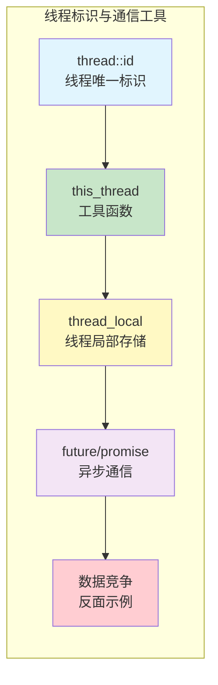
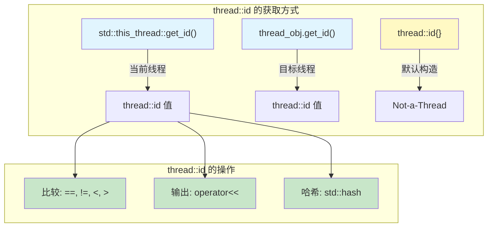
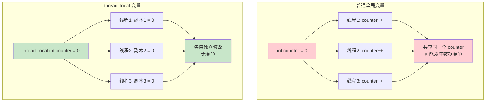
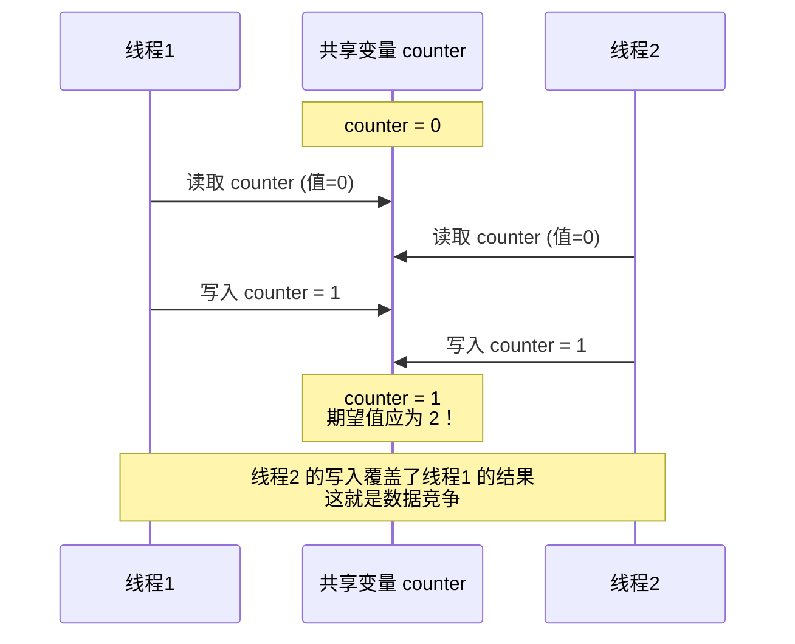
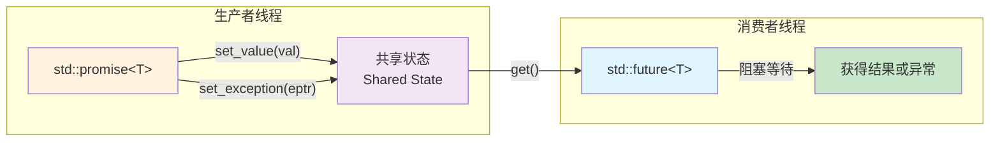
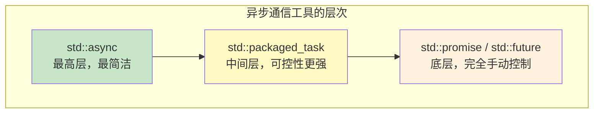
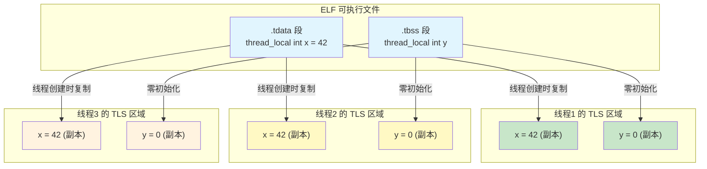
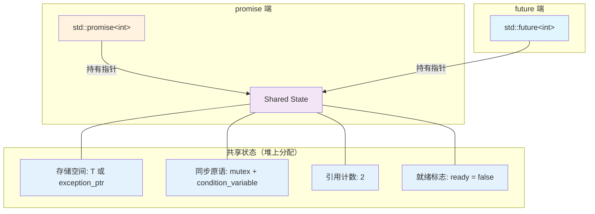

# 4.3 线程标识与线程间通信

> [返回第4章](./ch04-thread-atomic.md) | [返回目录](../README.md)

在上一节中，我们学习了如何创建线程、管理线程的生命周期，以及 `join()` 和 `detach()` 的语义。然而，线程仅仅被启动是不够的——线程之间需要**识别彼此**并**交换数据**。如何知道"我是哪个线程"？如何让每个线程拥有独立的数据副本？如何安全地从工作线程向主线程返回计算结果？

本节将围绕这些问题，依次介绍线程标识（`thread::id`）、线程工具函数（`this_thread` 命名空间）、线程局部存储（`thread_local`）、以及基于 `future`/`promise` 的异步通信模型。最后，我们将通过一个数据竞争（Data Race）的反面示例，引出后续章节对原子操作和互斥锁的讨论。

---

## 4.3.1 实现目标

### 问题描述

在多线程程序中，线程之间的通信需求可以归纳为以下四类场景：

| 通信场景 | 描述 | 典型应用 |
|----------|------|----------|
| **任务分发** | 主线程将任务参数传递给工作线程 | 线程池任务队列 |
| **结果收集** | 工作线程将计算结果返回给主线程 | `future`/`promise`、`async` |
| **状态通知** | 一个线程通知另一个线程某个事件已发生 | 条件变量、`promise` 设值 |
| **数据共享** | 多个线程同时读写共享数据 | 需要同步保护（原子操作/锁） |

在没有适当工具的情况下，最朴素的做法是让多个线程直接读写同一个全局变量。但正如我们将在本节末尾看到的，这样做会导致**数据竞争**——一种未定义行为。

### 期望效果



通过本节学习，读者应当达到以下目标：

1. **理解线程标识**：掌握 `std::thread::id` 类型的用途和比较操作
2. **掌握工具函数**：熟练使用 `this_thread::get_id()`、`sleep_for()`、`sleep_until()`、`yield()`
3. **掌握线程局部存储**：理解 `thread_local` 关键字的语义和适用场景
4. **掌握异步通信**：能够使用 `promise`/`future`、`packaged_task`、`std::async` 在线程间传递结果
5. **认识数据竞争**：理解为什么直接共享变量是危险的，从而引出对同步原语的需求

---

## 4.3.2 核心原理

### std::thread::id 类型

每个运行中的线程都有一个唯一的标识符，类型为 `std::thread::id`。它具有以下特性：

- 通过 `std::this_thread::get_id()` 获取当前线程的 ID
- 通过 `std::thread` 对象的 `.get_id()` 方法获取目标线程的 ID
- 默认构造的 `thread::id{}` 表示"无线程"（Not-a-Thread），可用于判断线程是否有效
- 支持 `==`、`!=`、`<`、`>`、`<=`、`>=` 比较运算符
- 支持 `operator<<` 输出到流
- 可以作为 `std::unordered_map` 的键（提供了 `std::hash<std::thread::id>` 特化）



### this_thread 命名空间

`std::this_thread` 命名空间提供了四个与当前线程相关的工具函数：

| 函数 | 功能 | 典型用途 |
|------|------|----------|
| `get_id()` | 获取当前线程的唯一标识 | 日志记录、调试、线程调度 |
| `sleep_for(duration)` | 让当前线程休眠指定时长 | 定时任务、模拟延迟 |
| `sleep_until(time_point)` | 让当前线程休眠到指定时刻 | 定时触发、周期任务 |
| `yield()` | 提示调度器让出 CPU 时间片 | 自旋等待中避免忙等 |

需要注意的是，`sleep_for()` 和 `sleep_until()` 的实际休眠时间可能**大于**指定时间（取决于操作系统调度），但不会小于。`yield()` 仅仅是一个**提示**，调度器可以选择忽略它。

### thread_local 存储

`thread_local` 是 C++11 引入的存储期说明符（Storage Duration Specifier）。被声明为 `thread_local` 的变量，每个线程拥有一份独立的副本，各线程的修改互不影响。



`thread_local` 变量的关键语义：

- **每个线程一份副本**：线程首次访问该变量时，会执行初始化（包括构造函数）
- **线程结束时析构**：线程退出时，其 `thread_local` 变量按构造的逆序析构
- **可以修饰全局变量、静态变量和局部静态变量**：`thread_local static int x = 0;` 等价于 `thread_local int x = 0;`（在命名空间作用域）
- **不能修饰普通局部变量或类的非静态成员变量**

### 数据竞争的概念

当两个或多个线程**同时访问**同一内存位置，且至少有一个是**写操作**，且没有使用任何同步机制时，就构成了**数据竞争**（Data Race）。根据 C++ 标准，数据竞争是**未定义行为**（Undefined Behavior）。



数据竞争的后果不仅仅是"计算结果不对"。由于它是未定义行为，编译器可以假设程序中不存在数据竞争，并据此进行激进的优化。这意味着数据竞争可能导致任何不可预测的行为。

### future/promise 异步通信模型

`std::promise` 和 `std::future` 提供了一种**一次性**的线程间通信通道。`promise` 是数据的"生产端"，`future` 是数据的"消费端"，二者通过一个**共享状态**（Shared State）连接。



除了 `promise`/`future` 的基本用法，C++ 标准库还提供了两个更高层的工具：

- **`std::packaged_task<R(Args...)>`**：将一个可调用对象包装起来，自动管理 `promise`/`future`，调用后结果自动存入共享状态
- **`std::async(policy, func, args...)`**：最简洁的异步任务接口，根据策略（`launch::async` 或 `launch::deferred`）在新线程或调用线程中执行任务



---

## 4.3.3 代码示例

### 示例1：线程 ID 与工具函数

```cpp
// code/ch04/04_03a_thread_id.cpp
#include <iostream>
#include <thread>
#include <chrono>

int main() {
    std::cout << "=== 线程标识与工具函数 ===" << std::endl;

    auto main_id = std::this_thread::get_id();
    std::cout << "[主线程] ID: " << main_id << std::endl;

    std::thread worker([]{
        std::cout << "[工作线程] ID: " << std::this_thread::get_id() << std::endl;
        std::cout << "[工作线程] 休眠 100ms..." << std::endl;
        std::this_thread::sleep_for(std::chrono::milliseconds(100));
        std::cout << "[工作线程] yield 让出 CPU" << std::endl;
        std::this_thread::yield();
        std::cout << "[工作线程] 完成" << std::endl;
    });

    worker.join();

    std::thread::id default_id{};
    std::cout << "[主线程] 默认 thread::id 表示无线程: " << default_id << std::endl;
    std::cout << "[主线程] 主线程ID != 默认ID: "
              << (main_id != default_id ? "true" : "false") << std::endl;

    std::cout << "=== 完成 ===" << std::endl;
    return 0;
}
```

> 📁 完整代码：[code/ch04/04_03a_thread_id.cpp](../code/ch04/04_03a_thread_id.cpp)

**关键观察**：

1. `std::this_thread::get_id()` 返回当前线程的 `thread::id`，每个线程的 ID 值不同
2. `sleep_for()` 接受 `std::chrono::duration` 类型的参数，精确控制休眠时长
3. `yield()` 仅仅是提示操作系统调度器，不保证线程会立即被切换
4. 默认构造的 `thread::id{}` 代表"无线程"，可以用于判断一个 `std::thread` 对象是否关联了活跃线程

### 示例2：thread_local 变量

```cpp
// code/ch04/04_03b_thread_local.cpp
#include <iostream>
#include <thread>

thread_local int counter = 0;

int main() {
    std::cout << "=== thread_local 变量演示 ===" << std::endl;

    for (int i = 0; i < 3; ++i) {
        std::thread t([i]{
            int times = i + 1;
            for (int j = 0; j < times; ++j) {
                ++counter;
            }
            std::cout << "[线程" << i << "] counter 递增 " << times
                      << " 次, 最终值: " << counter << std::endl;
        });
        t.join();
    }

    std::cout << "[主线程] 各线程的 counter 独立，互不影响" << std::endl;
    std::cout << "[主线程] 主线程的 counter: " << counter
              << " (未被任何工作线程修改)" << std::endl;

    std::cout << "=== 完成 ===" << std::endl;
    return 0;
}
```

> 📁 完整代码：[code/ch04/04_03b_thread_local.cpp](../code/ch04/04_03b_thread_local.cpp)

**关键观察**：

1. `thread_local int counter = 0;` 声明了一个线程局部变量，每个线程拥有独立的副本
2. 线程0 递增 1 次（最终值 1）、线程1 递增 2 次（最终值 2）、线程2 递增 3 次（最终值 3），每个线程都从 0 开始
3. 主线程的 `counter` 始终为 0，因为工作线程修改的是各自的副本
4. `thread_local` 变量在每个线程首次访问时初始化，线程结束时析构

### 示例3：promise/future 异步通信

```cpp
// code/ch04/04_03c_future_promise.cpp
#include <iostream>
#include <thread>
#include <future>
#include <stdexcept>
#include <chrono>
#include <atomic>

int main() {
    std::cout << "=== future/promise 异步通信 ===" << std::endl;

    // --- 基本用法 ---
    std::cout << "--- 基本用法 ---" << std::endl;
    {
        std::promise<int> prom;
        std::future<int> fut = prom.get_future();
        std::atomic<bool> main_printed{false};

        std::thread worker([&prom, &main_printed]{
            // 等待主线程先打印"等待结果"
            while (!main_printed.load()) {
                std::this_thread::yield();
            }
            int result = 42;
            std::cout << "[工作线程] 计算完成，设置结果" << std::endl;
            std::this_thread::sleep_for(std::chrono::milliseconds(10));
            prom.set_value(result);
        });

        std::cout << "[主线程] 等待结果..." << std::endl;
        main_printed.store(true);
        int value = fut.get();
        std::cout << "[主线程] 收到结果: " << value << std::endl;

        worker.join();
    }

    // --- 异常传播 ---
    std::cout << "--- 异常传播 ---" << std::endl;
    {
        std::promise<int> prom;
        std::future<int> fut = prom.get_future();

        std::thread worker([&prom]{
            prom.set_exception(
                std::make_exception_ptr(
                    std::runtime_error("计算过程中发生错误")));
        });

        worker.join();

        try {
            fut.get();
        } catch (const std::exception& e) {
            std::cout << "[主线程] 捕获异常: " << e.what() << std::endl;
        }
    }

    std::cout << "=== 完成 ===" << std::endl;
    return 0;
}
```

> 📁 完整代码：[code/ch04/04_03c_future_promise.cpp](../code/ch04/04_03c_future_promise.cpp)

**关键观察**：

1. `promise` 和 `future` 成对使用：`prom.get_future()` 获取与之关联的 `future` 对象
2. `prom.set_value(result)` 设置结果后，`fut.get()` 会立即返回该值
3. 如果工作线程没有调用 `set_value()` 而是调用了 `set_exception()`，那么 `fut.get()` 会重新抛出该异常——这使得异常可以跨线程传播
4. `fut.get()` 是**阻塞调用**：如果结果尚未就绪，调用线程会一直等待
5. `future::get()` **只能调用一次**，第二次调用会抛出 `std::future_error`

### 示例4：packaged_task 与 std::async

```cpp
// code/ch04/04_03d_async_packaged.cpp
#include <iostream>
#include <thread>
#include <future>

int add(int a, int b) {
    return a + b;
}

int multiply(int a, int b) {
    return a * b;
}

int main() {
    std::cout << "=== packaged_task 与 std::async ===" << std::endl;

    // --- packaged_task ---
    std::cout << "--- packaged_task ---" << std::endl;
    {
        std::packaged_task<int(int, int)> task(add);
        std::future<int> fut = task.get_future();

        std::thread worker(std::move(task), 3, 4);
        worker.join();

        std::cout << "[packaged_task] add(3, 4) = " << fut.get() << std::endl;
    }

    // --- std::async ---
    std::cout << "--- std::async ---" << std::endl;
    {
        std::future<int> fut = std::async(std::launch::async, multiply, 6, 7);
        std::cout << "[std::async] multiply(6, 7) = " << fut.get() << std::endl;
    }

    std::cout << "=== 完成 ===" << std::endl;
    return 0;
}
```

> 📁 完整代码：[code/ch04/04_03d_async_packaged.cpp](../code/ch04/04_03d_async_packaged.cpp)

**关键观察**：

1. `std::packaged_task` 将一个可调用对象包装起来，通过 `get_future()` 获取关联的 `future`。调用 `task()` 后，结果自动存入共享状态
2. `packaged_task` 是 move-only 类型，传递给 `std::thread` 时必须使用 `std::move()`
3. `std::async` 是最简洁的异步任务接口——一行代码即可在新线程中执行函数并获取 `future`
4. `std::launch::async` 策略保证在新线程中执行；`std::launch::deferred` 策略延迟到 `fut.get()` 时才在调用线程中执行

### 示例5：数据竞争演示

```cpp
// code/ch04/04_03e_data_race.cpp
// ⚠️ 数据竞争（Data Race）演示
// 期望值: 100000，实际值可能小于该值
// 这是未定义行为（UB），但在 x86-64 上通常不会崩溃
// 可用 g++ -fsanitize=thread 编译来检测数据竞争
// 解决方案：见 4.4 节（原子操作）或第5章（互斥锁）

#include <iostream>
#include <thread>
#include <vector>

int counter = 0;

int main() {
    std::cout << "=== 数据竞争演示 ===" << std::endl;

    const int num_threads = 10;
    const int increments_per_thread = 10000;

    std::vector<std::thread> threads;
    threads.reserve(num_threads);

    for (int i = 0; i < num_threads; ++i) {
        threads.emplace_back([]{
            for (int j = 0; j < increments_per_thread; ++j) {
                counter++;  // 数据竞争！
            }
        });
    }

    for (auto& t : threads) {
        t.join();
    }

    std::cout << "期望值: " << num_threads * increments_per_thread << std::endl;
    std::cout << "实际值: " << counter << std::endl;

    if (counter != num_threads * increments_per_thread) {
        std::cout << "发生了数据竞争，结果不正确！" << std::endl;
    } else {
        std::cout << "本次运行未观察到数据竞争（但问题仍然存在）" << std::endl;
    }

    std::cout << "=== 完成 ===" << std::endl;
    return 0;
}
```

> 📁 完整代码：[code/ch04/04_03e_data_race.cpp](../code/ch04/04_03e_data_race.cpp)

**关键观察**：

1. 10 个线程各自对全局变量 `counter` 执行 10000 次自增，期望最终值为 100000
2. 由于 `counter++` 不是原子操作（它包含"读取-修改-写回"三个步骤），多个线程的操作会互相覆盖
3. 实际运行时，结果几乎总是小于 100000，而且每次运行的结果可能不同
4. 即使某次运行恰好得到了正确结果，程序仍然包含数据竞争，仍然是未定义行为

> **警告**：数据竞争是 C++ 中最常见也最危险的并发 bug 之一。它不一定导致崩溃，但会导致不可预测的行为。在生产代码中，**任何共享可变数据的访问都必须使用同步机制保护**。解决方案包括：使用 `std::atomic`（见 4.4 节）或使用互斥锁（见第 5 章）。

---

## 4.3.4 深入讲解

### thread_local 的底层实现

在 Linux/ELF 平台上，`thread_local` 变量的实现依赖于 **TLS（Thread-Local Storage）** 机制。编译器和链接器会将 `thread_local` 变量放入 ELF 文件的特殊段中：

| TLS 段 | 说明 | 对应的变量 |
|--------|------|-----------|
| `.tdata` | 已初始化的 TLS 数据 | `thread_local int x = 42;` |
| `.tbss` | 未初始化的 TLS 数据 | `thread_local int y;` |

每个线程被创建时，操作系统（或线程库）会为该线程分配一块独立的 TLS 区域，并从 `.tdata` 段复制初始值。GCC 在 C++11 之前就通过 `__thread` 扩展支持了类似的功能，但 `__thread` 不支持非平凡类型（non-trivial types），而 `thread_local` 没有此限制。



在 x86-64 架构上，TLS 变量通过 `fs` 段寄存器进行寻址。编译器生成的访问 `thread_local` 变量的代码大致等价于：

```asm
mov %fs:offset, %rax   ; 从 TLS 区域读取变量
```

这使得 TLS 访问的性能开销很低——仅比普通全局变量多一次段寄存器间接寻址。

### future/promise 共享状态的实现

`promise` 和 `future` 之间通过一个**共享状态**对象连接。这个共享状态通常在堆上分配，并使用引用计数进行生命周期管理。



工作流程如下：

1. 创建 `promise` 时，分配共享状态，引用计数为 1
2. 调用 `get_future()` 时，`future` 获取共享状态的指针，引用计数变为 2
3. 调用 `set_value()` 时，值存入共享状态，就绪标志设为 `true`，通知等待的消费者
4. 调用 `fut.get()` 时，如果尚未就绪则阻塞等待；就绪后取出值并返回
5. `promise` 和 `future` 析构时各自减少引用计数，最后一个析构者释放共享状态

### packaged_task 与 async 的对比

| 特性 | `std::packaged_task` | `std::async` |
|------|---------------------|-------------|
| **抽象层次** | 中层，需要手动管理线程 | 高层，自动管理线程 |
| **线程创建** | 需要自己创建 `std::thread` | 自动创建（`launch::async`） |
| **延迟执行** | 不支持（必须显式调用） | 支持（`launch::deferred`） |
| **可移动性** | 可以移动到其他上下文 | 返回的 `future` 可移动 |
| **灵活性** | 可以存入容器、传递给线程池 | 较低，适合简单场景 |
| **返回值** | 通过 `get_future()` 获取 | 直接返回 `future` |
| **典型用途** | 线程池任务队列 | 简单的并行计算 |

### 线程间通信方式对比

| 通信方式 | 方向 | 次数 | 阻塞性 | 适用场景 |
|----------|------|------|--------|----------|
| **共享变量** | 多对多 | 多次 | 非阻塞（需同步） | 频繁读写的共享状态 |
| **future/promise** | 一对一 | 一次 | 阻塞（`get()`） | 异步任务结果返回 |
| **消息队列** | 多对多 | 多次 | 可阻塞/非阻塞 | 生产者-消费者模式 |
| **条件变量** | 一对多 | 多次 | 阻塞（`wait()`） | 事件通知、状态变更 |

其中，共享变量需要配合原子操作或互斥锁使用；条件变量需要配合互斥锁使用；消息队列通常内部封装了同步原语。`future`/`promise` 是最简单的一次性通信方式，适合"启动任务、等待结果"的场景。

---

## 4.3.5 常见陷阱

### 陷阱1：promise 未设值导致 broken_promise 异常

如果 `promise` 对象在没有调用 `set_value()` 或 `set_exception()` 的情况下被销毁，关联的 `future` 在调用 `get()` 时会抛出 `std::future_error`，错误码为 `std::future_errc::broken_promise`。

❌ **错误写法**：

```cpp
std::future<int> fut;
{
    std::promise<int> prom;
    fut = prom.get_future();
    // prom 在此处被销毁，没有设置值
}
// fut.get() 将抛出 std::future_error (broken_promise)
int value = fut.get();  // 抛出异常！
```

✅ **正确写法**：

```cpp
std::future<int> fut;
{
    std::promise<int> prom;
    fut = prom.get_future();
    prom.set_value(42);  // 在 promise 销毁前设置值
}
int value = fut.get();  // 正常返回 42
```

**规则**：确保 `promise` 在销毁前总是调用 `set_value()` 或 `set_exception()`。在异常可能发生的代码路径中，可以在 `catch` 块中调用 `set_exception(std::current_exception())` 来传播异常。

### 陷阱2：async(launch::deferred) 在调用线程执行

使用 `std::launch::deferred` 策略时，任务**不会在新线程中执行**，而是延迟到 `fut.get()` 或 `fut.wait()` 被调用时，在**调用线程**中同步执行。这可能导致意想不到的性能问题。

❌ **错误理解**：

```cpp
// 以为这会在新线程中执行，实际上是延迟执行
auto fut = std::async(std::launch::deferred, []{
    // 耗时计算...
    std::this_thread::sleep_for(std::chrono::seconds(5));
    return 42;
});

// 做其他工作...（以为耗时计算在并行进行）
do_other_work();

// 实际上，耗时计算在这里才开始执行（在主线程中）！
int result = fut.get();
```

✅ **正确做法**：

```cpp
// 明确使用 launch::async 策略，保证在新线程中执行
auto fut = std::async(std::launch::async, []{
    std::this_thread::sleep_for(std::chrono::seconds(5));
    return 42;
});

do_other_work();  // 耗时计算确实在并行进行
int result = fut.get();  // 如果计算已完成则立即返回
```

**规则**：如果你需要并行执行，请明确使用 `std::launch::async`。默认策略 `std::launch::async | std::launch::deferred` 允许实现自行选择，可能导致不可预测的行为。

### 陷阱3：thread_local 在线程池中的初始化问题

在线程池场景中，工作线程被复用来执行多个任务。此时 `thread_local` 变量**不会在每个任务开始时重新初始化**——它只在线程首次访问时初始化一次，之后在该线程的整个生命周期内保持其值。

```cpp
thread_local int request_id = 0;  // 仅在线程创建时初始化一次

void handle_request(int id) {
    request_id = id;               // 手动设置
    // ... 处理请求 ...
    // 如果忘记设置 request_id，可能会残留上一个请求的值！
}
```

**问题**：如果线程池中的一个线程先后处理了请求 A 和请求 B，但处理请求 B 时忘记重新设置 `thread_local` 变量，那么该变量仍然保持请求 A 的值，导致逻辑错误。

**建议**：在线程池场景中使用 `thread_local` 时，务必在每个任务的开头显式重置相关变量，或者使用 RAII 包装器在任务作用域结束时自动清理。

---

## 4.3.6 思考题

1. **thread_local 与 static 的关系**：`thread_local static int x = 0;` 和 `thread_local int x = 0;`（在命名空间作用域）有区别吗？在函数内部声明 `thread_local static int x = 0;` 呢？请分析它们各自的初始化时机和生命周期。

2. **future 的多次读取**：`std::future::get()` 只能调用一次。如果需要多个线程都能读取同一个异步结果，应该使用什么工具？请查阅 `std::shared_future` 的接口并说明其与 `std::future` 的区别。

3. **数据竞争的检测**：示例 5 中的数据竞争在 x86-64 平台上通常不会导致崩溃。请尝试使用 `g++ -fsanitize=thread` 编译并运行该程序，观察 ThreadSanitizer 的输出。它报告了什么信息？为什么说"没有崩溃不代表没有 bug"？

4. **async 的析构行为**：`std::async` 返回的 `std::future` 有一个特殊行为——当这个 `future` 被析构时，如果关联的任务尚未完成，析构函数会**阻塞等待**任务完成。请思考这个设计决策的原因，以及它可能带来的性能陷阱（提示：循环中创建临时 `future`）。

---

本节从线程标识和线程局部存储出发，介绍了线程间通信的基本工具，并通过 `future`/`promise` 展示了安全的异步通信方式。然而，最后的数据竞争示例揭示了一个关键问题：当多个线程需要频繁读写共享数据时，一次性的 `future`/`promise` 显然不够用。我们需要更底层、更灵活的同步原语。

**为什么需要原子操作？** 对于简单的计数器、标志位等场景，`std::atomic` 提供了无锁的线程安全操作——这正是 4.4 节的主题。

**为什么需要锁？** 对于需要保护多条语句组成的"临界区"的场景，原子操作力不从心，我们需要互斥锁（mutex）等同步原语——这将在第 5 章详细讨论。

---

*上一节：[4.2 线程的创建与生命周期](./ch04-02-thread-lifecycle.md)*
*下一节：[4.4 原子操作详解](./ch04-04-atomic-operations.md)*
